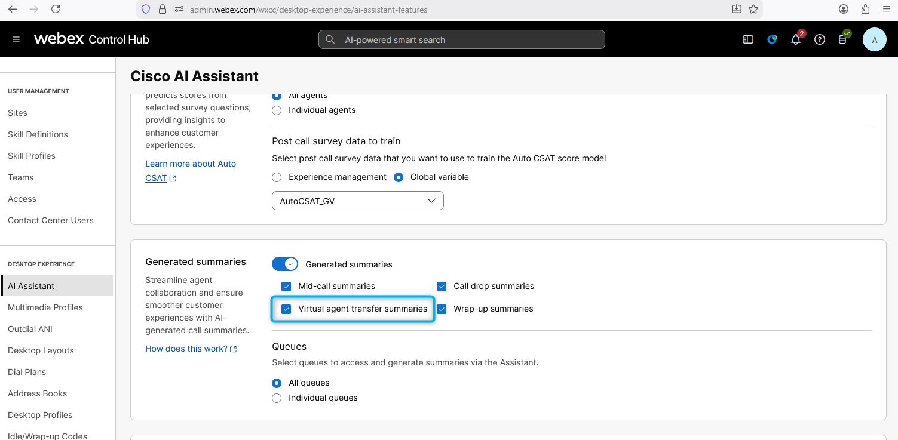
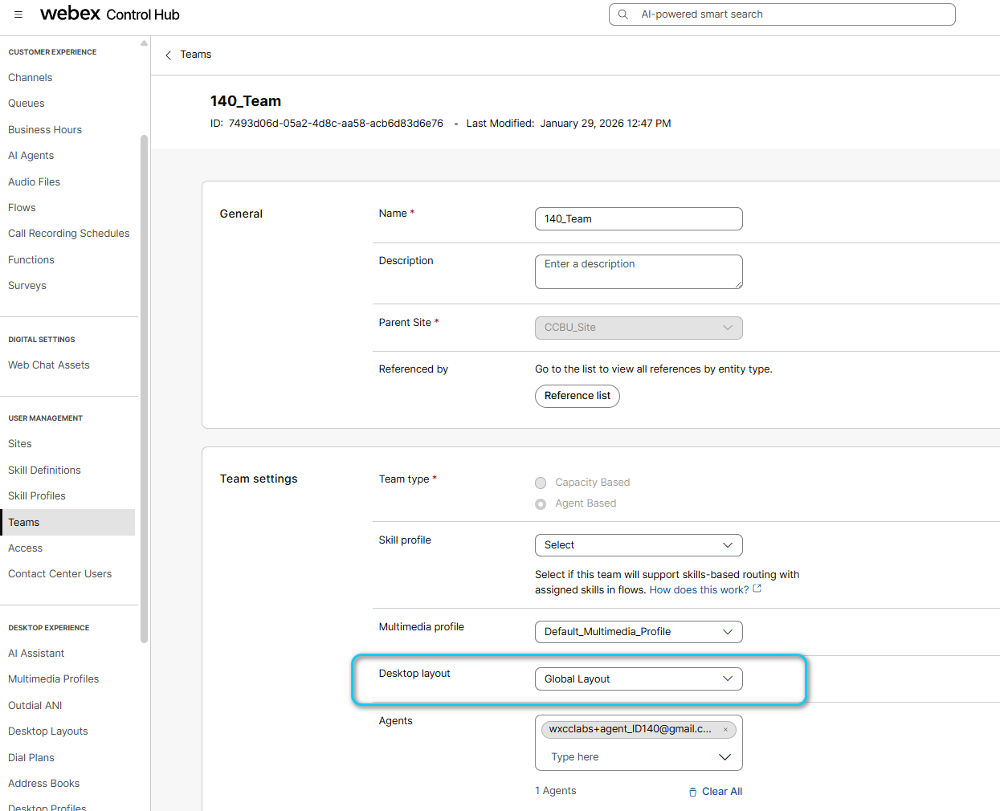
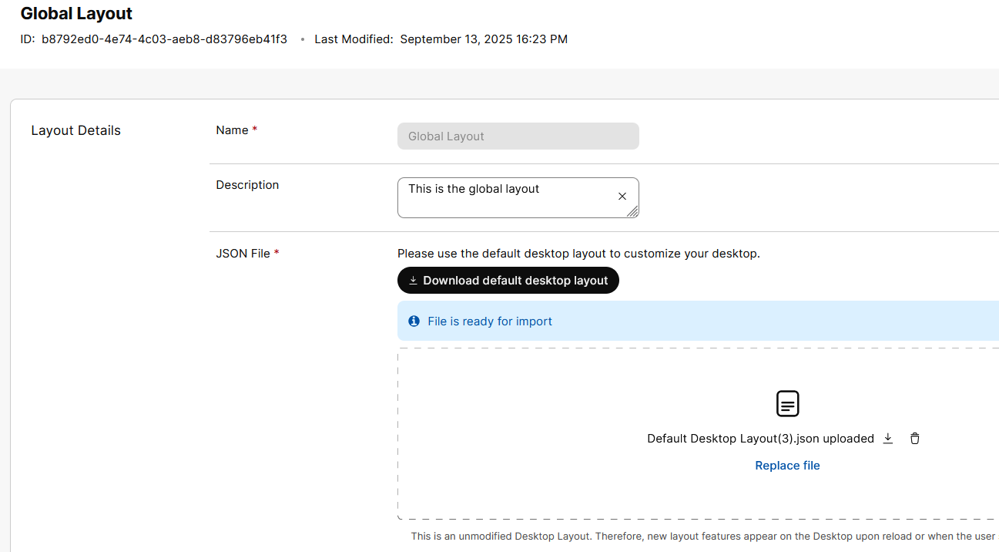
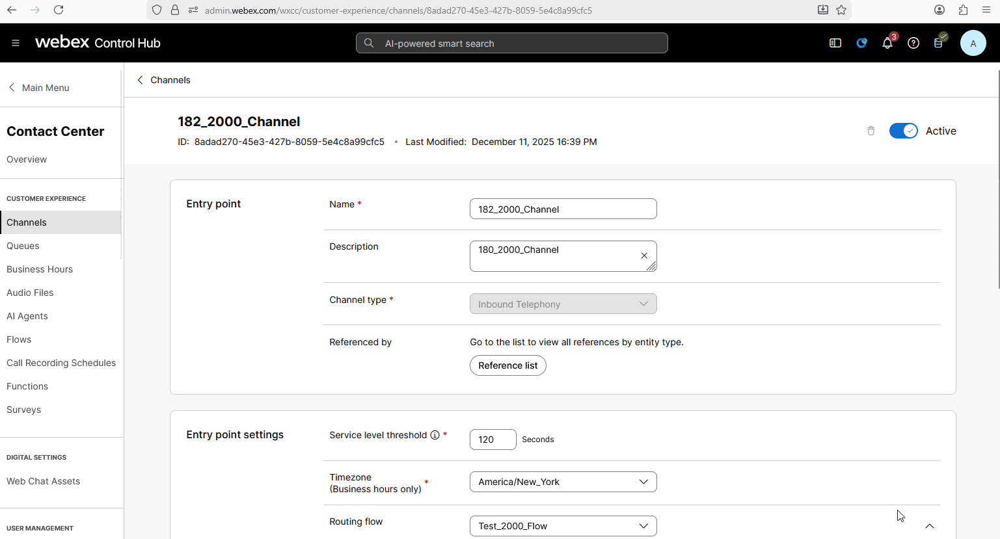
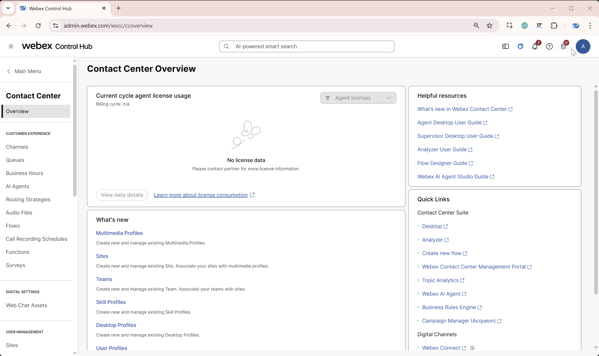
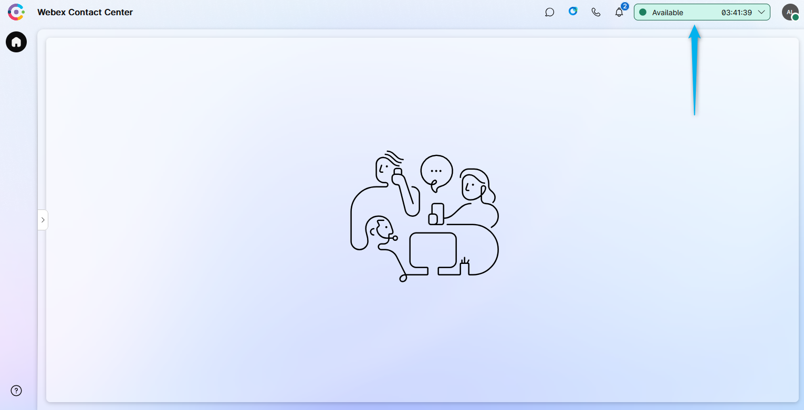
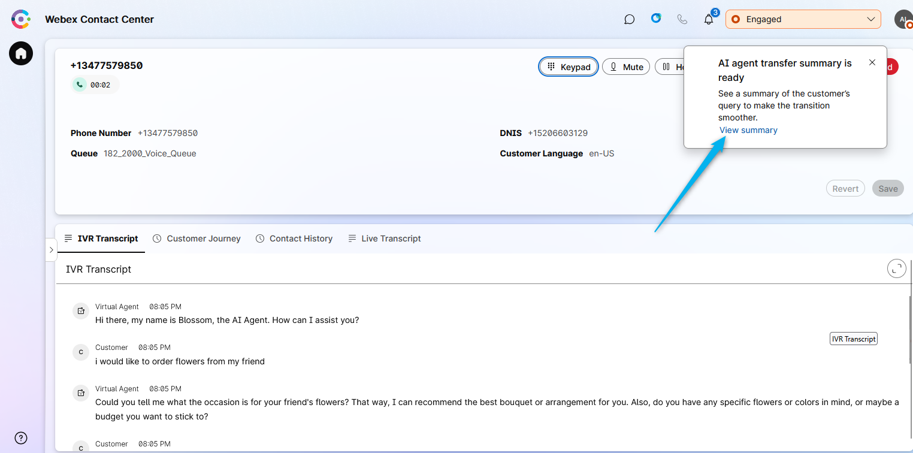
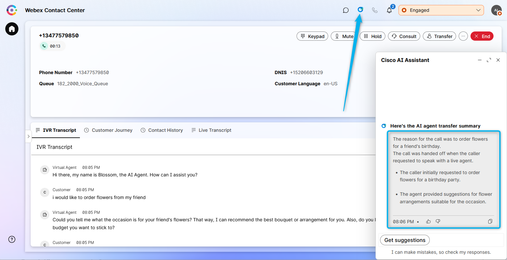

🚨 **Important Lab Dependency**

This mission requires configuration created in the following missions:

1. **[AI Agent Track ⮕ Autonomous AI Agent: Mission 1 – Create AI Autonomous Agent](../AI_Lab_Aut_Mission1/)** 
2. **[AI Agent Track ⮕ Autonomous AI Agent: Mission 2 – Integrating the AI Agent with Flow for Voice Calls](../AI_Lab_Aut_Mission1/)**

If these missions were not completed, some steps in current mission will not function correctly.

---

## Feature Description

AI Agent Transfer Summary enhances agent efficiency and elevate customer experiences.

When a customer calls the contact center and interacts with an AI Agent, they may request to speak with a live human agent at some point during the conversation. Once connected to an agent, it is important for the agent to receive a concise summary of the customer's interaction with the AI Agent. This summary provides the agent with a quick overview of the customer's call reason. The **AI Agent Handoff Summary** feature provides this summary, displaying it on the agent's desktop within the AI-Assistant Widget.

## Mission Details

Your mission is to:

1. Configure a smooth handoff to live human agent from AI Agent. [*this was completed in **AI Agent Track: Mission 1***]
2. Create a summary of Virtual Agent transcript to be provided during handoff.

## [READ ONLY] Verify feature configuration

1. On production Webex CC tenant you should have the new AI Assistant SKU **A-FLEX-AI-ASST** from CCW provisioned to make AI Assistant features work.

2. Once you have provisioned it, admins with the appropriate profile and access controls will be able to see the AI Assistant menu in Control Hub. From there, the customer can enable/disable the **Virtual Agent Transfer Summary** feature from the Control Hub.
   

3. The Agent needs to be logged in to the Team that is configured with Desktop Layout that has "ai-assistant" features configured
   (**Note: Default desktop layout already incudes the AI Agent Assistance widget**).  
    Agents Team:
     
     Desktop Layout:
   
     Desktop Layout file: Make sure **ai-assistant** is configured under the **advancedHeader** in case you are using a custom Layout file.
   
    You can download default desktop layout from the **Desktop Layout** configuration page by clicking on **Download default desktop layout** button.  

## Testing Agent Transfer Summary Feature

1. Switch to Control Hub and navigate to **Channels** under Customer Experience Section
    
    > - Locate your Inbound Channel (you can use the search):  **Your_Attendee_ID_Channel**
    > 
    > - Select the Routing Flow: **AutonomousAIFlow_2000_Your_Attendee_ID**
    > 
    > - Select the Version Label: **Latest**
    > 
    > - Click **Save** in the lower right corner of the screen

     

2. Your Agent Desktop session should still be active. If it is not, launch **Desktop** using the cross-launch link in **Control Hub**.

    **

See how to run Agent Desktop from the Control Hub
**

    

    

3. Make your agent **Available** and you're ready to make a call.
   

4. Place a test call to the number that is associated with you Channel **Your_Attendee_ID_Channel**, and, for example, mention that you need some flowers for a wedding party. **Allow the AI Agent to complete its response before requesting to transfer the call to a live human agent**. Then ask the AI Agent to transfer you to the human agent.

5. You will see a window with the message **"AI agent transfer summary is ready"** pop up. You can click on **View Summary** from the window.
   

6. The **AI agent transfer summary is ready** notification will disappear after a few seconds. However, you can always reopen it by clicking on the AI Assistant widget.
   

<strong>Congratulations, you have officially completed this mission! 🎉🎉 </strong>

