🚨 **<span style="color: blue;">Important Lab Dependency</span>**

This mission requires configuration created in the following missions:

- **[Core Track: Mission 1: Basic Call Routing (Flow Template, TTS, Language)](../CoreTrack_Mission1/)**<br>

If this mission was not completed, some steps in current mission will not function correctly.

## Feature Description 

**Agent Wellbeing (Burnout Detection)** feature in Webex Contact Center uses Cisco’s proprietary AI algorithms to analyze specific call metrics and transcripts to identify signs of stress and burnout in agents. The system continuously monitors shifts in agent performance, schedule, and other operational data to calculate a unique burnout index for each agent, tailored individually with separate thresholds. When an agent’s burnout level crosses a defined threshold, the AI Assistant proactively offers a 1-minute wellness break between call assignments to help the agent reset and reduce stress.

## Mission Details

Your mission is to:

 - Manually trigger Agent Wellbieng scenario for your agent


## Verify feature configuration

1. Switch to Control Hub and navigate to **AI Assistant** under Desktop Experience section. Make sure **Agent Wellbeing** feature is turned on and set to ***All Agents***. 

    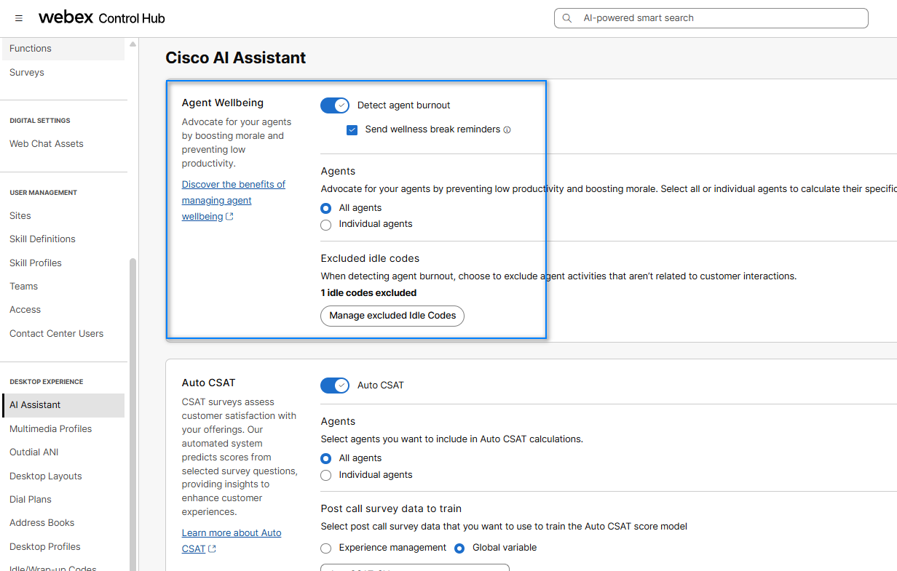

2. The Agent needs to logged in to the Team that is configured with Desktop Layout that has Agent Assistance features configured (**Note: Default desktop layout already incudes the AI Agent Assistance widget**). <br/>
   <br/>Agents Team:
   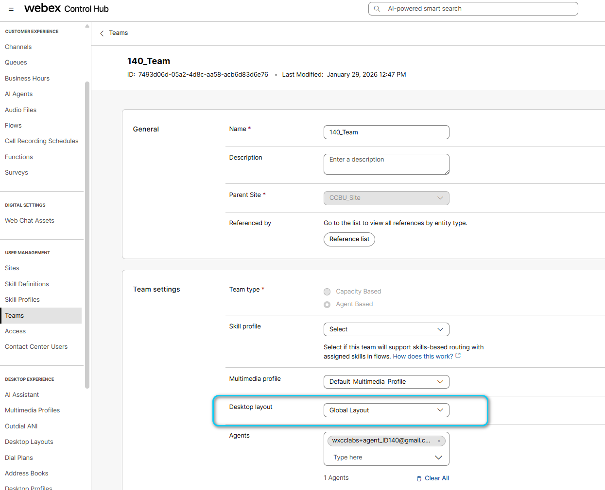  
    <br/>Desktop Layout:
   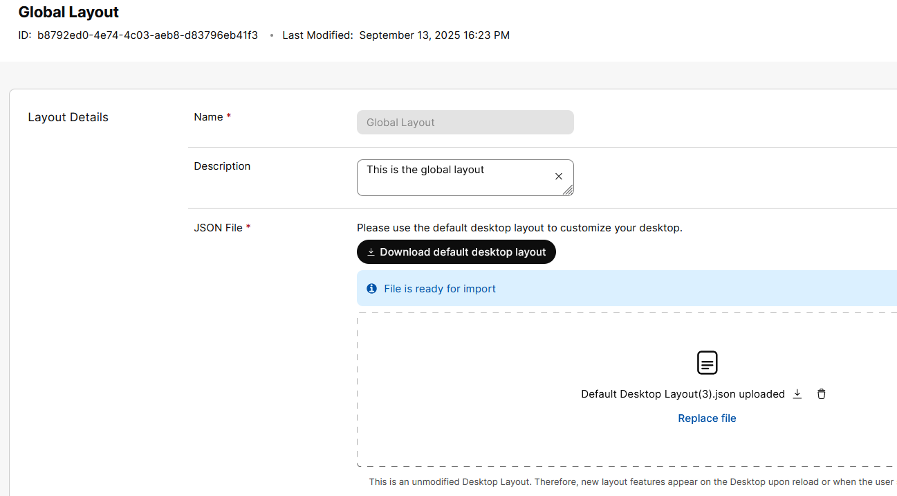
   <br/>Desktop Layout file: Make sure **ai-assistant** is configured under the **advancedHeader**.
   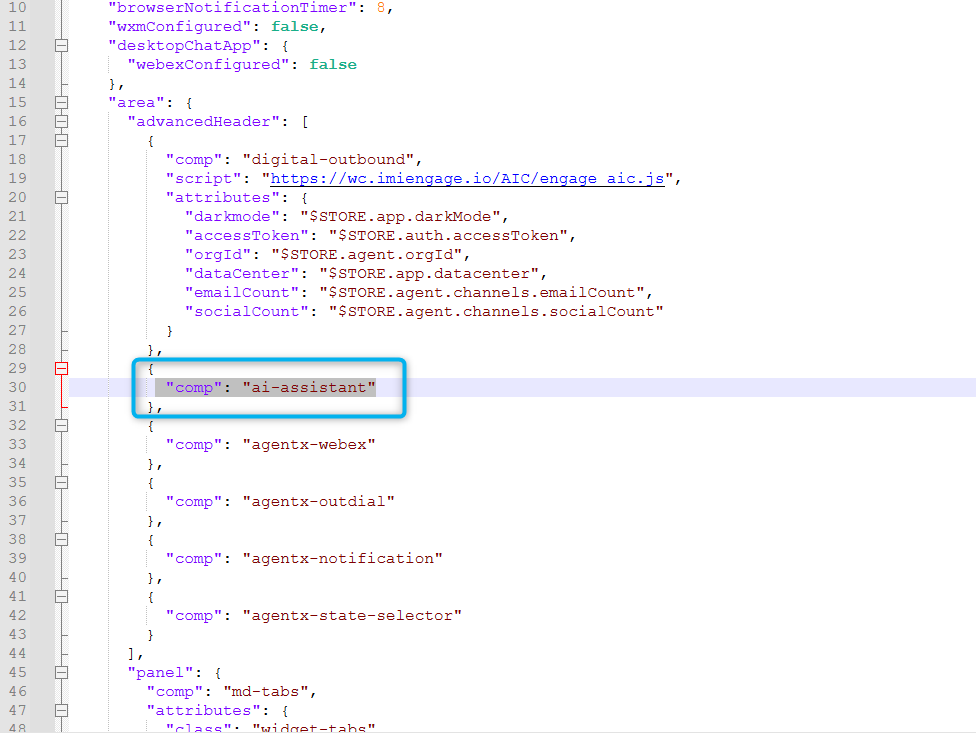
   <br/>You can download a preconfigured desktop layout here.<br/>
   [Desktop Layout](https://drive.google.com/file/d/1EnM-2r9XOVm2EcE6ND4fL3L62qZesm5_/view?usp=sharing){:target="\_blank"}


## Build

1. Open up your voice flow <span class="attendee-id-container">**Main_Flow_<span class="attendee-id-placeholder" data-prefix="Main_Flow_">Your_Attendee_ID</span><span class="copy" title="Click to copy!"></span></span>** and click on **Edit**.
    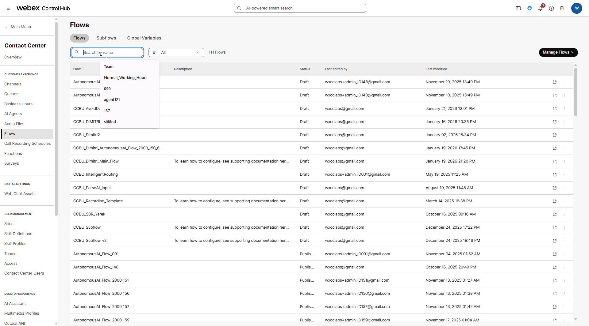 

2. Click on the **Event Flow**
3. Locate **PhoneContactEnded** node and remove connection between this and **EndFlow** nodes.

    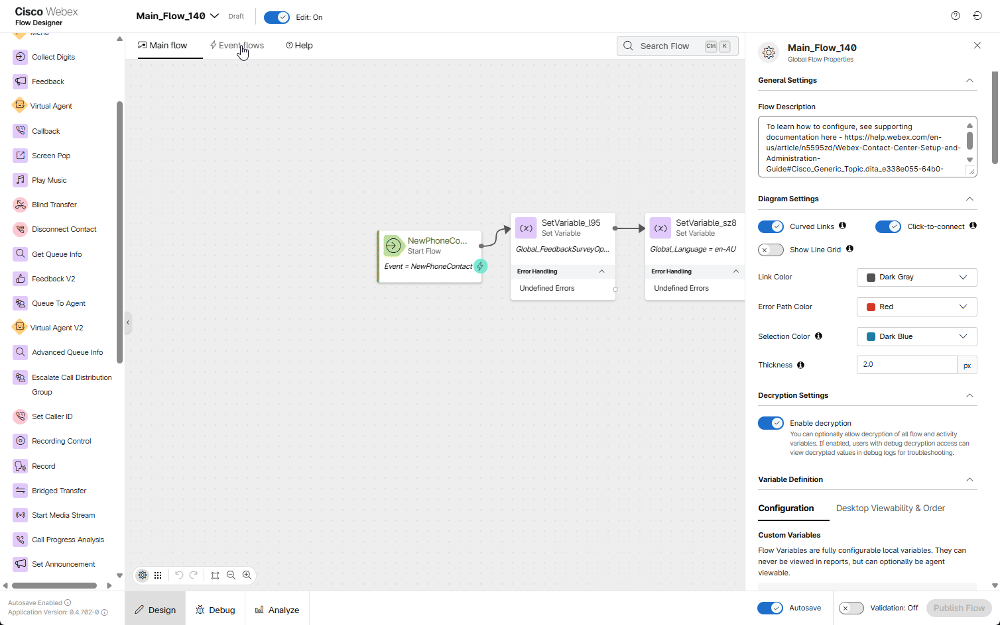 

4. Add an **HTTP Request** node for our query:

    > - Connect the output node edge from the **PhoneContactEnded** node to this node
    > 
    > - Select **Use Authenticated Endpoint**
    >
    > - Connector: **WxCC_API**<span class="copy-static" data-copy-text="WxCC_API"><span class="copy" title="Click to copy!"></span></span>
    > 
    > - Path: **/agentburnout/mock/event**<span class="copy-static" data-copy-text="/agentburnout/mock/event"><span class="copy" title="Click to copy!"></span></span>
    > 
    > - Method: **POST**<span class="copy-static" data-copy-text="POST"><span class="copy" title="Click to copy!"></span></span>
    >
    > - Content Type: **Application/JSON**<span class="copy-static" data-copy-text="Application/JSON"><span class="copy" title="Click to copy!"></span></span>
    >
    > Request Body:  
    ```JSON
    {
        "agentId": "You Agent ID will be here",
        "orgId": "e56f00d4-98d8-4b62-a165-d05a41243d98",
        "burnoutIndex": 0.9234
    }
    ```

    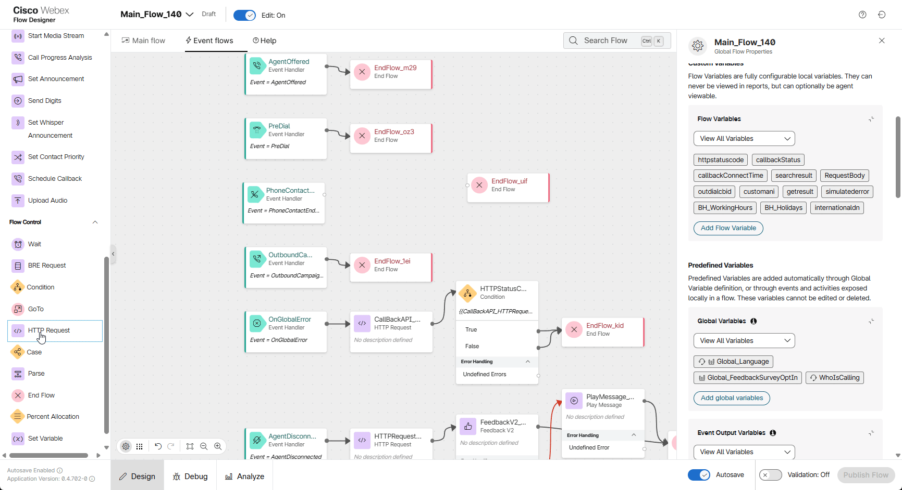 

5. Switch to **Control Hub**, navigate to **Contact Center Users** and search for your admin user (who is also you agent) **<span class="attendee-id-container">wxcclabs+admin_ID<span class="attendee-id-placeholder" data-prefix="wxcclabs+admin_ID" data-suffix="@gmail.com">Your_Attendee_ID</span>@gmail.com<span class="copy" title="Click to copy!"></span></span>** and open it. 

6. Copy the **Contact Center User Id** to the buffer, then return to your flow and change **agentid** value from <span style="color: green;">***"You Agent ID will be here"***</span> to id from the buffer. The id <span style="color: red;">**MUST**</span> be inside double quotes <span style="color: red;">**" "**</span>. Ex. *"agentId": "4333936f-dab9-4cdf-a142-dad826673eec"*

  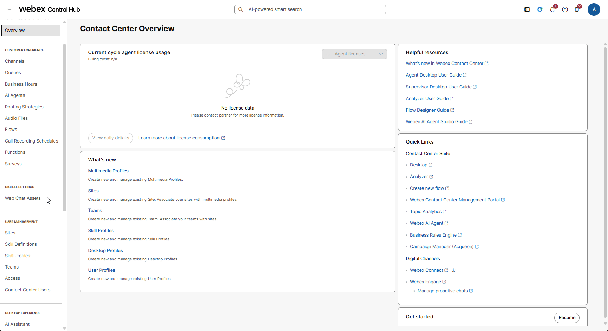 


6. Validate and publish the flow:

    > - Enable the **Validation** toggle in the bottom right corner of the flow designer window to check for any potential flow errors and recommendations.
    >
    > - If there are no **Flow Errors** after validation is complete, click on **Publish Flow** next to it.
    >
    > - In the pop-up window, ensure that the **Latest** label is selected in the **Add Version Label(s)** list, then click **Publish Flow**.

    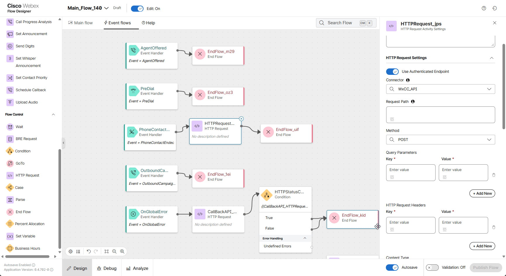 

7. Return to Control Hub to assign the Flow to your **Channel (Entry Point)**. Go to **Channels**, search for your channel **<span class="attendee-id-container"><span class="attendee-id-placeholder" data-suffix="_Channel">Your_Attendee_ID</span>_Channel<span class="copy" title="Click to copy!"></span></span>**
8. Click on **<span class="attendee-id-placeholder">Your_Attendee_ID</span>_Channel**
. In **Entry Point** settings section change the following, then click **Save** button:

    > - Routing flow: **Main_Flow_<span class="attendee-id-placeholder">Your_Attendee_ID</span>**
    >
    > - Music on hold: **defaultmusic_on_hold.wav**
    >
    > - Version label: **Latest**

    

## Testing (Simulation of Burnout Event)

!!! Note
    This simulation will demonstrate what the agent experiences when the AI model detects a threshold that initiates a wellness intervention.

1. Your Agent Desktop session should still be active. If it is not, launch **Desktop** using the cross-launch link in **Control Hub**.

    **<details><summary>See how to run Agent Desktop from the Control Hub</summary>**

    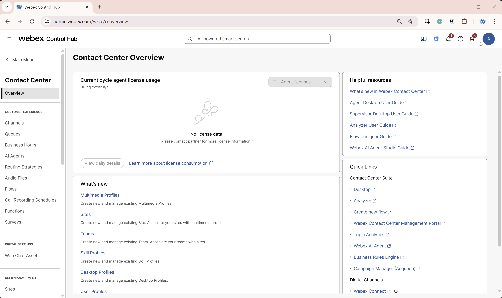

    </details>

2. Make your agent **Available** and you're ready to make a call.
   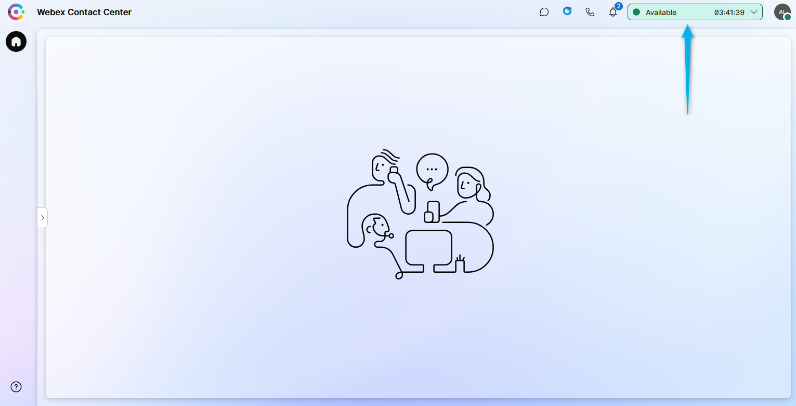

3. Place the test call to the number that is associated with your **<span class="attendee-id-container"><span class="attendee-id-placeholder" data-suffix="_Channel">Your_Attendee_ID</span>_Channel<span class="copy" title="Click to copy!"></span></span>**, and ask to talk to an agent. 

4. Answer the call and then drop the call either on Agent Desktop or on caller side.

5. Observe the actions taken by the contact center system once a burnout event is detected.
     


<p style="text-align:center"><strong>Congratulations, you have officially completed this mission! 🎉🎉 </strong></p>
