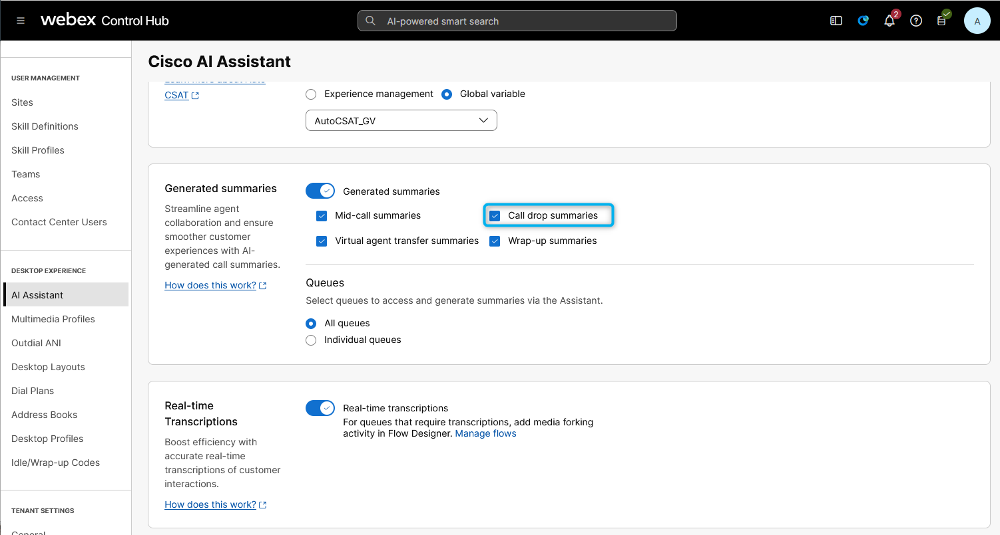
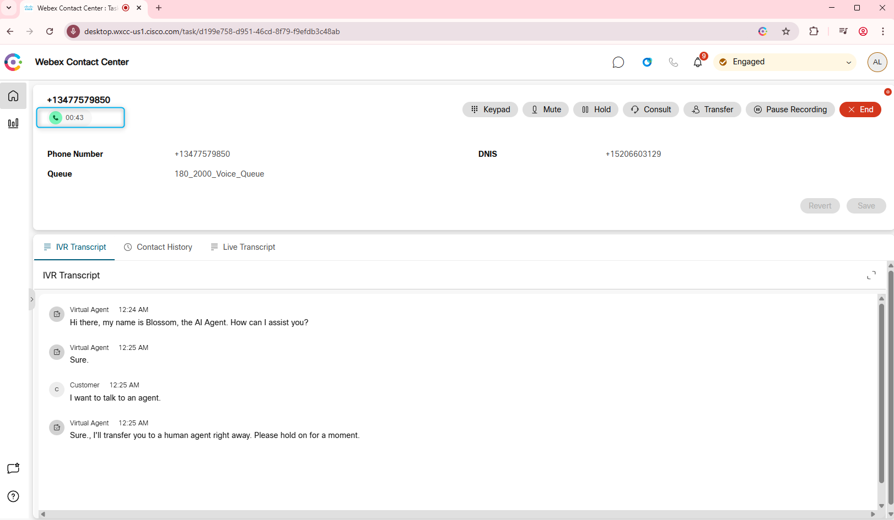
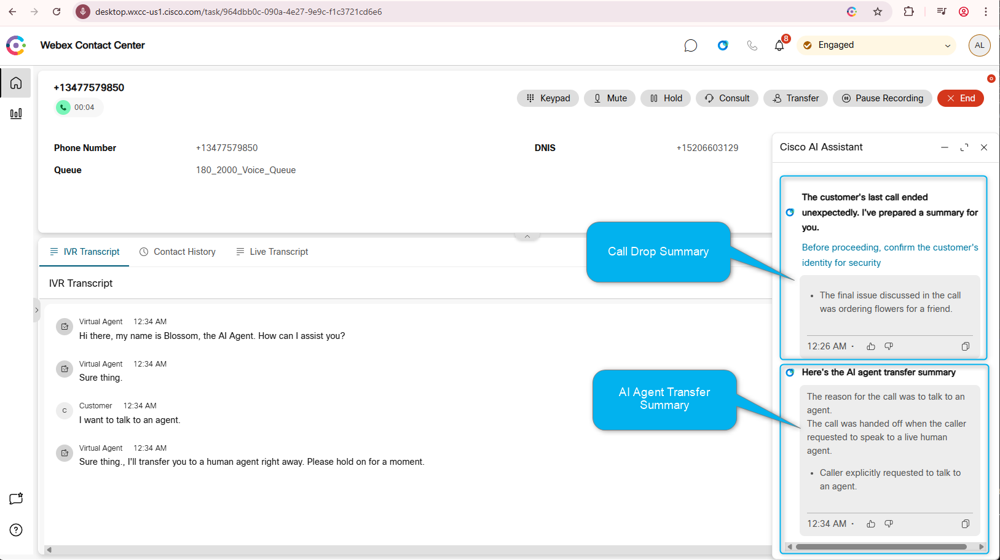

🚨 **Important Lab Dependency**

This mission requires configuration created in the following missions:

- **[Core Track: Mission 1: Basic Call Routing (Flow Template, TTS, Language)](../CoreTrack_Mission1/)** 

If this mission was not completed, some steps in current mission will not function correctly.

## Feature Description

Customers find it frustrating to repeat themselves, especially after a call drop. Now, agents can pick up where the call left off, reducing frustration and handling time, while empowering agents to work more efficiently.

The Cisco AI Assistant provides a summary of the recently dropped interaction, detailing the reason for the call and the last action discussed. This enables agents to seamlessly resume the conversation.

## Mission Details

Your mission is to:

1. Understand how **Call Drop Summary** feature is enabled.
2. Test **Call Drop Summary** feature.

## [READ ONLY] Verify feature configuration

1. You should have the new AI Assistant SKU **A-FLEX-AI-ASST** from CCW provisioned in the tenant.

2. Once you have provisioned it, admins with the appropriate profile and access controls will be able to see the AI Assistant menu in Control Hub. From there, the customer can enable/disable the **Call Drop Summaries** features from the Control Hub.
   

3. The Agent needs to logged in to the Team that is configured with Desktop Layout that has Agent Assistance features configured (**Note: Default desktop layout already incudes the AI Agent Assistance widget**).  
    Agents Team:
     
     Desktop Layout:
   
    Desktop Layout file: Make sure **ai-assistant** is configured under the **advancedHeader**.
   
    You can download a preconfigured desktop layout here. 
   [Desktop Layout](https://drive.google.com/file/d/1EnM-2r9XOVm2EcE6ND4fL3L62qZesm5_/view?usp=sharing){:target="\_blank"}

### Testing Call Drop Summary Feature

1. Switch to Control Hub to assign the Flow to your **Channel (Entry Point)**. Go to **Channels**, search for your channel **Your_Attendee_ID_Channel**
7. Click on **Your_Attendee_ID_Channel**
8. In **Entry Point** settings section change the following, then click **Save** button:

    > - Routing flow: **Main_Flow_Your_Attendee_ID**
    >
    > - Music on hold: **defaultmusic_on_hold.wav**
    >
    > - Version label: **Latest**

    

2. Your Agent Desktop session should still be active. If it is not, launch **Desktop** using the cross-launch link in **Control Hub**.

    **

See how to run Agent Desktop from the Control Hub
**

    

    

3. Make your agent **Available** and you're ready to make a call.
   

4. Place the test call to the number that is associated with your **Your_Attendee_ID_Channel**. 

5. Stay on the call for 35 - 45 seconds, as a customer ask questions such as that you want to order flowers for a friend.

6. After 35-45 seconds, end the call from the customer side.
   

7. Call back from the same number. Ask to talk to an agent.

8. Make sure you are **Available** on the Agent Desktop and answer the call. You will see AI Assistant Widget will have Call Drop Summary and the Agent Transfer Summary.
   

<strong>Congratulations, you have officially completed this mission! 🎉🎉 </strong>

