# Mission 2: Integrating the AI Agent with Flow for Voice Calls

## Mission overview

Your mission is to:

 - Integrate the AI Agent with the Voice Flow.

### Task 1. Build WxCC voice flow with AI Agent.

1. In Control Hub navigate to **Flows**, click on **Manage Flows** dropdown list and select **Create Flows**. Select **Start Fresh**.
   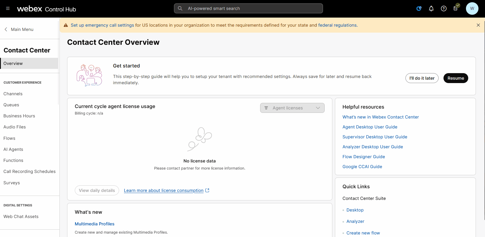 

2. Name the new flow **AutonomousAIFlow_2000_Your_Attendee_ID** and click on **Create Flow**.
   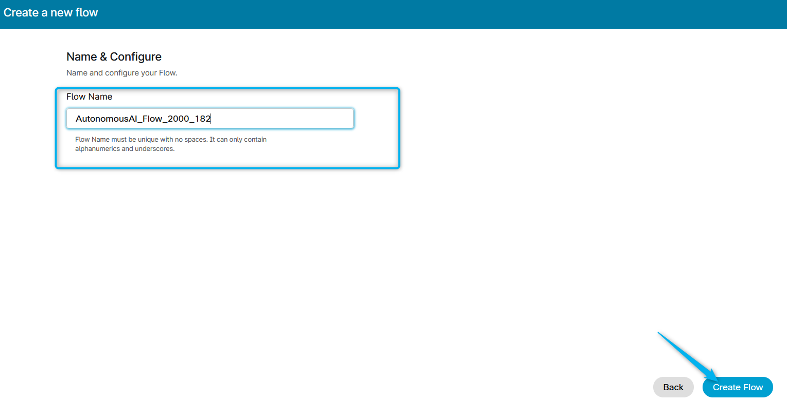 

3. Make sure the **Edit** mode at the top is set to **ON**. Then, drag and drop the **Virtual Agent V2** and **Disconnect Contact** activities from the left panel onto the Design field.

    !!! Note
        Please make sure to use **VirtualAgentV2** activity and **NOT** **VirtualAgent** also present on the Activity Library for Backward Compatibility.

    >
    > Connect the **New Phone Contact** output node edge to this **VirtualAgentV2** node.
    >
    > Connect the **Handled outputs** to **DisconnectContact**.
    >    
    > Connect the **Errored** outputs to **DisconnectContact**.
    >
    > Click on **VirtulaAgentV2** block and select **Static Contact Center AI Config**.
    >
    > Select Contact Center AI Config as **Webex AI Agent (Autonomous)**.
    >
    > Virtual Agent: **Your_Attendee_ID_2000_AutoAI_Lab**

    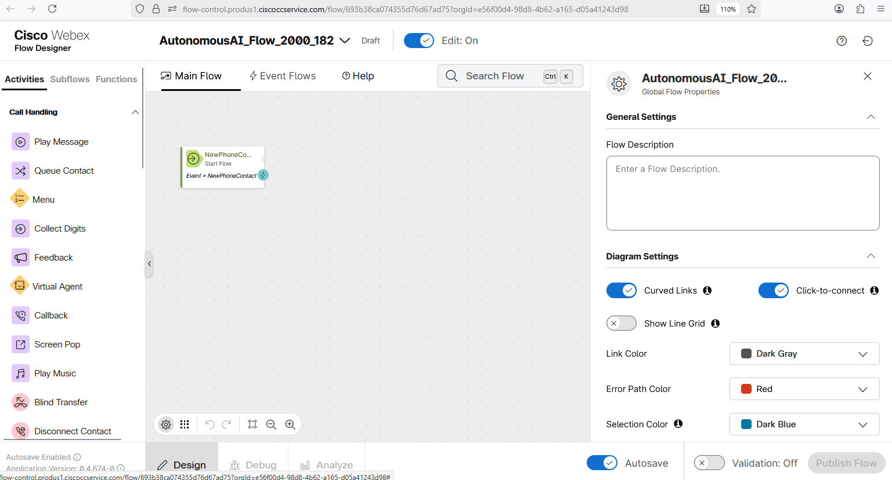 

4. Drag and drop **Queue Contact** and **Play Music** nodes. Configure them as the following:
    - **Queue Contact**

      > Connect the **Escalated** path from the **Virtual Agent V2** activity to the **Queue Contact** activity.
      >
      > Connect the **Queue Contact** activity to the **Play Music** activity.
      >
      > Connect the **Failure** path from the **Queue Contact** activity to the **Disconnect Contact** activity.
      >
      > Click on **Queue Contact** node and select **Static Queue**.
      >
      > Queue name: **Your_Attendee_ID_Queue**
    
    - **Play Music**

      > Create a loop by connecting the Play Music activity back to itself - to create a music loop, following the example provided below.
      >
      > Connect the **Failure** path from the **Play Music** activity to the **Disconnect Contact** activity.
      >
      > Click on the **Play Music** node and select Music File: **defaultmusic_on_hold_cisco_opus_no_1.wav**.
       
    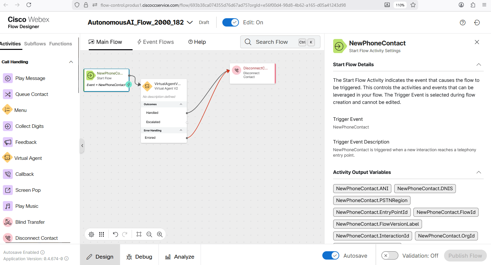 

5. Validate and publish the flow:

    > - Enable the **Validation** toggle in the bottom right corner of the flow designer window to check for any potential flow errors and recommendations.
    >
    > - If there are no **Flow Errors** after validation is complete, click on **Publish Flow** next to it.
    >
    > - In the pop-up window, ensure that the **Latest** label is selected in the **Add Version Label(s)** list, then click **Publish Flow**.

    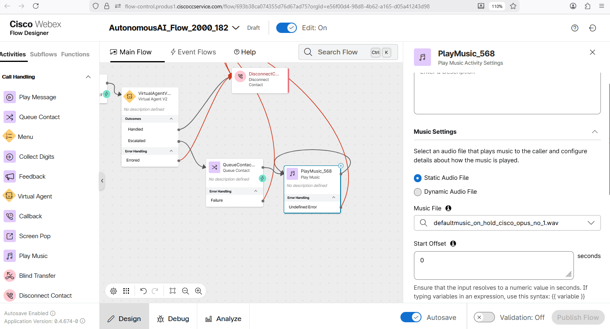 

6. Switch to Control Hub and navigate to **Channels** under Customer Experience Section
    
    > - Locate your Inbound Channel (you can use the search):  **Your_Attendee_ID_Channel**
    > 
    > - Select the Routing Flow: **AutonomousAIFlow_2000_Your_Attendee_ID**
    > 
    > - Select the Version Label: **Latest**
    > 
    > - Click **Save** in the lower right corner of the screen

    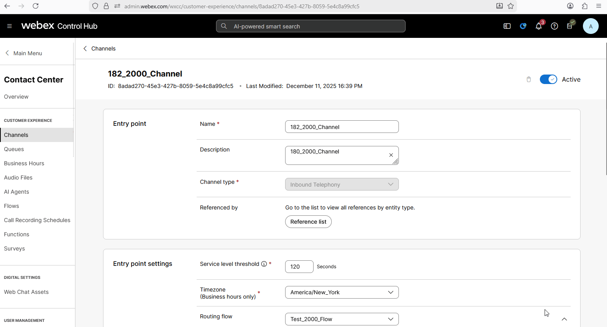 

7. Dial the support number assigned to your **Your_Attendee_ID_Channel** to test the Autonomous AI Agent over a voice call.
    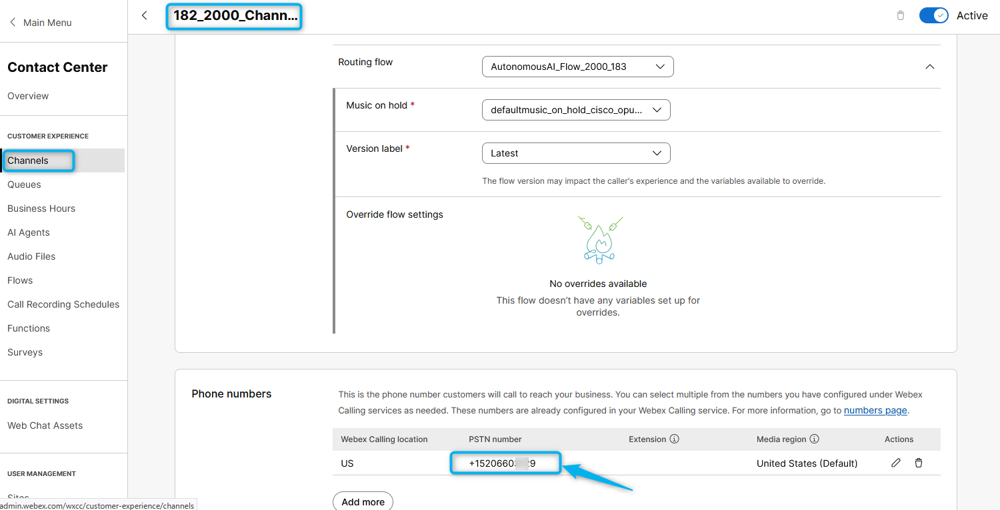
 
 

### Task 2. Test Agent Handoff Configurations

1. Go to **Control Hub** and from **Overview > Quick Links**, select **Desktop** option.
    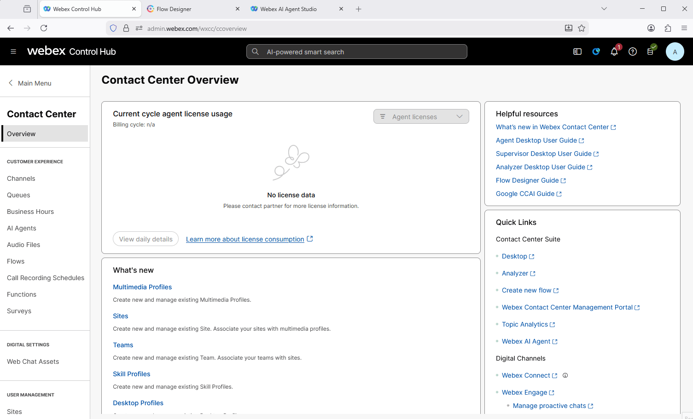 
2. Choose the team **Your_Attendee_ID_Team**. Click **Submit**. Allow browser to access Microphone by clicking **Allow** on every visit.

3. Make your agent **Available** and you're ready to make a call.
    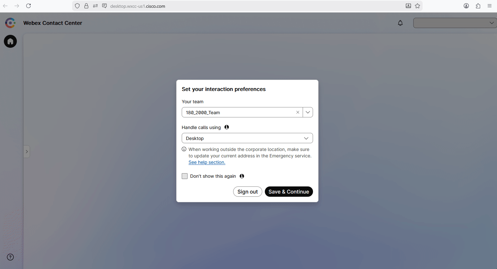 

4. Dial the support number assigned to your **Your_Attendee_ID_Channel** channel, and during the conversation with the AI agent, ask to **talk to a representative or live agent**.

5. By default, the **Conversation Transcripts** setting is enabled in **VirtualAgentV2** node.
    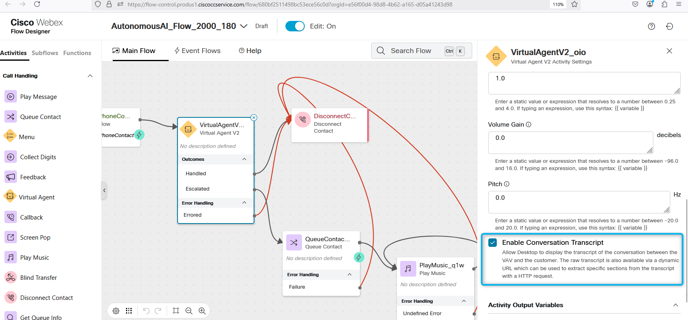 

6. With this setting enabled, the live agent can see the conversation details between the caller and the AI agent. Please check if you can view the IVR transcripts during your test calls with Agent Handoff.
    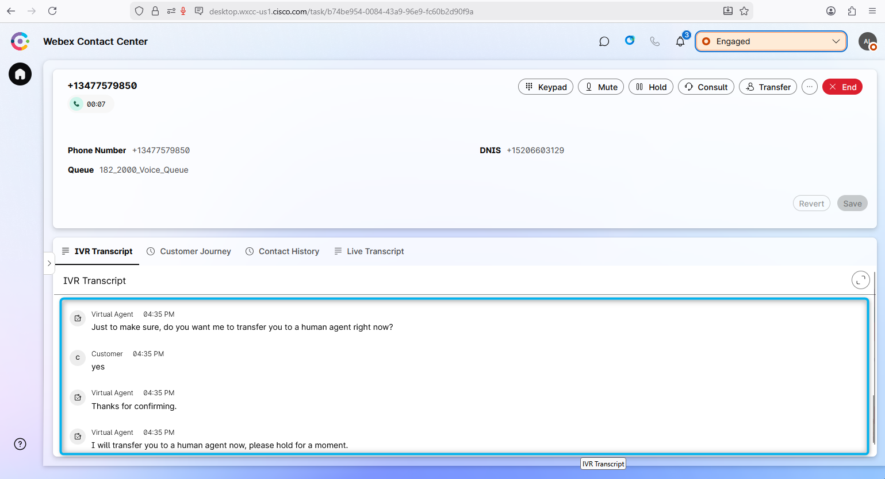

<strong>Congratulations, you have officially completed the Autonomous AI Agent lab! 🎉🎉 </strong>

