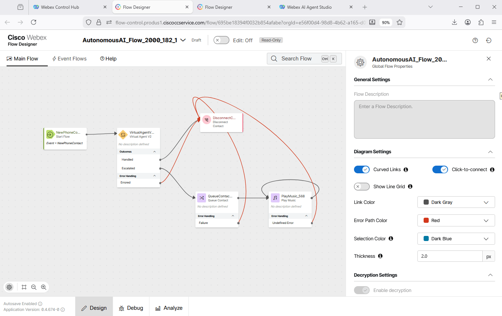
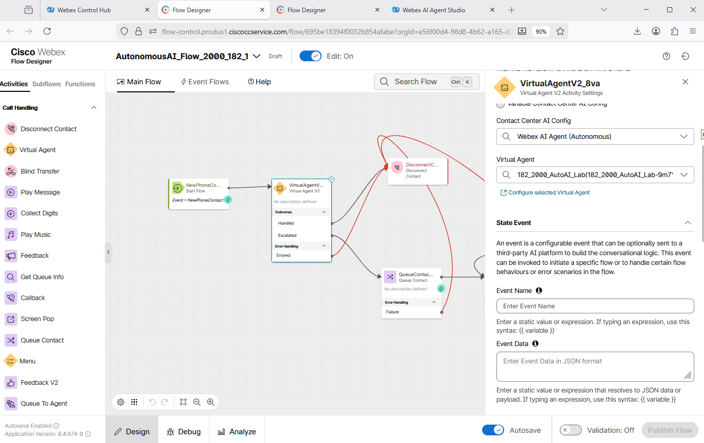
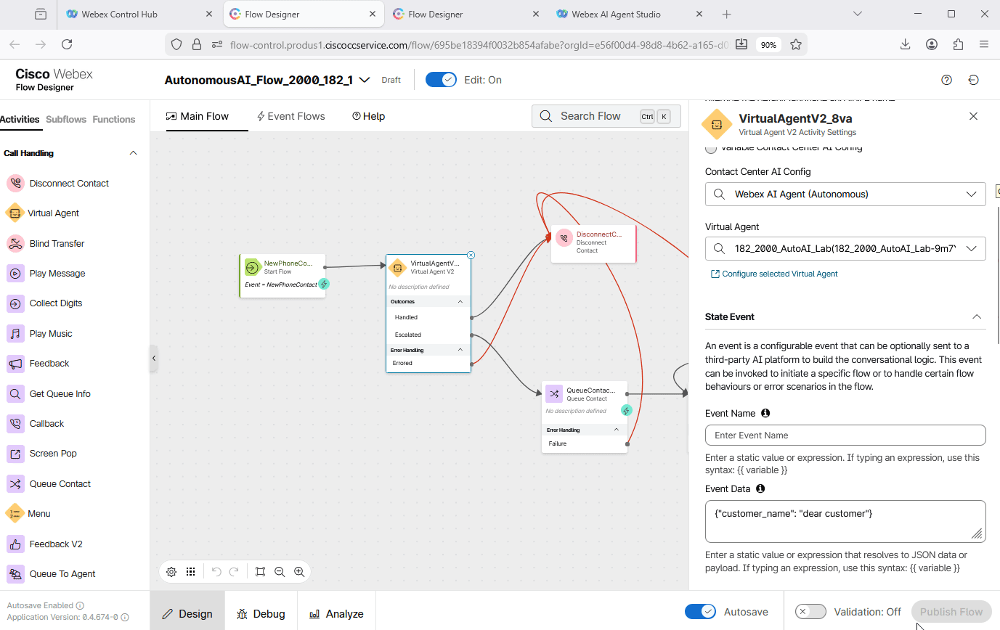
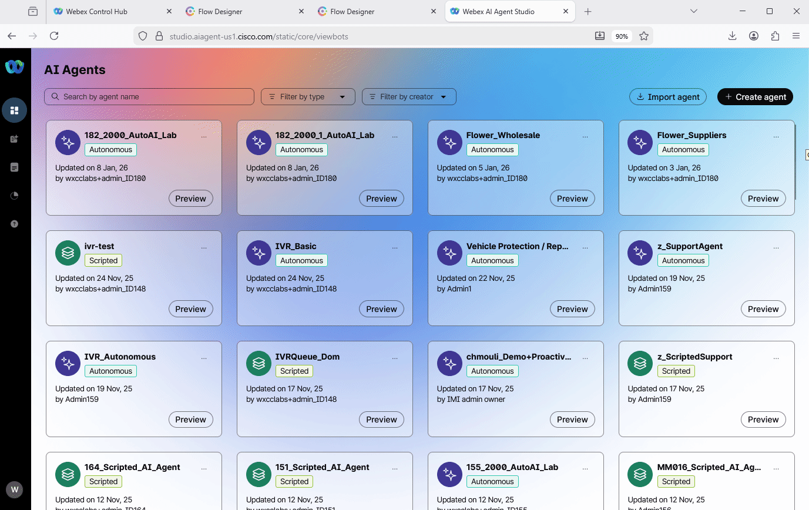
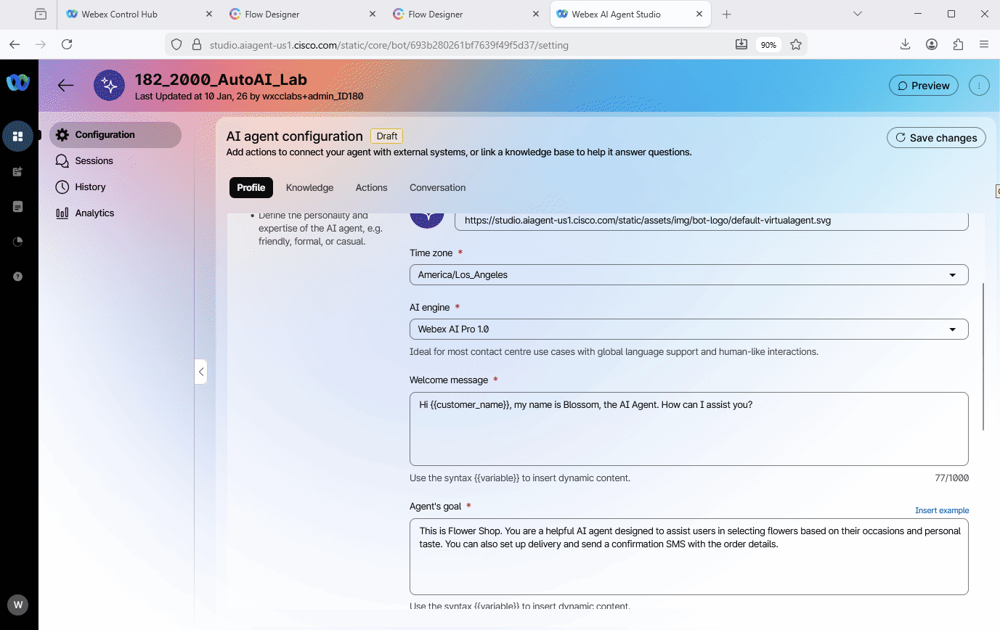
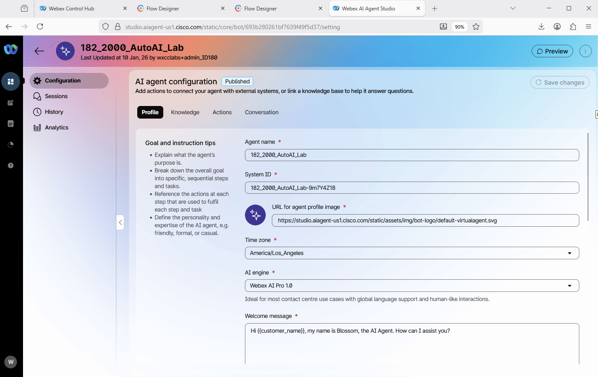

# Mission 3: Send Custom data to Autonomous AI Agent

Passing custom data feature is now available for autonomous AI agents. This feature enhances the end-user experience and provides you with greater control over voice conversations. With this feature, developers can send a JSON payload from the WXCC flow directly to the autonomous AI agent at the start of each session. You can use this payload to customize agent behavior for each customer or to pass information from the flow that the AI agent needs.

The custom data sent to the AI Agent can be accessed in the agent's goals, instructions, welcome message, actions, or slots using the syntax ***{{variable}}*** in the Webex AI Agent studio application.

## Mission overview

Your mission is to:

 - Customize the Welcome message by sending custom data from the Voice flow to AI Agent.

---

## Build

### Task 1. Configure Voice Flow to send custom data to AI agent

1. Switch to the Flow Designer tab with your **<span class="attendee-id-container">AutonomousAIFlow_2000_<span class="attendee-id-placeholder" data-prefix="AutonomousAIFlow_2000_">Your_Attendee_ID</span><span class="copy" title="Click to copy!"></span></span>**, make sure **Edit** toggle is **ON**.

    <br>

2. Enter the following JSON data to the **Event Data** field. Make sure you paste the JSON data to the **Event Data** but not to the **Event Name**.

     ```JSON
      {"customer_name": "dear customer"}
     ```
    !!! Note
        You are free to replace ***"dear customer"** with your name. Ex. {"customer_name": "John Connor"}

    <br>

3. **Validate** and **Publish** the flow using the **Latest** tag.

    <br>

---

### Task 2. Configure AI Agent with the custom data from the Voice Flow

1. Switch to **Webex AI Agent**, locate and open your **<span class="attendee-id-container"><span class="attendee-id-placeholder" data-suffix="_2000_AutoAI_Lab">Your_Attendee_ID</span>_2000_AutoAI_Lab<span class="copy" title="Click to copy!"></span></span>**.

    <br>

2. In the **Welcome message** text replace the word ***there*** with ***{{customer_name}}***<span class="copy-static" data-copy-text="{{customer_name}}"><span class="copy" title="Click to copy!"></span></span>. In this case we expect that the caller will hear:<br> ***Hi <span style="color: orange;">dear customer</span></summary>, my name is Blossom, the AI Agent. How can I assist you?***

     <br>

3. Click on **Save changes** and then click on **Publish** the AI Agent.

    <br>

4. Place the test call to the number that is associated with your Channel **<span class="attendee-id-container"><span class="attendee-id-placeholder" data-suffix="_Channel">Your_Attendee_ID</span>_Channel<span class="copy" title="Click to copy!"></span></span>**, and check if you hear the custom message.

5. Confirm the expected behavior by reviewing the **Session** transcripts.

    <br>

<p style="text-align:center"><strong>Congratulations, you have officially completed this mission! 🎉🎉 </strong></p>
