# Mission 4: Configure Fulfilment Action and create an order


**<details><summary>Good to Know: <span style="color: blue;">What is fulfilment Action?</span></summary>**

Fulfilment Action is a task that an AI agent performs by understanding user intents and completes by connecting to external systems over API.

For more information, visit [Webex Documentation](https://help.webex.com/en-us/article/ncs9r37/Webex-AI-Agent-Studio-Administration-guide#concept-template_5ea99e1f-a679-4cf9-8e33-7a4f83d9f66a){:target="\_blank"}.

</details>

## Mission overview

Your mission is to:

 - Configure Fulfilment action to collect order details from the customer and send them to a third-party application via APIs.

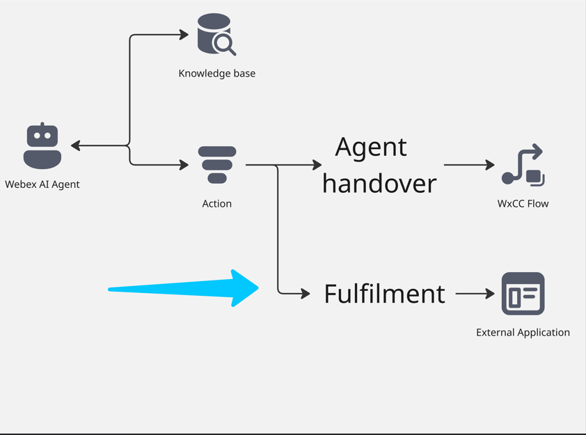

---

## Build

### Task 1. Create Service and AI Agent Flow in Webex Connect

1. In **Control Hub**, go to **Contact Center** > **Overview** and open up the **Webex Connect** Portal.
    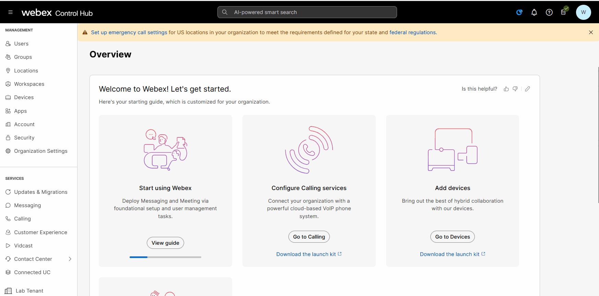<br>

2. Create a new Service with name **<span class="attendee-id-container"><span class="attendee-id-placeholder" data-suffix="_2000_Service">Your_Attendee_ID</span>_2000_Service<span class="copy" title="Click to copy!"></span></span>**.<br>
    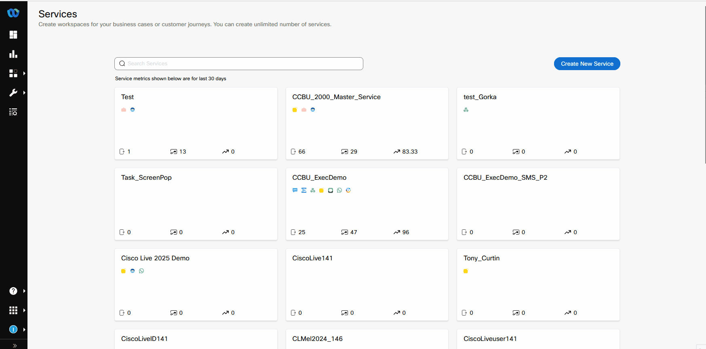<br>

3. Click on **Flows** and create new flow with the name **<span class="attendee-id-container">Create_Order_Flowers_<span class="attendee-id-placeholder" data-prefix="Create_Order_Flowers_">Your_Attendee_ID</span><span class="copy" title="Click to copy!"></span></span>**.<br>
    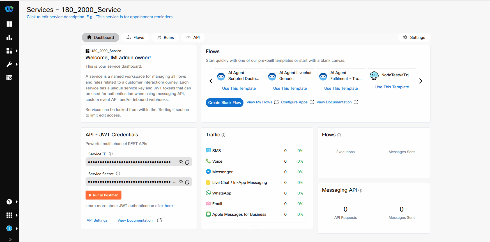<br>

4. From the Integrations list, select **AI Agent**.
    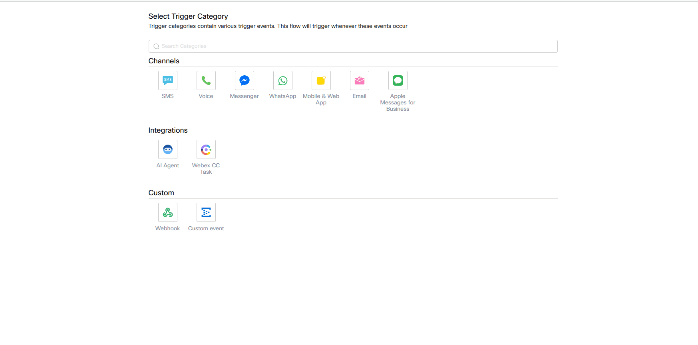<br>

5. For now, **Save** the flow and **Make it live**. We will return to configuring this flow later. Creating it now is necessary to complete configurations in the Webex AI Agent Portal.
    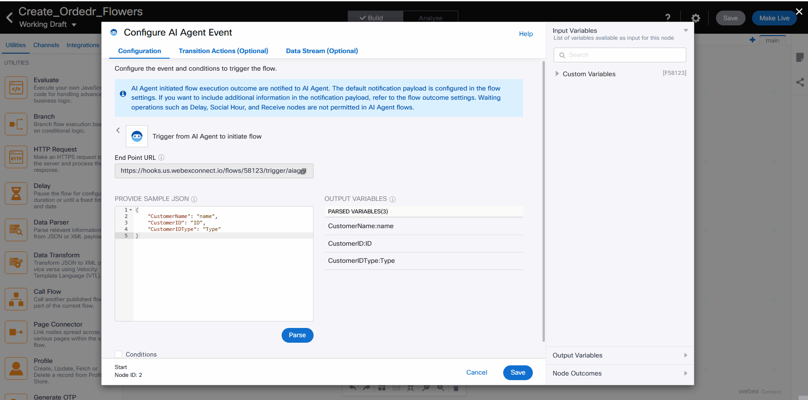<br>

### Task 2. Configure Action in the AI Studio

1. Switch to **Webex AI Agent Portal**.
    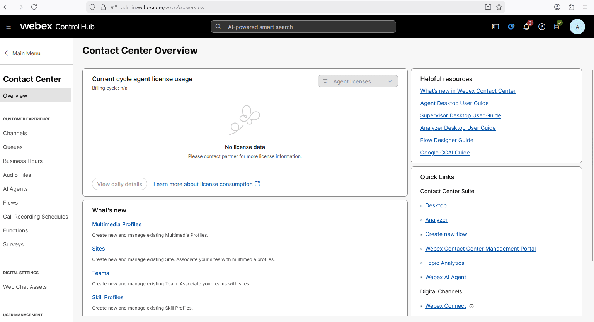<br>

2. Select your AI agent with name **<span class="attendee-id-container"><span class="attendee-id-placeholder" data-suffix="_2000_AutoAI_Lab">Your_Attendee_ID</span>_2000_AutoAI_Lab<span class="copy" title="Click to copy!"></span></span>** that you created earlier and go to **Actions**. You will see one Action is already created by default for the Agent Handover. We will now create few more actions.<br>
    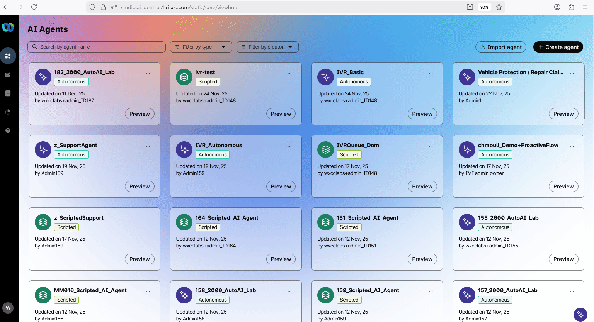<br>

3. Click on create **New Action**. From the drop-down option, select **Fulfillment action**.
    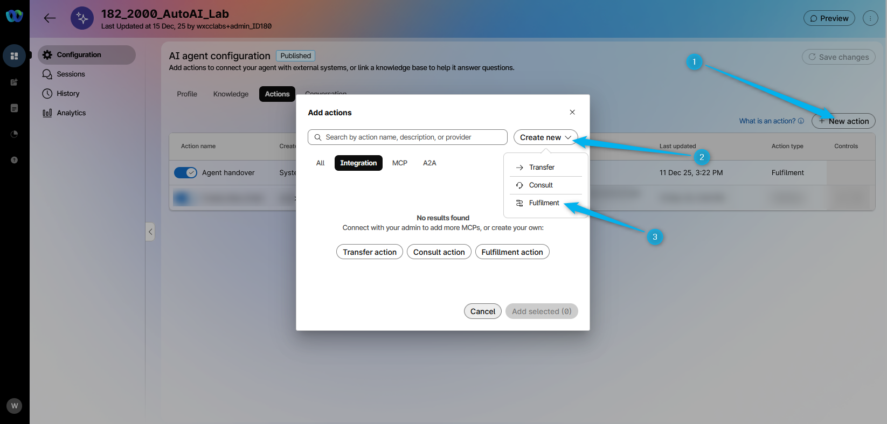<br>

4. Configure new action as follows:

    > - Action name: **Create_New_Order**<span class="copy-static" data-copy-text="Create_New_Order"><span class="copy" title="Click to copy!"></span></span><br>
    > - Action description: **Collect order details, delivery address, total and response with the orderNumber once the order is completed.**<span class="copy-static" data-copy-text="Collect order details, delivery address, total and response with the orderNumber once the order is completed."><span class="copy" title="Click to copy!"></span></span><br>
    > - Action score: select **Slot filling and fulfillment** from the drop-down list.<br>
    
    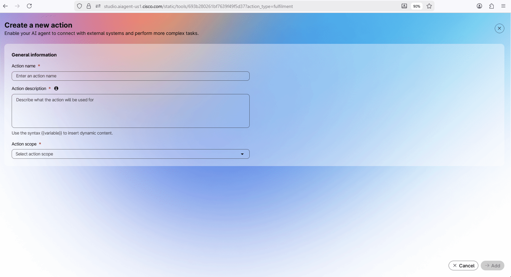<br>

5. Scroll down and click to create **New input entity**. Fill up the table with the following and then click on **Add**. <br>
   > Entity Name: **address**<span class="copy-static" data-copy-text="address"><span class="copy" title="Click to copy!"></span></span><br>
   > Entity Type: **string**<span class="copy-static" data-copy-text="string"><span class="copy" title="Click to copy!"></span></span><br>
   > Description: **Collect the customer's delivery address**<span class="copy-static" data-copy-text="Collect the customer's delivery address"><span class="copy" title="Click to copy!"></span></span><br>
   > Add example: **548 Catalina Drive, Cary, NC 27515**<span class="copy-static" data-copy-text="548 Catalina Drive, Cary, NC 27515"><span class="copy" title="Click to copy!"></span></span><br>
   > Required: **Yes**<br>
    <br>

6. By following the same pattern, create a new entity that specifies whether the customer requires delivery. <br>
   > Entity Name: **delivery**<span class="copy-static" data-copy-text="delivery"><span class="copy" title="Click to copy!"></span></span><br>
   > Entity Type: **string**<span class="copy-static" data-copy-text="string"><span class="copy" title="Click to copy!"></span></span><br>
   > Description: **Check if the customer needs delivery or not. Event if they want to proceed with order without specifying the delivery details. If the customer wants to confirm the order but didn't specify if they need delivery or not, ask one more time if they need the delivery or not.**<span class="copy-static" data-copy-text="Check if the customer needs delivery or not. Event if they want to proceed with order without specifying the delivery details. If the customer wants to confirm the order but didn't specify if they need delivery or not, ask one more time if they need the delivery or not."><span class="copy" title="Click to copy!"></span></span><br>
   > Add example: **Yes**<span class="copy-static" data-copy-text="Yes"><span class="copy" title="Click to copy!"></span></span><br>
   > Add example: **No**<span class="copy-static" data-copy-text="No"><span class="copy" title="Click to copy!"></span></span><br>
   > Required: **Yes**

7. By following the same pattern, create a new entity to collect the customer's phone number.<br>
   > Entity Name: **phoneNumber**<span class="copy-static" data-copy-text="phoneNumber"><span class="copy" title="Click to copy!"></span></span><br>
   > Entity Type: **string**<span class="copy-static" data-copy-text="string"><span class="copy" title="Click to copy!"></span></span><br>
   > Description: **Collect customer's phone number. Before the customer complete the order, ask if they would like to receive confirmation over the SMS. If so, collect the phone number.**<span class="copy-static" data-copy-text="Collect customer's phone number. Before the customer complete the order, ask if they would like to receive confirmation over the SMS. If so, collect the phone number."><span class="copy" title="Click to copy!"></span></span><br>
   > Add example: **3477579861**<span class="copy-static" data-copy-text="3477579861"><span class="copy" title="Click to copy!"></span></span><br>
   > Required: **Yes**

8. By following the same pattern, create a new entity to collect the customer's order details.<br>
   > Entity Name: **orderDetails**<span class="copy-static" data-copy-text="orderDetails"><span class="copy" title="Click to copy!"></span></span><br>
   > Entity Type: **string**<span class="copy-static" data-copy-text="string"><span class="copy" title="Click to copy!"></span></span><br>
   > Description: **Collect the flowers and bouquets information that customer orders. Make sure to do correct math. If one rose is 20 dollars and the customer would like buy 9 roses then the price should be 180 dollars. Don't use double quotes (") in the generated responses.**<span class="copy-static" data-copy-text="Collect the flowers and bouquets information that customer orders. Make sure to do correct math. If one rose is 20 dollars and the customer would like buy 9 roses then the price should be 180 dollars. Don't use double quotes (") in the generated responses."><span class="copy" title="Click to copy!"></span></span><br>
   > Add example: **Romantic Roses standard bouquet and one more bouquet with 9 roses**<span class="copy-static" data-copy-text="Romantic Roses standard bouquet and one more bouquet with 9 roses"><span class="copy" title="Click to copy!"></span></span><br>
   > Required: **Yes**

9. By following the same pattern, create a new entity to store the total price information of the order.<br>
   > Entity Name: **orderTotal**<span class="copy-static" data-copy-text="orderTotal"><span class="copy" title="Click to copy!"></span></span><br>
   > Entity Type: **string**<span class="copy-static" data-copy-text="string"><span class="copy" title="Click to copy!"></span></span><br>
   > Description: **After the customer inform if they need delivery or not, and confirm that they would like to proceed with completing the order, collect the Total information and assigned it to this slot.**<span class="copy-static" data-copy-text="After the customer inform if they need delivery or not, and confirm that they would like to proceed with completing the order, collect the Total information and assigned it to this slot."><span class="copy" title="Click to copy!"></span></span><br>
   > Add example: **150 dollars, 70 dollars**<span class="copy-static" data-copy-text="150 dollars, 70 dollars"><span class="copy" title="Click to copy!"></span></span><br>
   > Required: **Yes**

10. By following the same pattern, create a new entity to store the order status information.<br>
   > Entity Name: **status**<span class="copy-static" data-copy-text="status"><span class="copy" title="Click to copy!"></span></span><br>
   > Entity Type: **string**<span class="copy-static" data-copy-text="string"><span class="copy" title="Click to copy!"></span></span><br>
   > Description: **Always create it as "new"**<span class="copy-static" data-copy-text="Always create it as "new""><span class="copy" title="Click to copy!"></span></span><br>
   > Add example: **new**<span class="copy-static" data-copy-text="new"><span class="copy" title="Click to copy!"></span></span><br>
   > Required: **Yes**


11. At this point you should see 6 created entities. Please double check that your configuration matches the screenshot below.
    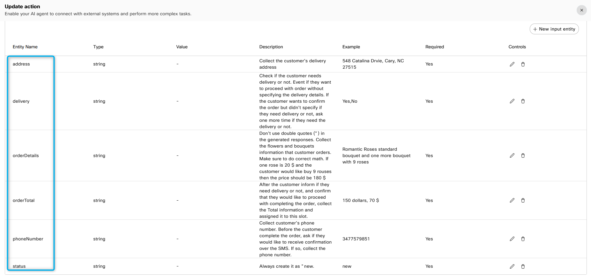<br>

12. Scroll down to **Webex Connect Builder Fulfillment**, select Service: **<span class="attendee-id-container"><span class="attendee-id-placeholder" data-suffix="_2000_Service">Your_Attendee_ID</span>_2000_Service<span class="copy" title="Click to copy!"></span></span>** and Flow: **<span class="attendee-id-container">Create_Order_Flowers_<span class="attendee-id-placeholder" data-prefix="Create_Order_Flowers_">Your_Attendee_ID</span><span class="copy" title="Click to copy!"></span></span>**. Click on **Add**.<br>
    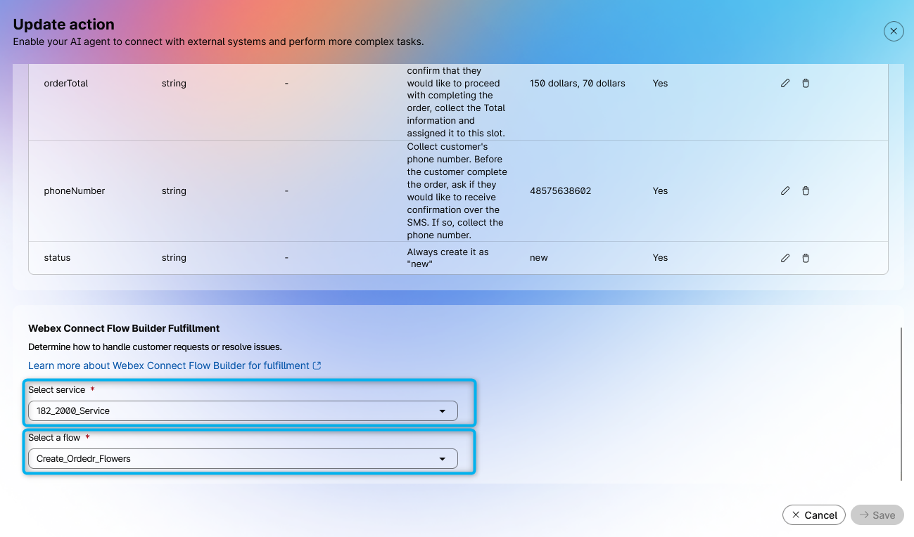<br>

13. **Publish** the update of your AI Agent. Provide any version name in popped up window (e.g. "1.1").<br>
    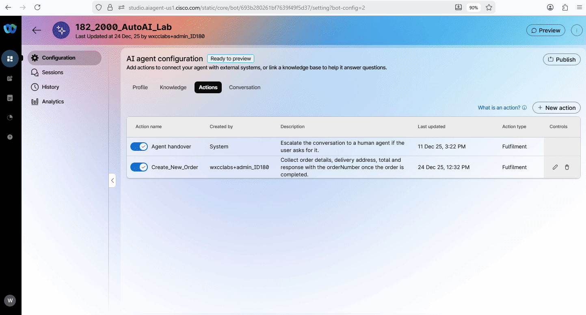<br>

### Task 3. Deliver collected order information to Webex Connect for fulfillment

1.  Switch to **Webex Connect** portal, select the Service **<span class="attendee-id-container"><span class="attendee-id-placeholder" data-suffix="_2000_Service">Your_Attendee_ID</span>_2000_Service<span class="copy" title="Click to copy!"></span></span>**, then click on **Flows** tab. 

2. Next to your **<span class="attendee-id-container">Create_Order_Flowers_<span class="attendee-id-placeholder" data-prefix="Create_Order_Flowers_">Your_Attendee_ID</span><span class="copy" title="Click to copy!"></span></span>** flow, click on a small arrow under **Actions** and then **Manage**.
    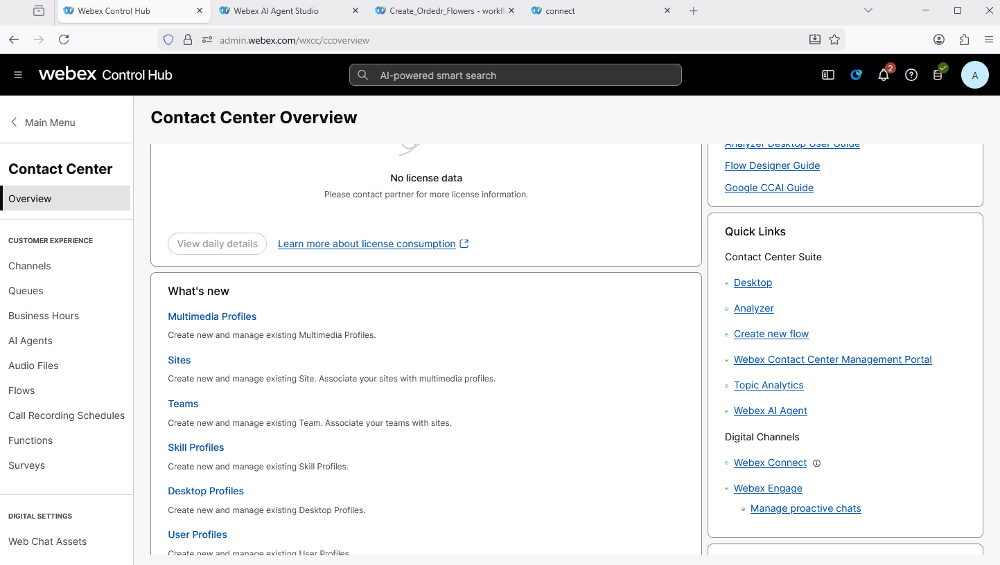<br>

3. Click on **Edit** the flow on the right top. Then double click on the **AI Agent** event. In the **PROVIDE SAMPLE JSON**, replace the standard JSON body with the following:<br>
    
    ``` JSON
    {
      "orderDetails": "ID",
      "orderTotal": "Type",
      "delivery": "Type",
      "address": "Type",
      "status": "Type",
      "phoneNumber": "Type"
    }
    ```

    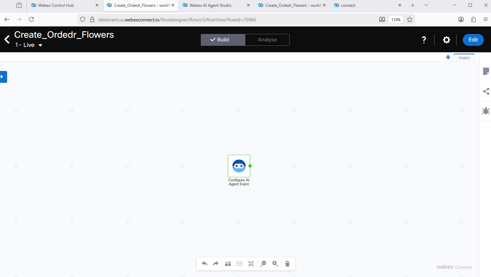<br>

4.  Click on **Parse** and **Save** the change.
    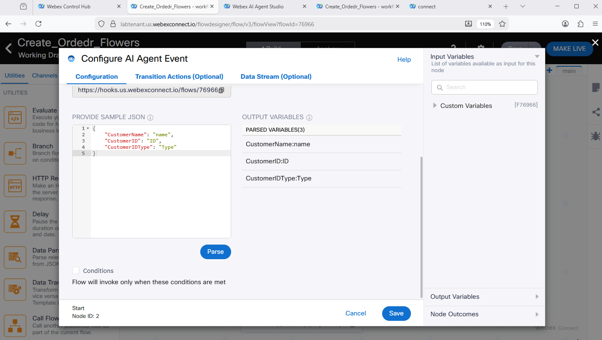<br>

5.  Drag and drop an **HTTP Request** node from the left side of the Webex Connect Flow Builder. Connect **AI Agent** node to the **HTTP Request** node.
    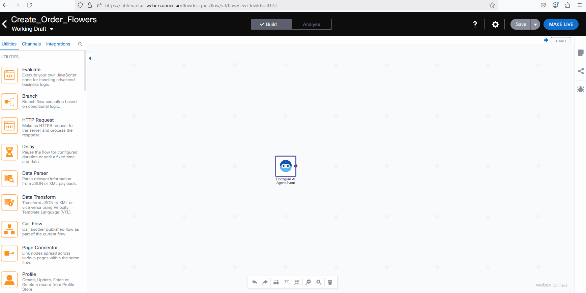<br>

6.  Open up the **HTTP Request** node and configure it with the following HTTP Request: <br>

    > Method: **POST**
    > <br>
    > Endpoint URL: [https://674481b1b4e2e04abea27c6e.mockapi.io/flowdesigner/Lab/flowers](https://674481b1b4e2e04abea27c6e.mockapi.io/flowdesigner/Lab/flowers){:target="_blank"}<span class="copy-static" data-copy-text="https://674481b1b4e2e04abea27c6e.mockapi.io/flowdesigner/Lab/flowers"><span class="copy" title="Click to copy!"></span></span><br>
    > Header: ***Content-Type***<span class="copy-static" data-copy-text="Content-Type"><span class="copy" title="Click to copy!"></span></span><br>
    > Value: ***application/json***<span class="copy-static" data-copy-text="application/json"><span class="copy" title="Click to copy!"></span></span><br>
    > <br>
    > Body: <br>
    >       ``` JSON
    >       {
    >        "orderDetails": "$(n2.aiAgent.orderDetails)",
    >        "orderTotal": "$(n2.aiAgent.orderTotal)",
    >        "delivery": "$(n2.aiAgent.delivery)",
    >        "address": "$(n2.aiAgent.address)",
    >        "status": "$(n2.aiAgent.status)",
    >        "phoneNumber": "$(n2.aiAgent.phoneNumber)"
    >       }
    >       ```   
    > <br>

7. In the same configuration window make sure **Output Variable Type** set to **JSON**. Then click on **+Add Variable**<br> 

    > Output Variable Name: **orderNumber**<span class="copy-static" data-copy-text="orderNumber"><span class="copy" title="Click to copy!"></span></span><br>
    > Response Entity: **Body**<br>
    > Response Path **$.id**<span class="copy-static" data-copy-text="$.id"><span class="copy" title="Click to copy!"></span></span><br>
      

     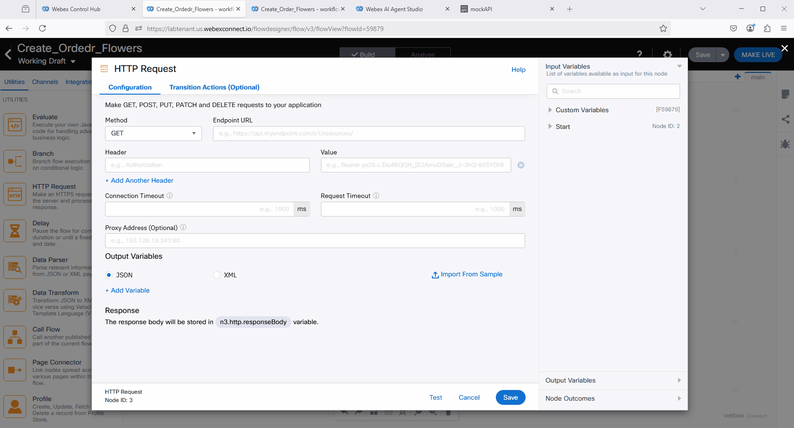<br>

7.  Compare your settings with the screenshot below to make sure you configured the **HTTP Request** correctly. Make sure you **Save** the changes.
    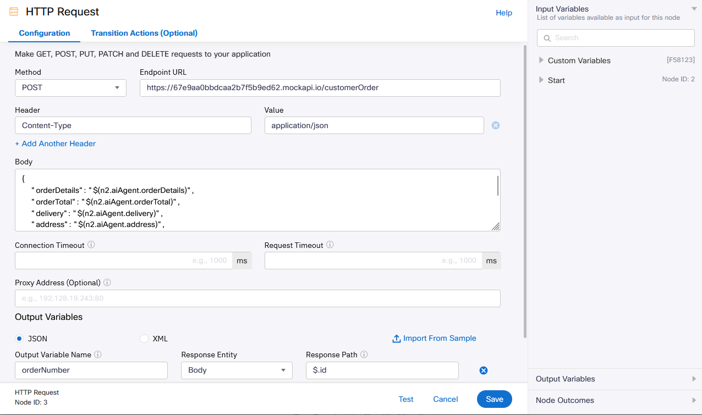<br>

8.  Save changes and click on **Make Live**.
    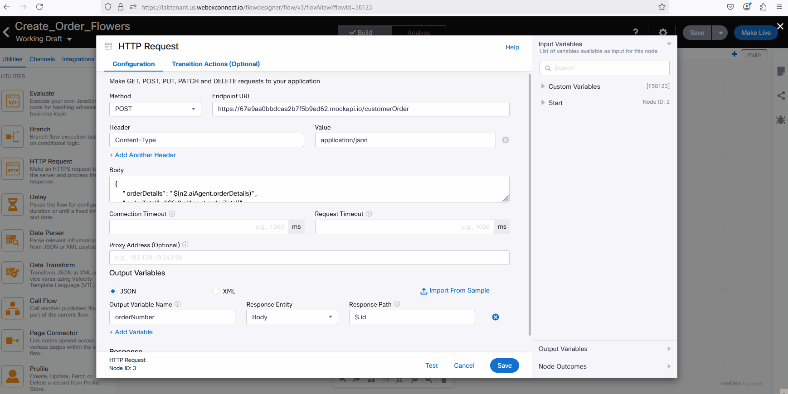<br>

### Task 4. Deliver data from Webex Connect to AI studio for the response to the customer

1. <span style="color: red;">[Read Only]</span> Once the HTTP request is completed a new object will be created on the third-party application. You can see all objects by using the this link [https://674481b1b4e2e04abea27c6e.mockapi.io/flowdesigner/Lab/flowers](https://674481b1b4e2e04abea27c6e.mockapi.io/flowdesigner/Lab/flowers){:target="_blank"}. Below you can see the screenshot with all orders information. Currently, there are only 2 orders, but by the time of this lab there could be more.
   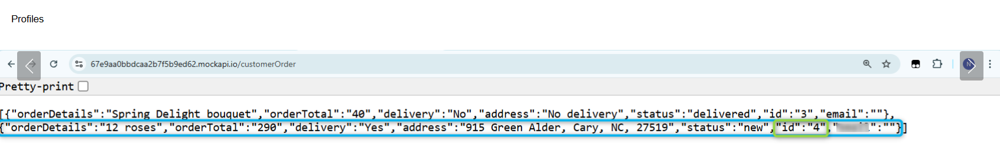
   <br>
   Each order/object will contain all the information that we sent from AI Studio but one - **id**. This key is created automatically once we create the object. The goal of this Task is to send the value of the **id** back to the AI Agent so AI Agent can provide it to the customer while they are still in live contact, like you can see on the picture below.<br>
   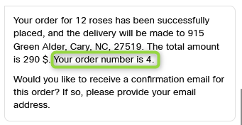<br>

2. <span style="color: red;">[Read Only]</span> When you were configuring HTTP Request in your previous Task, on the bottom of the request you configured the Output Variable. This variable will be used to parse the unique order **id** and pass the value to the Output Variable with name **orderNumber**. See the screenshot below. In the next step, we will be configuring this **orderNumber** variable to be sent to Webex AI studio.</br>
   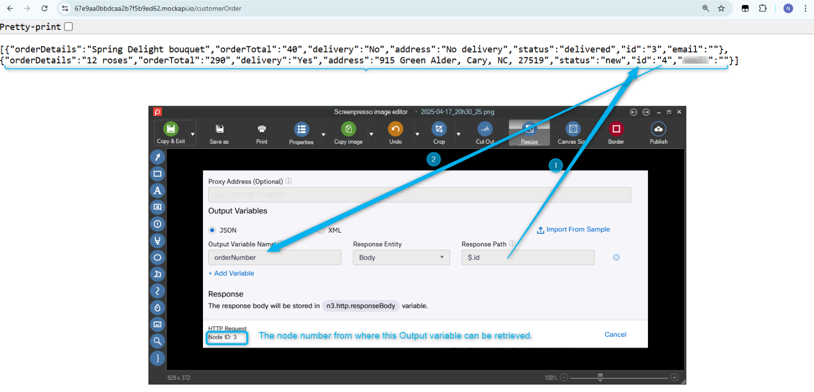<br>

3. While on your Webex Connect flow, click on **Edit** the flow, then click on the **Settings** and on the top select **Flow Outcomes** and expand **Last Execution Status**. In the **Define key-value pairs to be sent to the AI Agent** select **Enter JSON**.<br>
   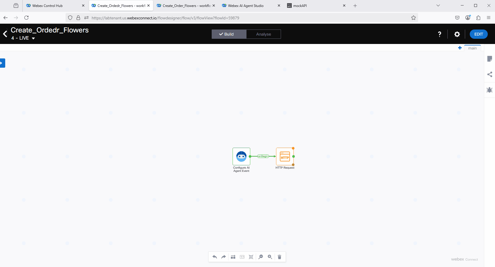<br>

4. We need to add the key-value pair to the existing JSON body. Add the comma after the last pair and insert **_<copy>"orderNumber": "$(n3.orderNumber)"</copy>_**. Make sure there is no comma after the pair that you inserted. Then click on **Save**.<br>
    ``` JSON
    "orderNumber": "$(n3.orderNumber)"
    ```    
    <br>
   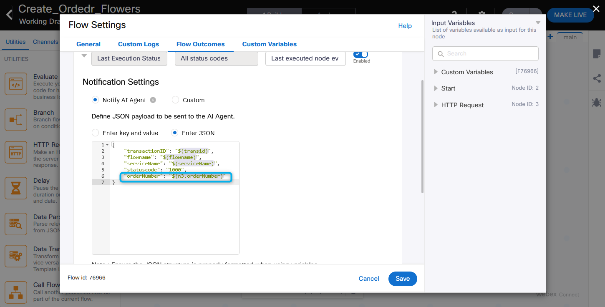 <br>
   <br>
   Also see this change in action below.<br>
   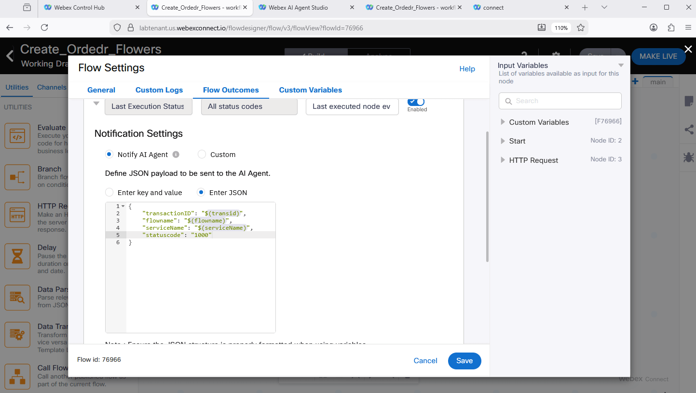<br>

5. Click on **Make Live** to publish the flow.<br>
   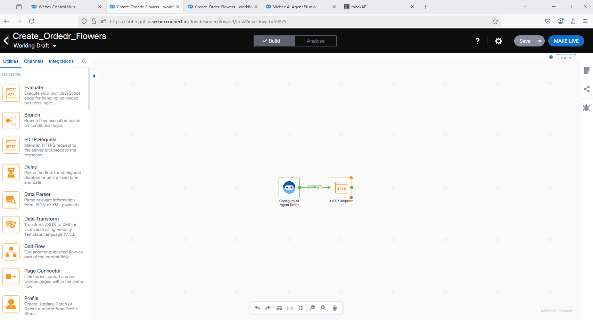<br>

6. Wait until the flow become **Live** if you want to do any tests. This may take a few minutes.<br>
   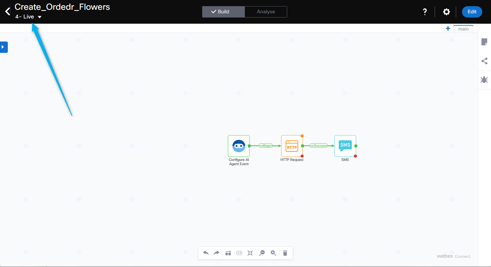<br>

### Task 5. Configure SMS confirmation

1. On the right top click on **Edit**. Then, from the available **Utilities** on the left side, find the **SMS** node and drag and drop the node to the flow. Connect **HTTP Request** node to the **SMS** node.<br>
   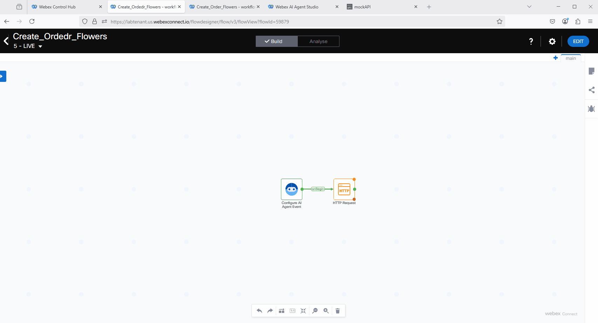<br>

2. Double click on the SMS node and configure the following:
   > Destination: **$(n2.aiAgent.phoneNumber)**<span class="copy-static" data-copy-text="$(n2.aiAgent.phoneNumber)"><span class="copy" title="Click to copy!"></span></span><br>
   > From Number: **447507201958**<span class="copy-static" data-copy-text="447507201958"><span class="copy" title="Click to copy!"></span></span><br>
   > Message Type: **Text**<br><br>
   > Message as below:<br>

    ``` JSON
    Here is your order details:
    orderNumber: "$(n3.orderNumber)"
    orderDetails: "$(n2.aiAgent.orderDetails)"
    orderTotal: "$(n2.aiAgent.orderTotal)"
    delivery: "$(n2.aiAgent.delivery)"
    address: "$(n2.aiAgent.address)"
    status: "$(n2.aiAgent.status)"
    phoneNumber: "$(n2.aiAgent.phoneNumber)"
    ```
    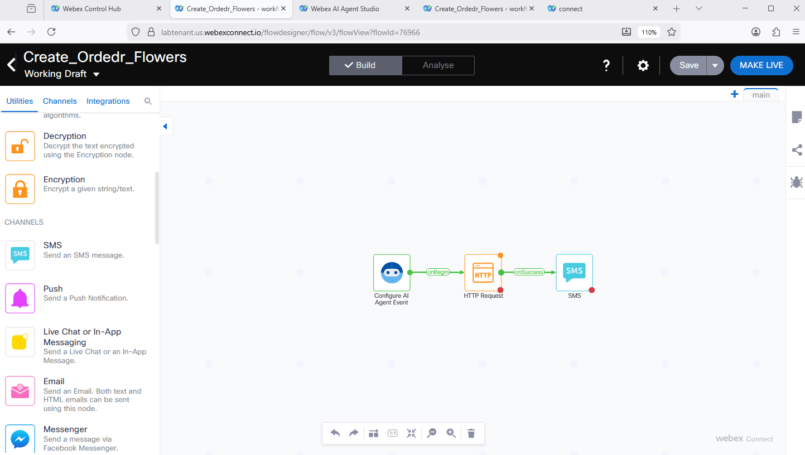<br>

3. Save and click on **Make Live**.<br>
   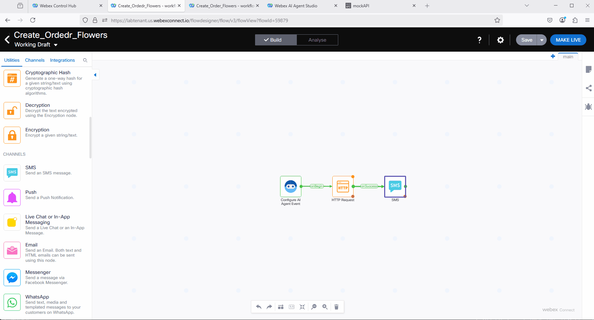<br>

### Task 6. Test the order creating and details delivery over SMS

1. In the **Webex AI Agent Studio**, click on preview and order flowers for your friend. Try to order flowers with or without delivery. When asking for your number, **provide your cellphone number without +**. Complete the order.<br>
   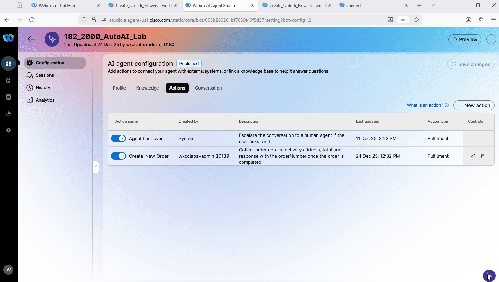<br>

2. Another way to test the order creation is to dial the support number assigned to your **<span class="attendee-id-container"><span class="attendee-id-placeholder" data-suffix="_Channel">Your_Attendee_ID</span>_Channel<span class="copy" title="Click to copy!"></span></span>** channel, and create an order during the conversation with the AI agent.

3. Check if the confirmation SMS was received on your phone. </br>
   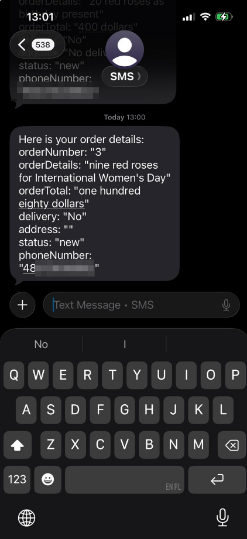<br>

4. Optionally, you can check your order by accessing the database and replacing <span style="color: red;">***'YOUR_PHONE_NUMBER'***</span></summary> with the phone number you provided while ordering:
    ***https://674481b1b4e2e04abea27c6e.mockapi.io/flowdesigner/Lab/flowers?phoneNumber=<span style="color: red;">***'YOUR_PHONE_NUMBER'***</span></summary><span class="copy-static" data-copy-text="https://674481b1b4e2e04abea27c6e.mockapi.io/flowdesigner/Lab/flowers?phoneNumber='YOUR_PHONE_NUMBER'"><span class="copy" title="Click to copy!"></span></span><br>
   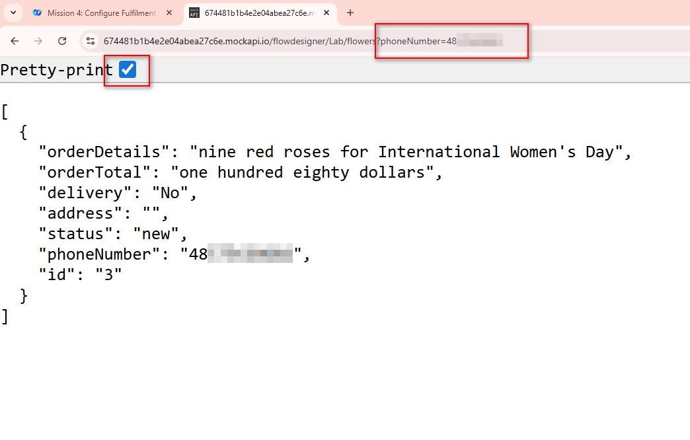<br>


<p style="text-align:center"><strong>Congratulations, you have officially completed this mission! 🎉🎉 </strong></p>
