# Mission 6: Configure Transfer Action for Webex AI Agent

**

Good to Know: What is a Transfer to Webex AI Agent Action?
**

Transfer Action is a task that an AI agent performs by understanding user intents and transferring the interaction back to the WxCC flow with custom data for connecting to another Webex AI Agent.

## 

## Mission overview

Your mission is to:

 - The goal of this mission is to transfer the call from your AI agent to **Flower_Wholesale** (preconfigured) using the Transfer operation.  
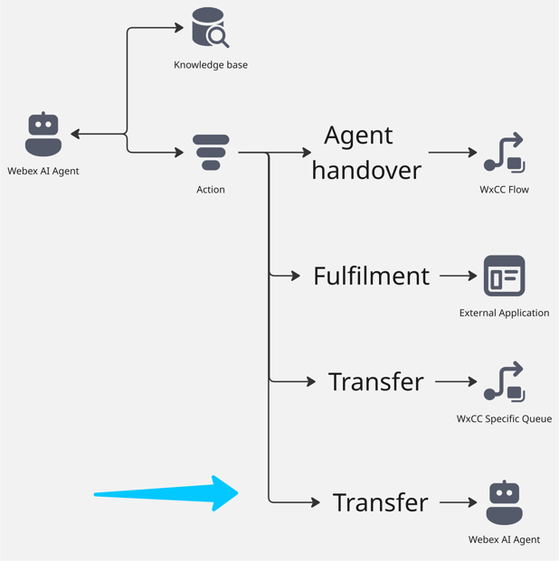

### Preconfigured entities      
     
- Webex AI Agent: **Flower_Wholesale**.

---

## Build

### Task 1. Adjust Transfer Action in AI Agent Studio portal

1. Open your AI agent with name **Your_Attendee_ID_2000_AutoAI_Lab** and then click on **Actions**.
    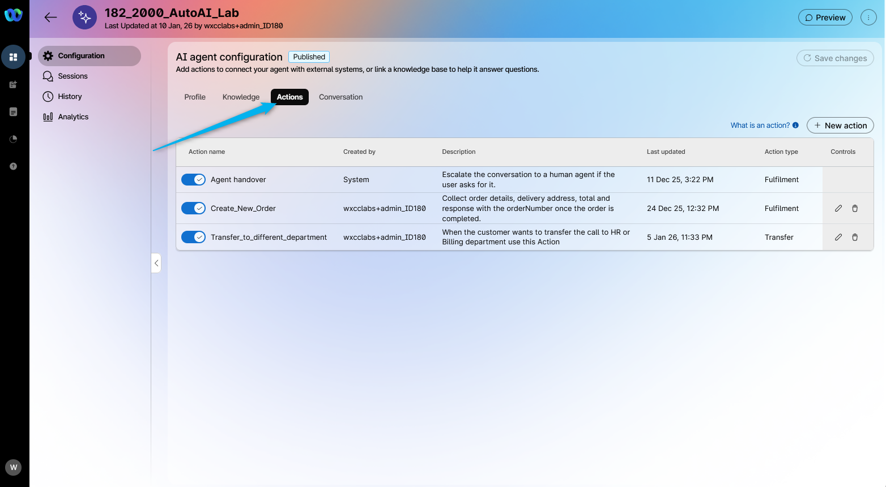 

2. Click on **Transfer_to_different_department** action.
    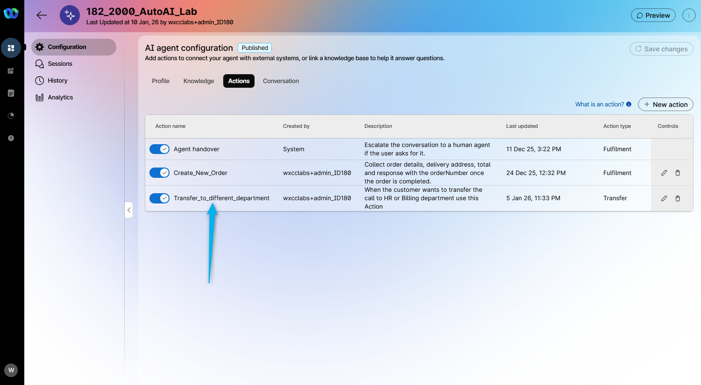 

3. Adjust the **Transfer condition** by adding **or Wholesale** as the department option.  
    > Copy the following text: **When the customer wants to transfer the call to HR or Billing or Wholesale department use this Action.** 

    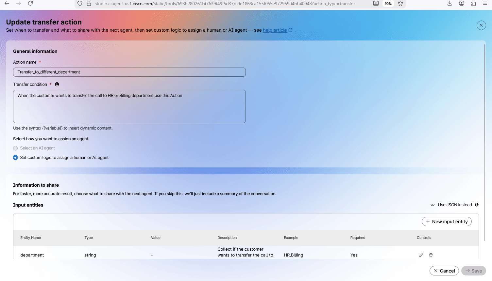 

4. In the **Input entities** for **department** entity, click on edit button on the right under **Controls** column. In the new window click on **+Add** and write **Wholesale**.
    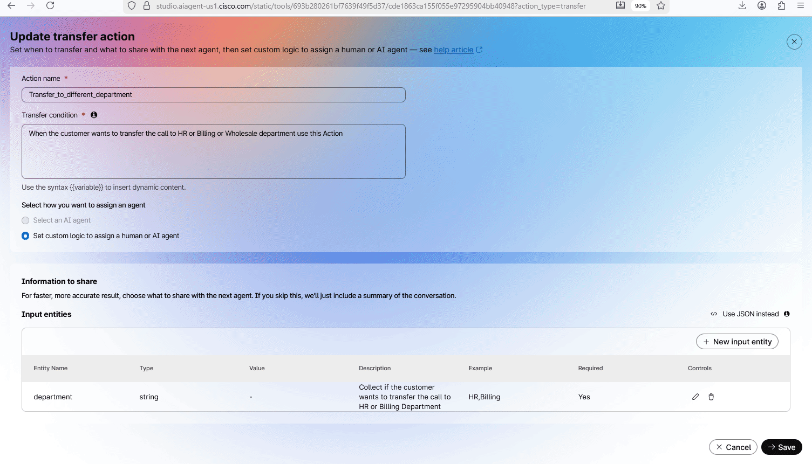 

5. **Save** and **Publish** the changes. Provide any version name in popped up window (e.g. "1.3"). 
    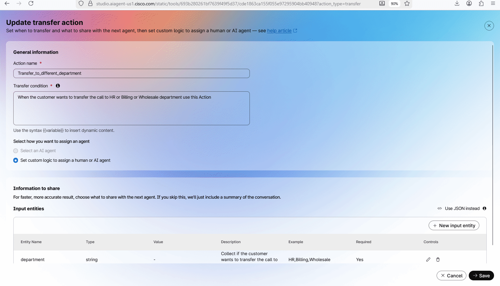 

### Task 2. Configure Voice flow to Transfer the call to **Flower_Wholesale** AI Agent

1. Go to **Control Hub** and open up your flow **AutonomousAIFlow_2000_Your_Attendee_ID**. Click on **Edit** the flow.
    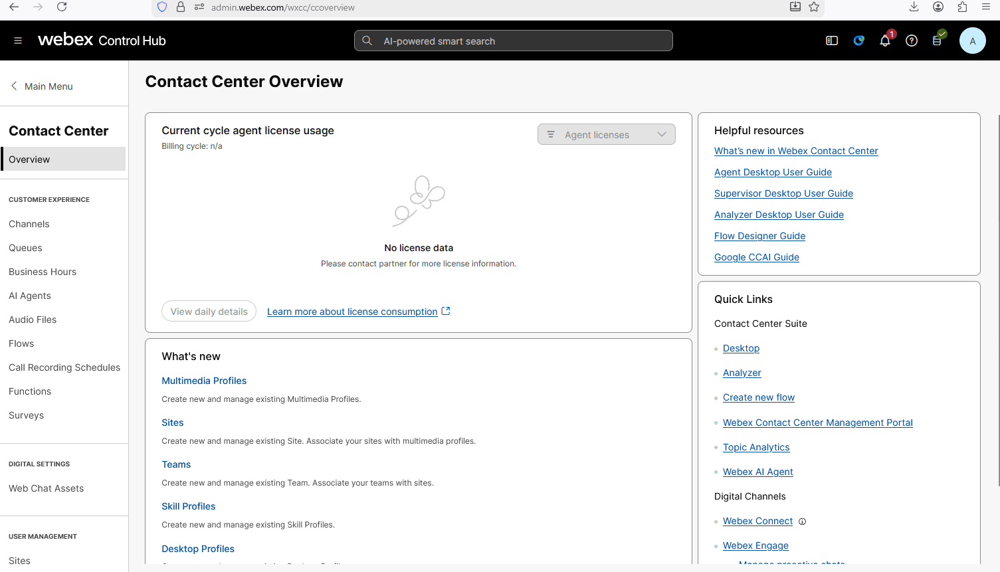 

2. Click on **Case** node and add one more option with value **Wholesale**.

3. Bring additional **VirtualAgentV2** node to the flow. Connect **Wholesale** output from **Case** node to **VirtualAgentV2**.
    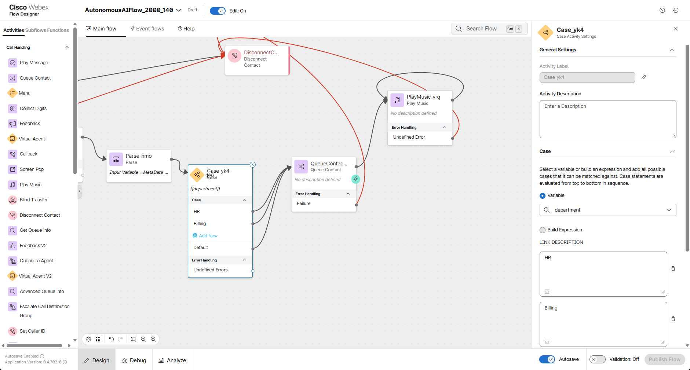 

4. Connect **Handled** output from **VirtualAgentV2** to the **DisconnectContact** node. Connect **Escalate** output from **VirtualAgentV2** to **Queue Contact**.
    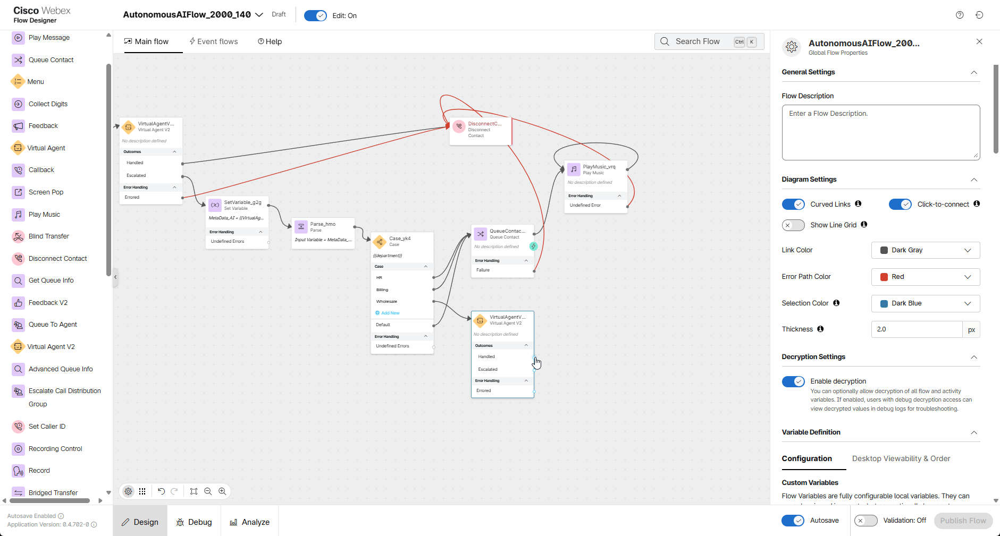 

5. Click on the **VirtualAgentV2** and configure as follows: 
    
    > Set **Static Contact Center AI Config** 
    > Contact Center AI Config: **Webex AI Agent (Autonomous)** 
    > Virtual Agent: **Flower_WholeSale** 

6. **Validate** and **Publish** the flow.
    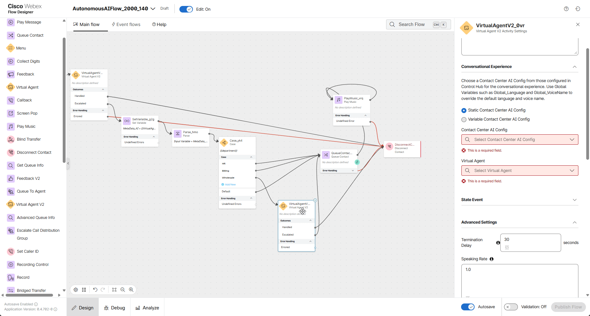 

### Task 3. Test Webex AI Agent transfer to Webex AI Agent

Place a call to the number associated with your **Your_Attendee_ID_Channel** channel and ask to speak with the **Wholesale department**. You will be connected to an AI agent who can assist you with ordering flowers if you need to purchase at least one box (each box contains 100 flowers). In this case, the price will be different. Below, you can find the screenshot of the knowledge base used by the **Flower_WholeSale** AI Agent.
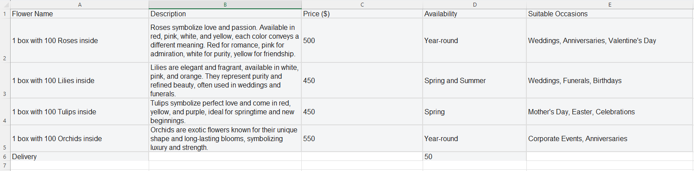 

Or you can review the full configuration of the **Flower_Wholesale** AI Agent in the AI Agent Studio.
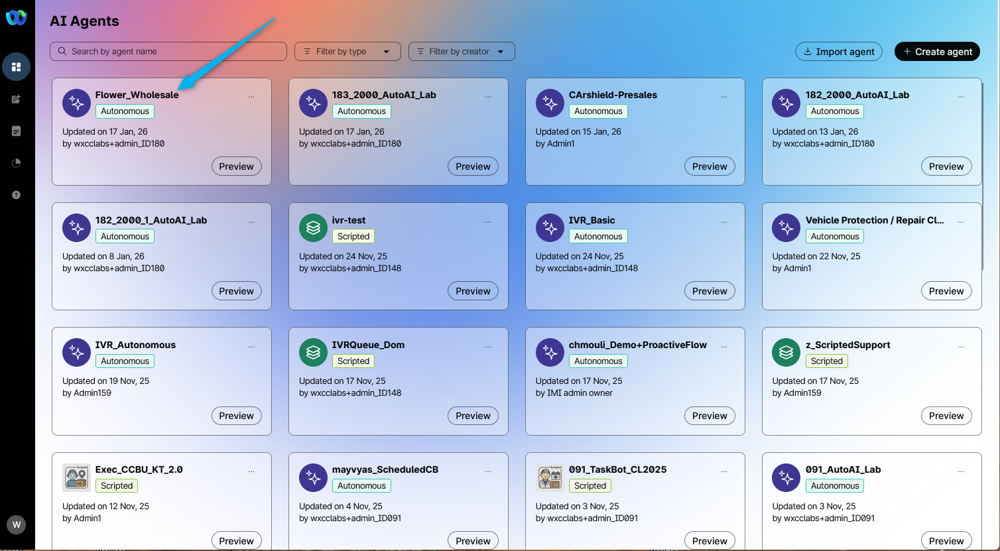 

For your reference, please see the chat discussion with the **Flower_WholeSale** AI Agent. This will help you have a similar dialogue during your test call.
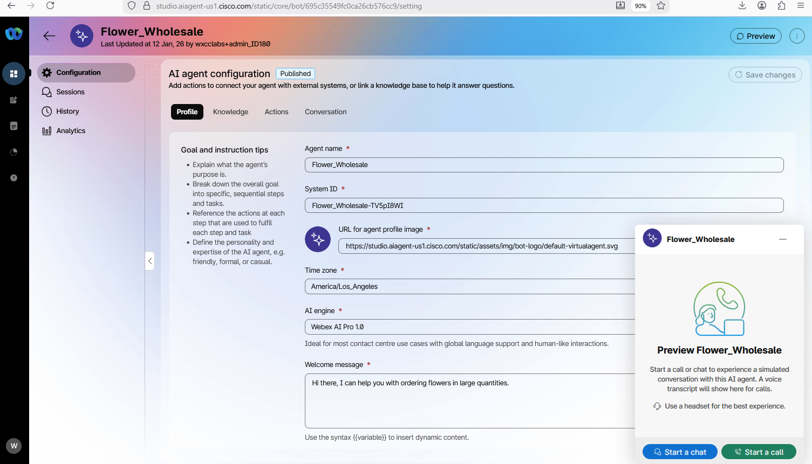 

In addition, similar to previous mission, you can check **Debug** tool and observe you test call.

<strong>Congratulations, you have officially completed this mission! 🎉🎉 </strong>

