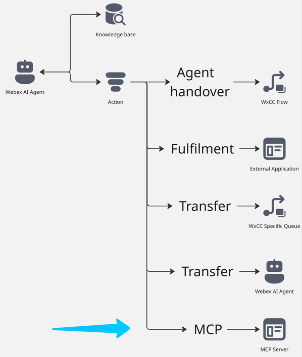
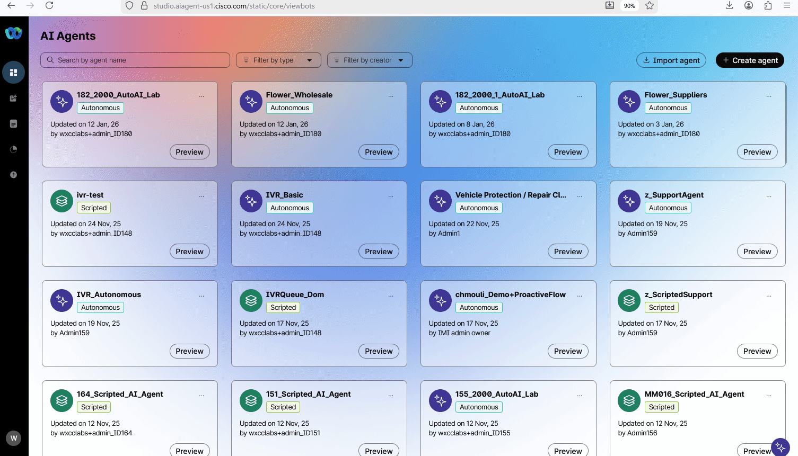
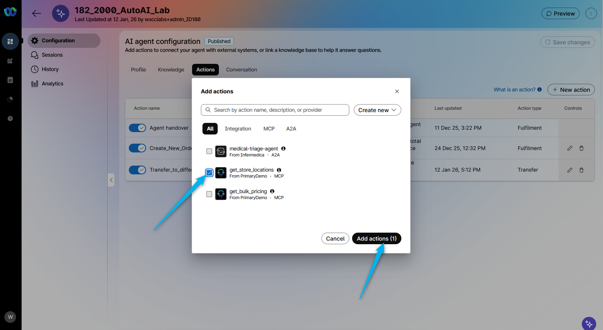
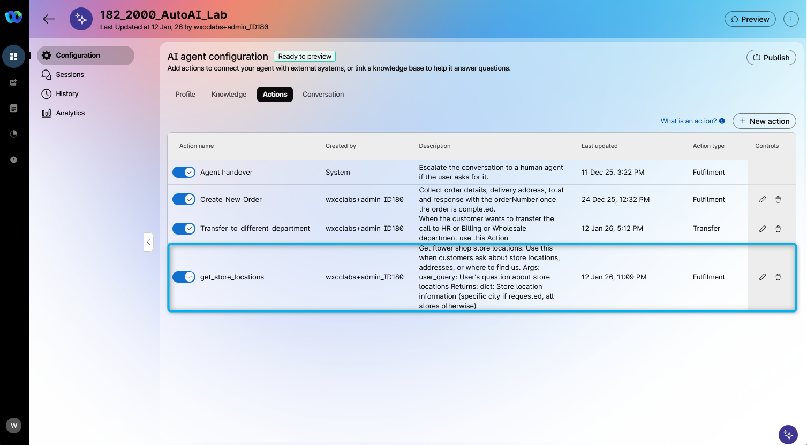
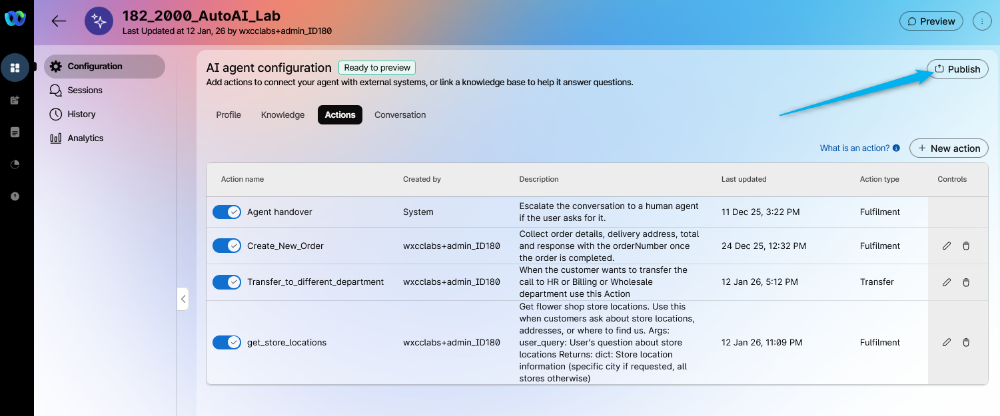
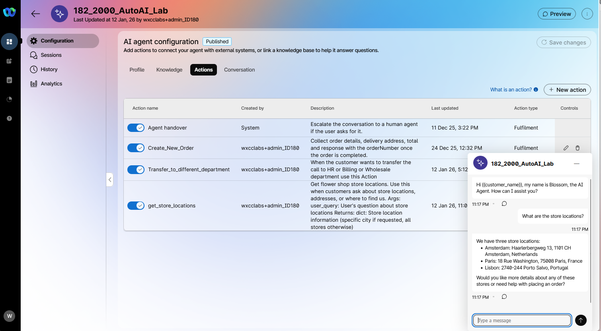
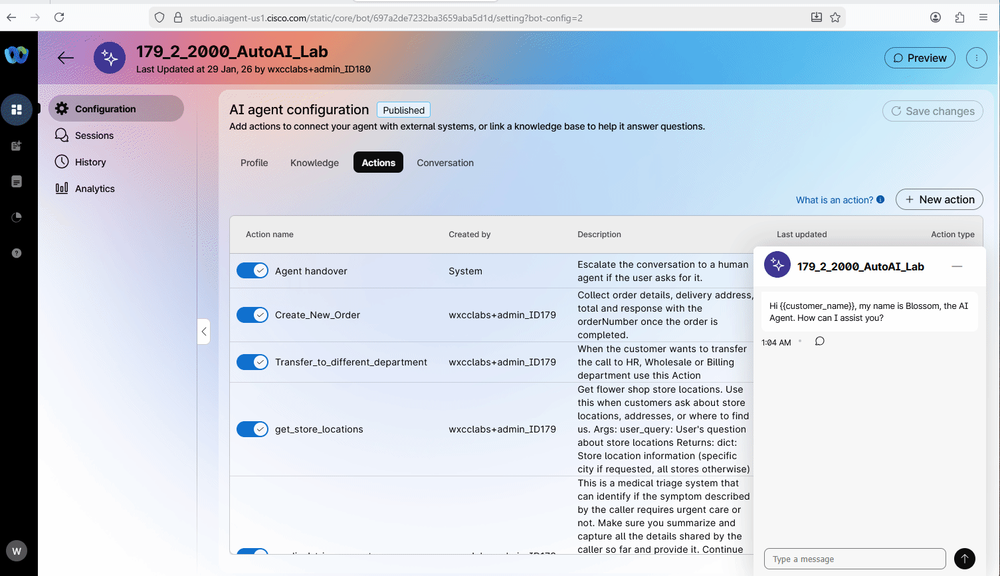

This mission requires configuration created in the following missions:

1. **[AI Agent Track: Mission 1 - Create AI Autonomous Agent](../AI_Lab_Aut_Mission1/)** 
2. **[AI Agent Track: Mission 2 - Integrating the AI Agent with Flow for Voice Calls](../AI_Lab_Aut_Mission2/)** 
3. **[AI Agent Track: Mission 3 - Send Custom data to Autonomous AI Agent](../AI_Lab_Aut_Mission3/)** 
4. **[AI Agent Track: Mission 4 - Configure Fulfillment Action and create an order](../AI_Lab_Aut_Mission4/)** 
5. **[AI Agent Track: Mission 5 - Configure Transfer Action for a Specific Queue](../AI_Lab_Aut_Mission5/)** 
6. **[AI Agent Track: Mission 6 - Configure Transfer Action for Webex AI Agent](../AI_Lab_Aut_Mission6/)** 

If these missions were not completed, some steps in current mission will not function correctly.

---

**

Good to Know: What is MCP?
**

MCP, or Model Context Protocol, is a standardized framework designed to facilitate the exchange of contextual information between AI models and external systems, enabling more dynamic and context-aware interactions. By using MCP, AI agents can be easily integrated with other external tools, allowing for different types of fulfillment.

## 

## Mission overview

MCP Action is still in development and is currently available only for customer demos. In this mission, you will not be creating an MCP server or adding it to the tenant, as this functionality is not yet available to customers. The MCP server has already been created and added to the tenant for this lab. Your task is to create an action using this MCP server and test how it works.

For this mission, the MCP server was created to search external database for Flower Store locations. Your mission is to create a new action with this MCP server and test the results. 

---

## Build

### Task 1. Create MCP Action

1. Open up your AI Agent **Your_Attendee_ID_2000_AutoAI_Lab** and start creating the new **Action**.
   

2. From the list, select **get_store_locations** MCP option.
   

3. You can see that another Action was created, and some of the configurations, such as Description and Entity, were transferred from the MCP server. This new Action essentially adds functionality to the AI Agent, enabling it to provide customers with store locations. These location details are stored in a third-party database and are accessed through the MCP integration.
   

4. **Publish** the changes. Provide any version name in popped up window (e.g. "1.4"). 
   

### Task 2. Test MCP Action

1. You can test the functionality using the chat **Preview** option. Ask the AI agent **<copy>What are the store locations?</copy>**. The information that the AI agent will respond with will be retrieved from the external database over the MCP.
   

2. Open up the interaction transcripts in the **Session** tab to confirm that result came from the MCP tool.
   

<strong>Congratulations, you have officially completed this mission! 🎉🎉 </strong>

