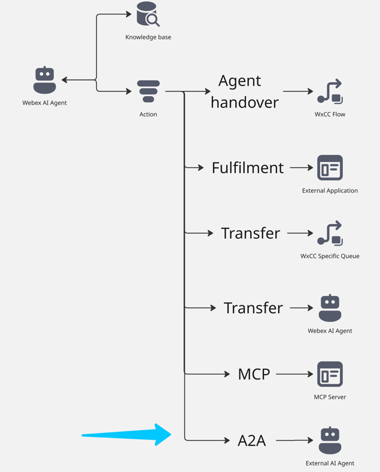
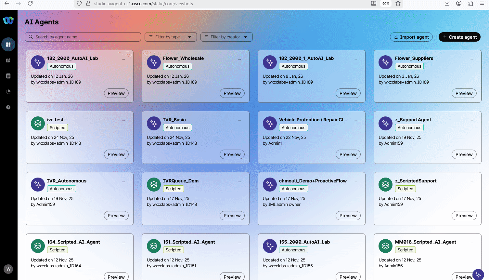
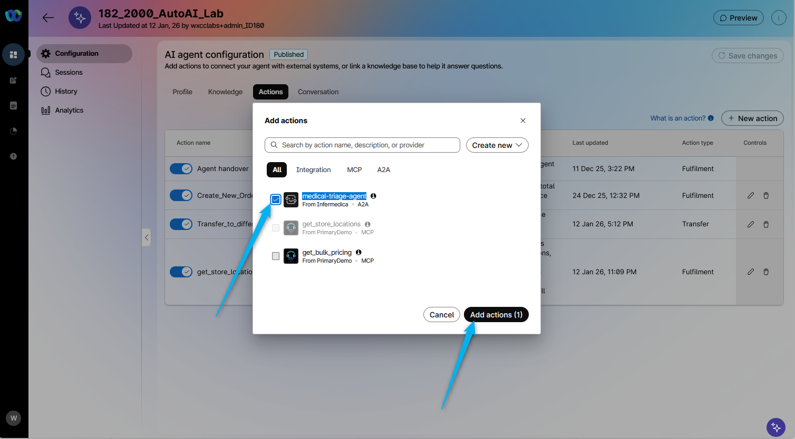
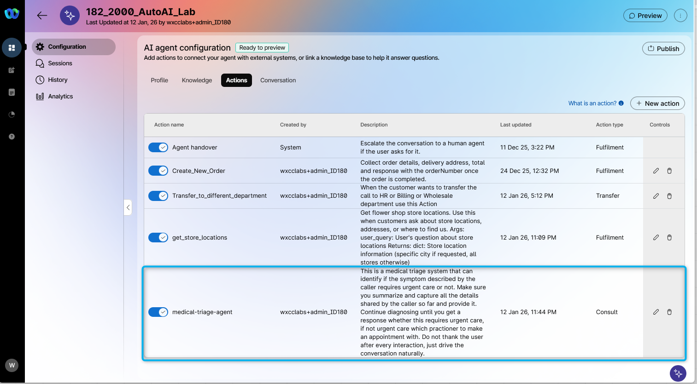
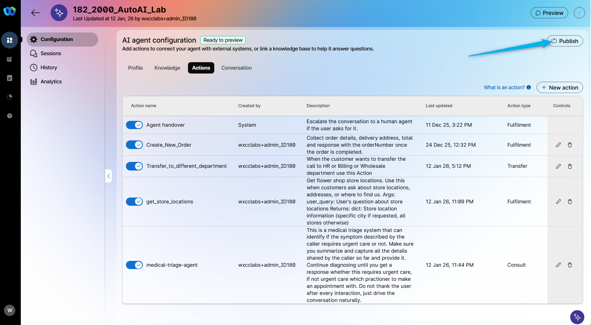
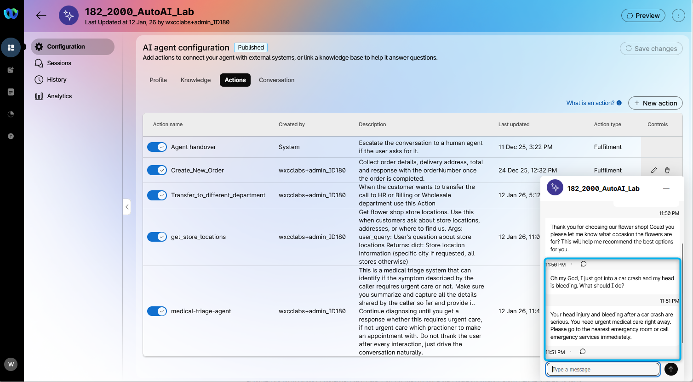
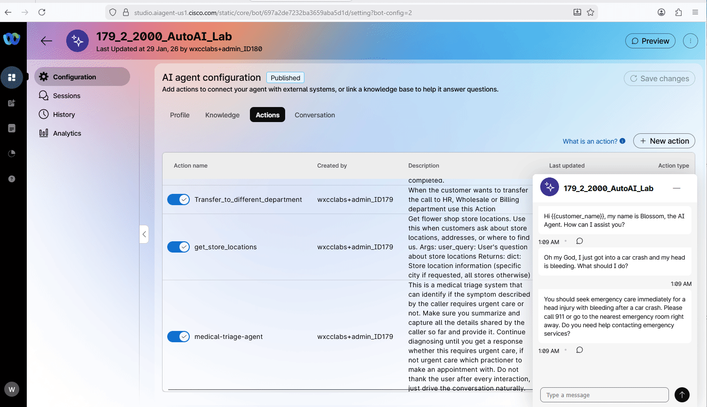

This mission requires configuration created in the following missions:

1. **[AI Agent Track: Mission 1: Create AI Autonomous Agent](../AI_Lab_Aut_Mission1/)** 
2. **[AI Agent Track: Mission 2: Integrating the AI Agent with Flow for Voice Calls](../AI_Lab_Aut_Mission2/)** 
3. **[AI Agent Track: Mission 3: Send Custom data to Autonomous AI Agent](../AI_Lab_Aut_Mission3/)** 
4. **[AI Agent Track: Mission 4: Configure Fulfilment Action and create an order](../AI_Lab_Aut_Mission4/)** 
5. **[AI Agent Track: Mission 5: Configure Transfer Action for a Specific Queue](../AI_Lab_Aut_Mission5/)** 
6. **[AI Agent Track: Mission 6: Configure Transfer Action for Webex AI Agent](../AI_Lab_Aut_Mission6/)** 
7. **[AI Agent Track: Mission 7: Configure Transfer Action for Webex AI Agent](../AI_Lab_Aut_Mission7/)** 

If this mission was not completed, some steps in current mission will not function correctly.

---

**

Good to Know: What is A2A?
**

A2A, or Agent-to-Agent protocol, refers to a standardized method that enables direct communication and collaboration between different AI agents or systems. This protocol allows multiple agents—potentially developed by different organizations or for various functions—to exchange information, coordinate actions, and work together efficiently. In the context of AI, A2A protocols help create more integrated, flexible, and scalable ecosystems by ensuring that agents can share context, delegate tasks, and leverage each other's capabilities to deliver more intelligent and effective solutions.

## 

## Mission overview

A2A Action is still in development and is currently available only for customer demos. In this mission, you will not be creating a complete A2A integration for the Webex AI Agent and the Third Party AI Agent, as this functionality is not yet available to customers. The A2A integration has already been created and added to the tenant for this lab. Your task is to create an action using this A2A integration and test how it works.

For this mission, you will utilize the integration with the **Infermedica AI Agent**. This third-party AI agent is designed to support medical triage, symptom assessment, and patient intake by analyzing user-provided health information and symptoms.

Imagine an unfortunate situation where a customer is ordering flowers over the phone while driving and gets into an accident. The customer may be in shock and not know what to do. The AI agent should help direct the customer to call emergency service.

---

## Build

### Task 1. Create A2A Action

1. Open up your AI Agent **Your_Attendee_ID_2000_AutoAI_Lab** and start creating the new **Action**.
    

2. From the list, select **medical-triage-agent** A2A option.
    

3. You can see that another Action was created, and some of the configurations, such as Description and Entity, were transferred from the A2A integration. This new Action essentially adds functionality to the AI Agent, enabling it to provide customers with health symptom analysis and suggest appropriate actions.
    

4. **Publish** the changes. Provide any version name in popped up window (e.g. "1.5"). 
    

### Task 2. Test A2A Action

1. You can test the functionality using the chat **Preview** option. Type to the AI Agent for example this: **Oh my God, I just got into a car crash and my head is bleeding. What should I do?**
**
    

2. Open up the interaction transcripts in the **Session** to confirm that result came from the A2A integration.
    

<strong>Congratulations, you have officially completed this mission! 🎉🎉 </strong>

