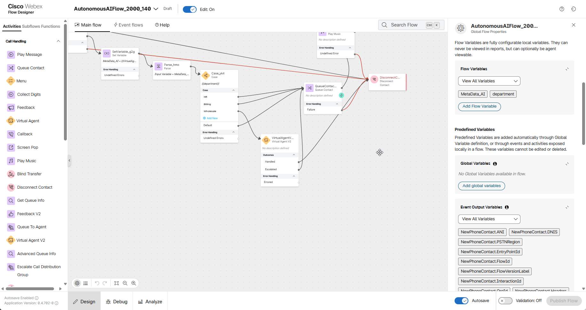
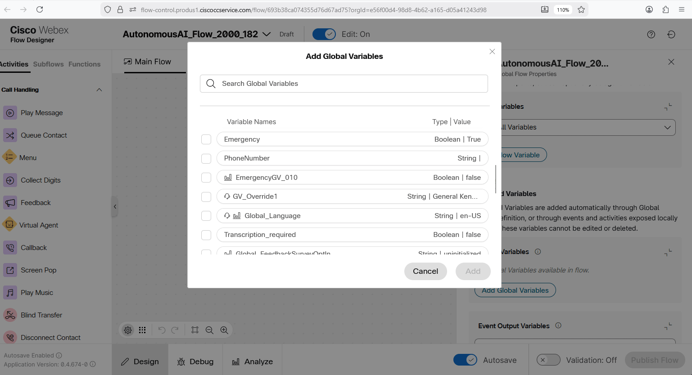
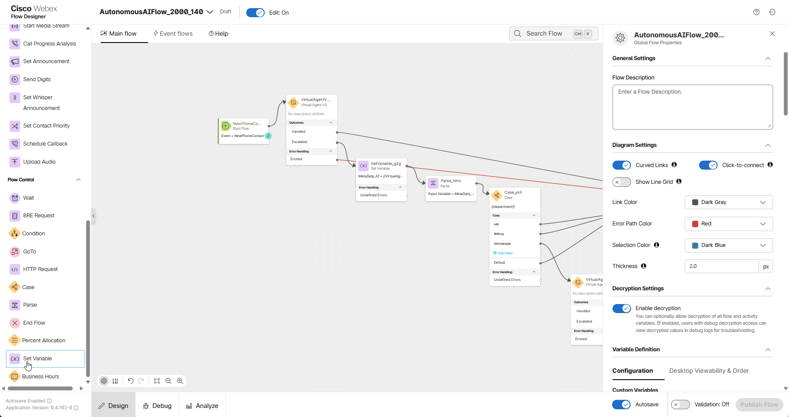
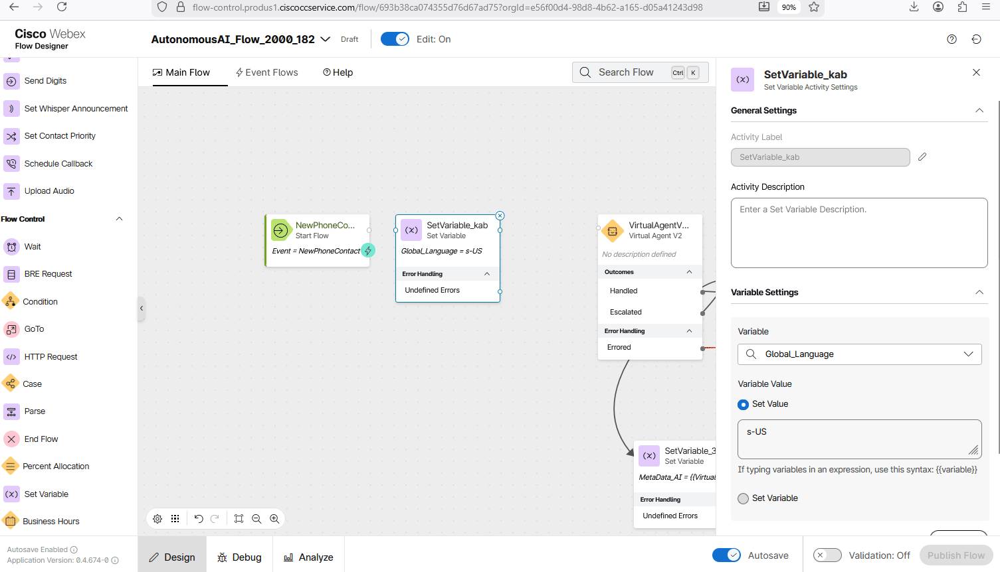
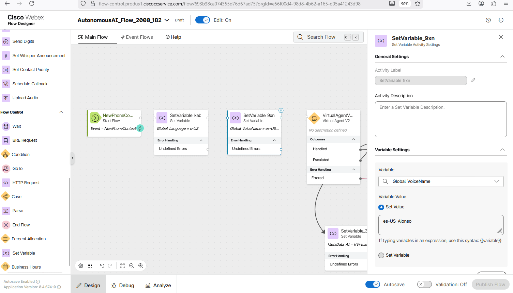
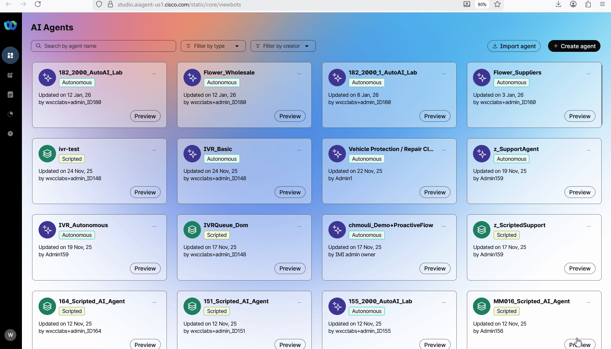
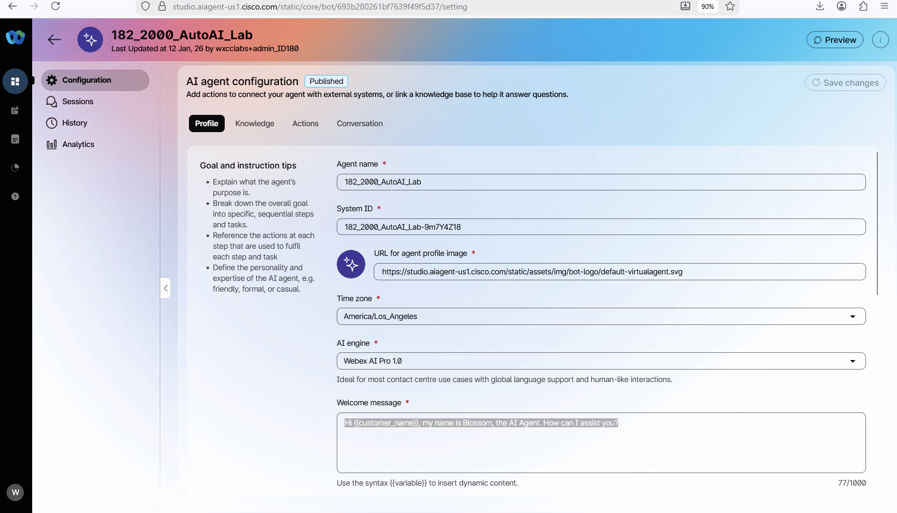

# Mission 9: Customize AI Agent Language

## Mission overview

 - In this mission, you will change the language of your AI agent for the voice channel. This feature allows flexibility for supporting customers in different languages.

---

## Build

### Task 1. Configure language related Global Variables in voice flow

1. Go to Flows and open up your voice flow **AutonomousAIFlow_2000_Your_Attendee_ID** and click **Edit Flow**.

2. Click anywhere on the grey field area and navigate to the **Global Flow Properties** panel on the right-hand side.
    
    > - Scroll down and Locate the **Predefined Variables** section.
    >
    > - Click on the **Add Global Variables** button.
    >
    > - Search for **Global_Language** variable and click on **Add** button.
    >
    > - Click on the **Add Global Variables** button one more time.
    >
    > - Search for **Global_VoiceName** variable and click on **Add** button.

    

3. Add Global Variables with name: **Global_VoiceName** and **Global_Language**.
    

    !!! Note
        Review documentation with available languages and voices.  
        [Supported-languages-and-voices-for-AI-agents](https://help.webex.com/en-us/article/pdef2d/Supported-languages-and-voices-for-AI-agents){:target="\_blank"}

5. Add **SetVariable** node in front of the **NewPhoneContact node**. Select Variable as **Global_Language** and put the value of the language that you want to test. For example, to set up the AI agent to speak Spanish, you can enter **<copy>es-US</copy>**.
   

6. Add one more **SetVariable** node. Select Variable as **Global_VoiceName**. Select the appropriate voice from the documentation. For example **<copy>es-US-Alonso</copy>**.
   

7. Connect the nodes like below. **Validate** and **Publish** the flow.
   

8. Call the number that is related to your channel. You should hear the AI agent play the Welcome message in English with an accent, but afterward, you can continue the conversation in the language that you configured in the flow. You will change the Welcome message in the next Task.

### Task 2. Change the Welcome message

The AI Agent Welcome message is currently a **static value**. If you want to change the Welcome message to a different one, you can update it in the AI Agent Studio portal.

1. Open up your AI Agent **<copy><w class="attendee"></w>\_2000_AutoAI_Lab</copy>**.
   

2. Update the Welcome message with the one in different language. For example for Spanish you can update it to: **<copy>Hola, mi nombre es Blossom, el Agente de IA. ¿Cómo puedo ayudarle?</copy>**. **Save changes** and **Publish** the flow.
   

3. Call the number associated with your channel. You should hear the Welcome message and be able to have a conversation with the AI Agent in a different language. All functionality, such as transferring to the HR department or to another AI agent, will still function in different languages without adjusting any further configurations.

<strong>Congratulations, you have officially completed this mission! 🎉🎉 </strong>

