🚨 **Important Lab Dependency**

This mission requires configuration created in the following missions:

1. **[Core Track: Mission 1 - Basic Call Routing (Flow Template, TTS, Language)](../CoreTrack_Mission1/)** 

If this mission was not completed, some steps in current mission will not function correctly.

## Mission overview

Your mission is to:

 - Create an Evaluation Form with requirements to ask the caller's name and the occasion for the flower purchase. Make test calls and, using the Supervisor Dashboard, evaluate if the agent asked these questions to the caller.

---

## Build

### Create Evaluation form

1. In your browser, open **New Incognito Window** (need a new Desktop window to login as Supervisor).
   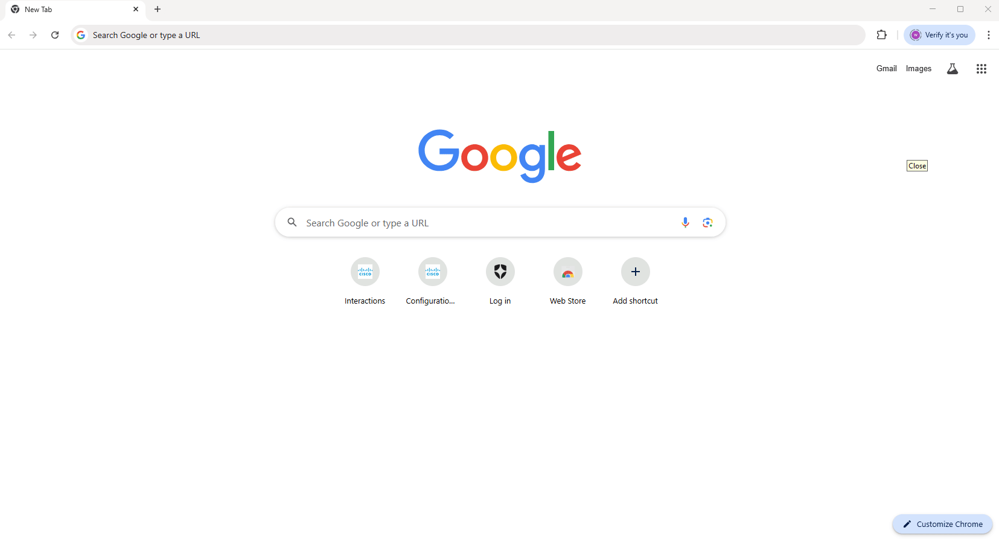

2. In this Incognito Window open up **https://desktop.wxcc-us1.cisco.com/**.
   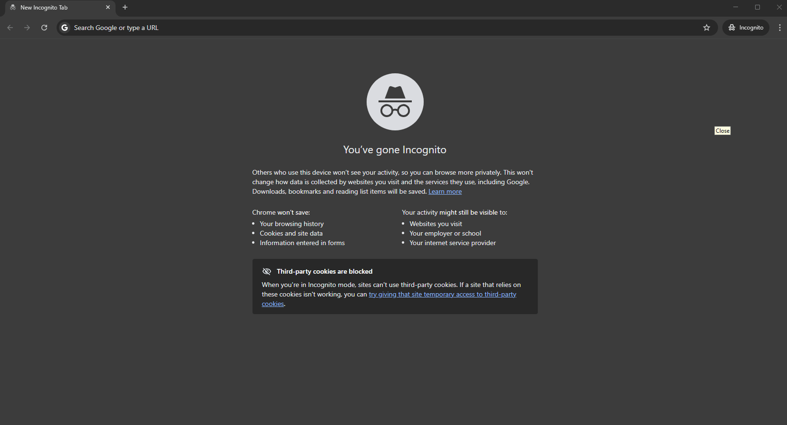

3. Login with your Supervisor user **wxcclabs+supvr_IDYour_Attendee_ID@gmail.com**. Password is the same as for your Admin user.

4. In the **"Set your interaction preferences"** pop-up window, select Role as **Supervisor** and Handle calls using **Desktop**. Allow using microphone.
   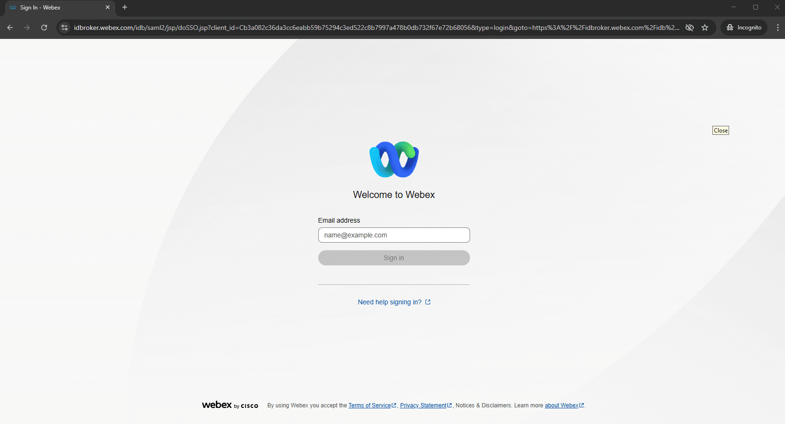 

5. Click on **Configurations** and then select to **Create a form**.
   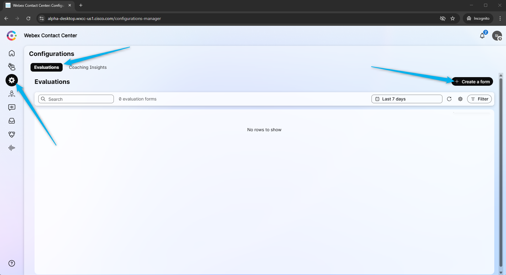 

6. In the **Form title** field enter **Your_Attendee_ID_Flower_Form**. In the Section name field enter **<copy>Initial_Questions</copy>**
   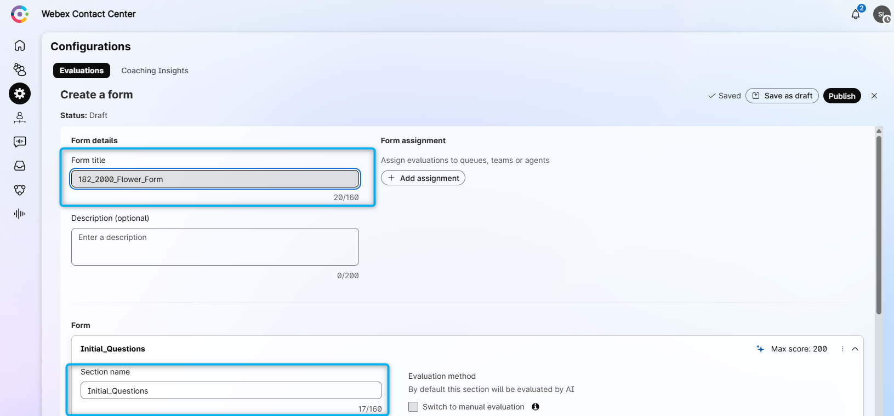 

7. Configure the first question with the following:
   > Question: **Was the caller's name asked?** 
   > Context: **The agent needs to ask the caller's name every time the conversation starts.** 
   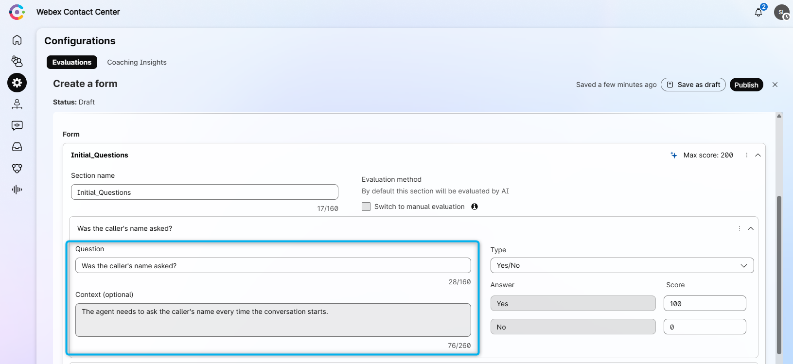 

8. Click **Add question** and configure the second question with the following: 
   > Question: **Was the caller asked what the occasion for the flowers was?** 
   > Context: **The agent needs to ask the occasion for the flowers to better assist the customer.** 
   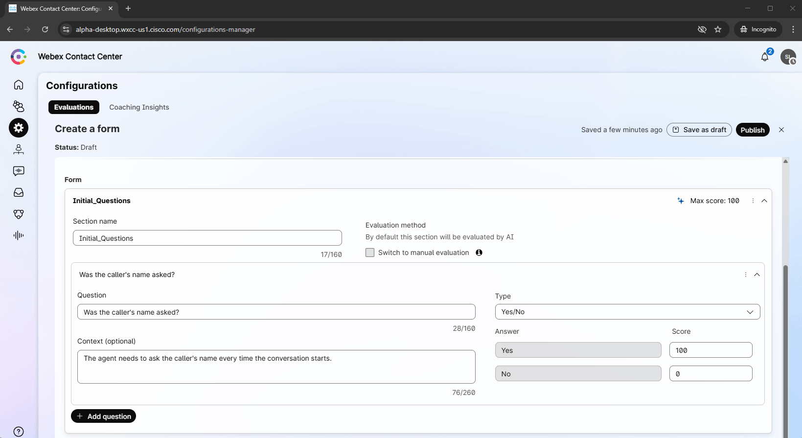 

9. Scroll up and click on **Add assignment**. From the list of queues, select your queue **Your_Attendee_ID_Queue**. And click on **Assign**.
   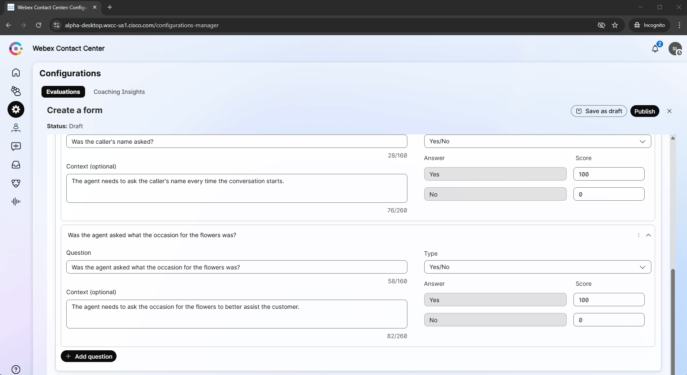 

10. **Publish** the form.
   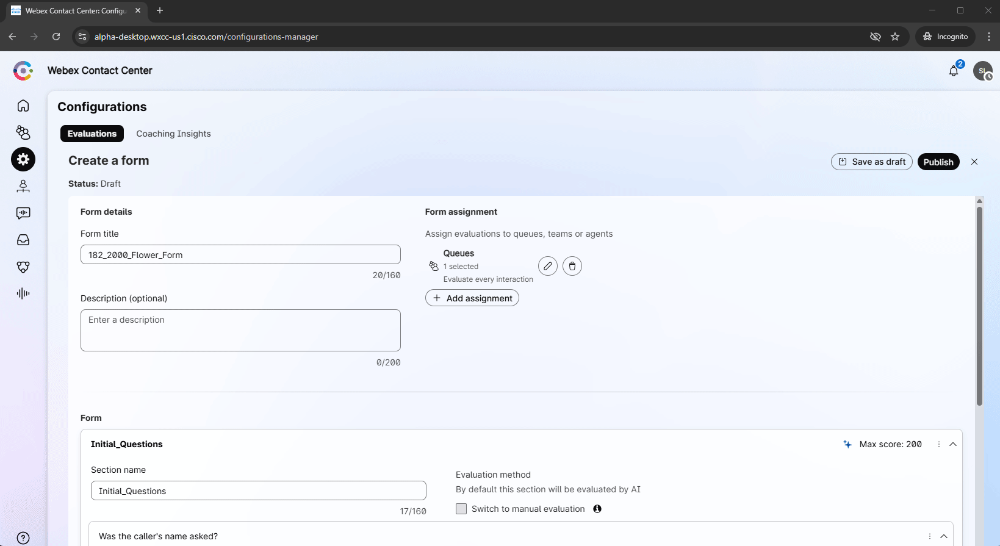 

### Evaluate agent using the Evaluation form

1. Return to Control Hub to assign the Flow to your **Channel (Entry Point)**. Go to **Channels**, search for your channel **Your_Attendee_ID_Channel**
2. Click on **Your_Attendee_ID_Channel**
3. In **Entry Point** settings section change the following, then click **Save** button:

    > - Routing flow: **Main_Flow_Your_Attendee_ID**
    >
    > - Music on hold: **defaultmusic_on_hold.wav**
    >
    > - Version label: **Latest**

    

4. Go back to your **non-incognito browser**. Your Agent Desktop session should still be active. If it is not, launch **Desktop** using the cross-launch link in **Control Hub**.

    **

See how to run Agent Desktop from the Control Hub
**

    

    

5. Make your agent **Available** and you're ready to make a call.
   

6. Place a test call to the number that is associated with your channel **Your_Attendee_ID_Channel**. During the conversation, ask the caller's name but don't ask what the occasion of the flowers is. 
   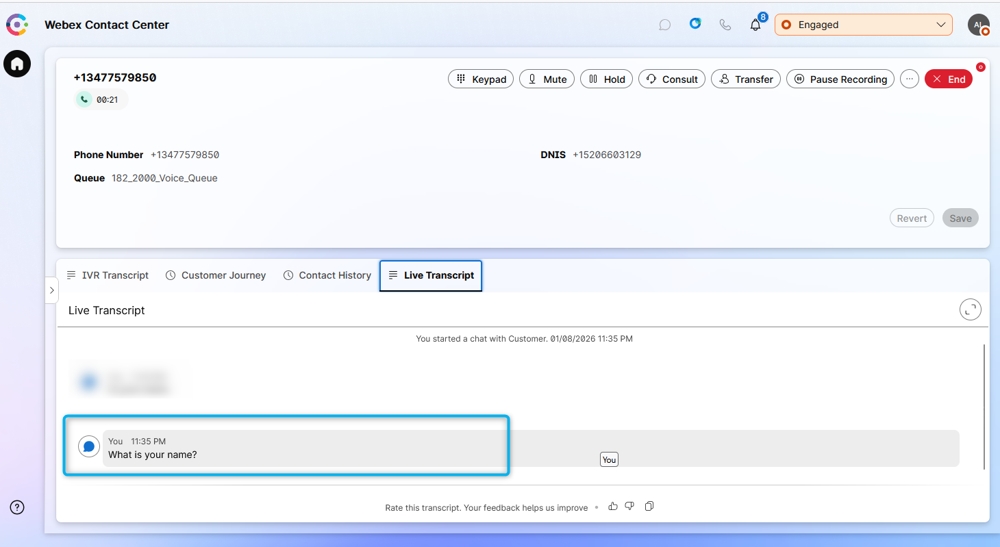 

7. Complete the call.

8. Switch back to your **Supervisor Desktop** in the Incognito Window (**https://desktop.wxcc-us1.cisco.com/**), click on **Interactions** and select **Completed**.
   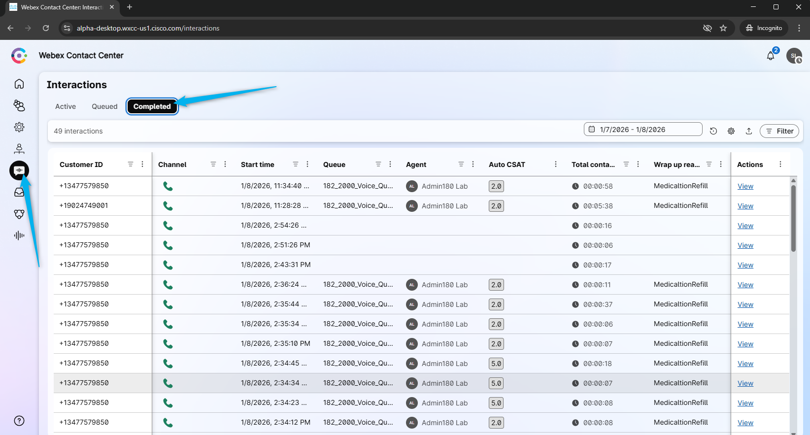 

8. Find the **Customize** option and add **Automated evaluation** column.
   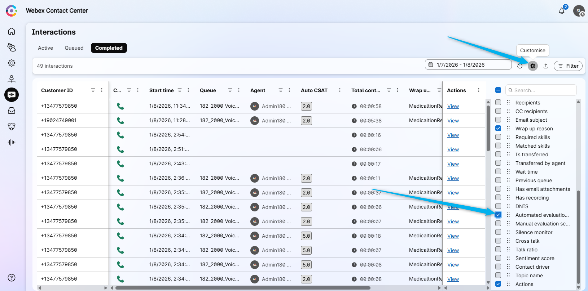 

9. Review your call and you should see the evaluation as 50%, as you only answered one of the two questions.
   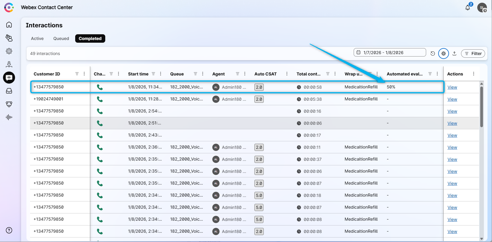 

10. Click on **View** to see more details about the interaction and evaluation.
   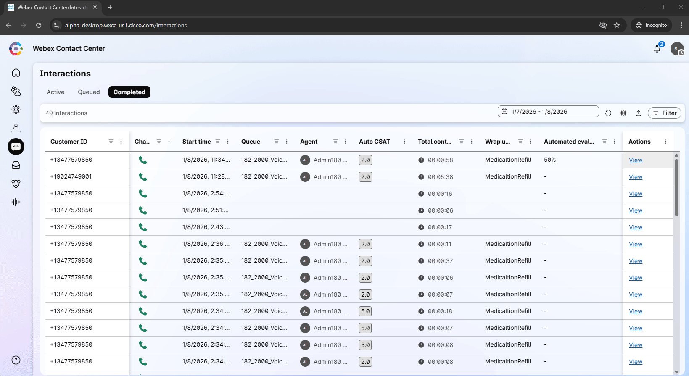 

<strong>Congratulations, you have officially completed this mission! 🎉🎉 </strong>

