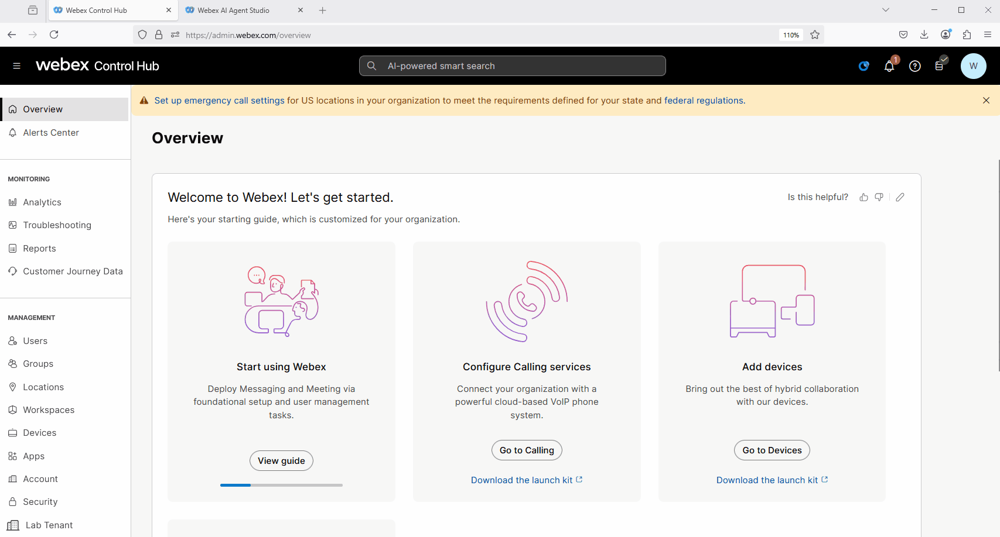
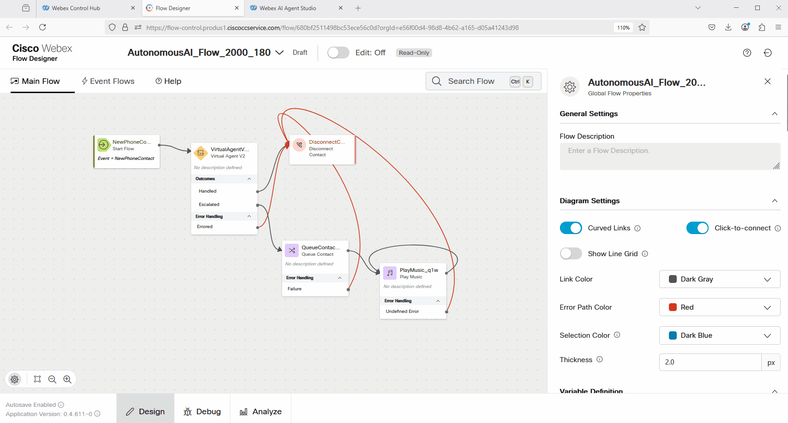
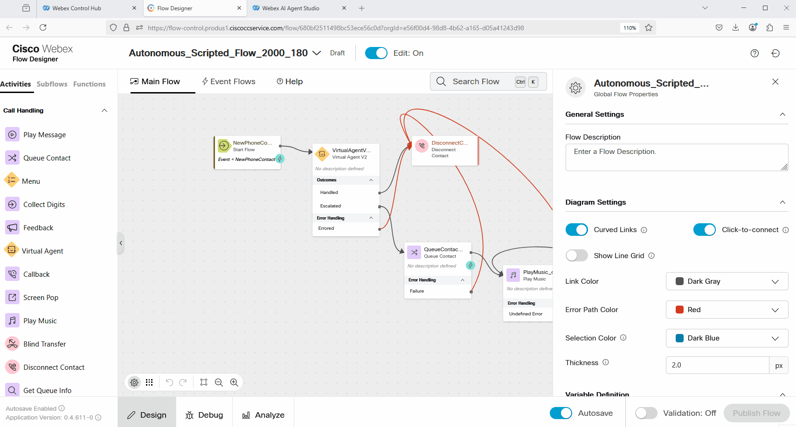
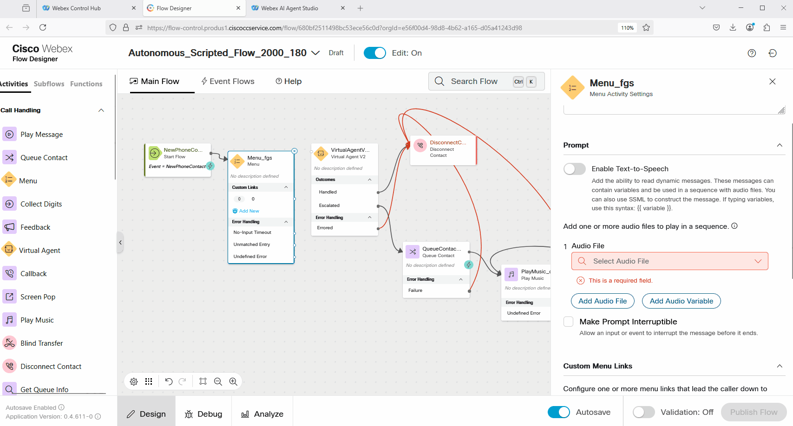
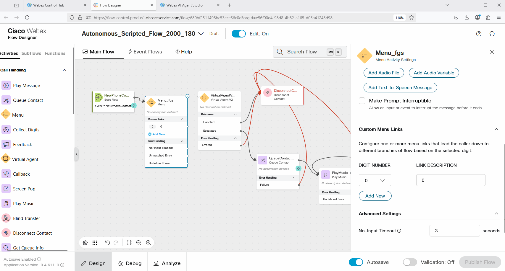
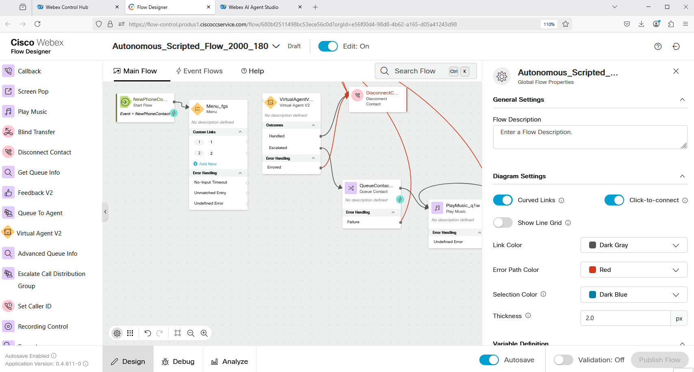
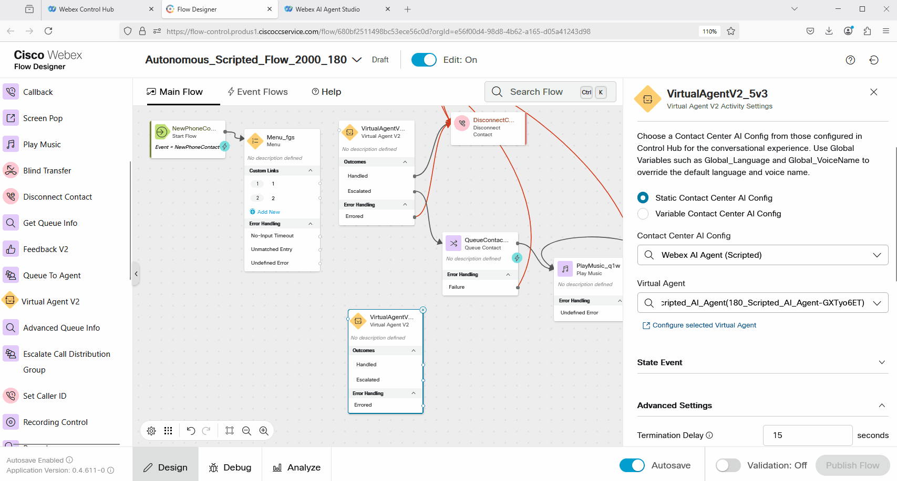
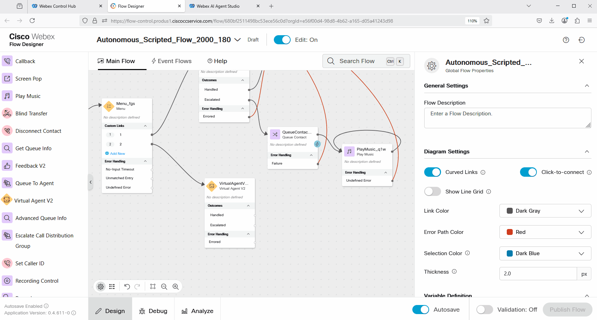
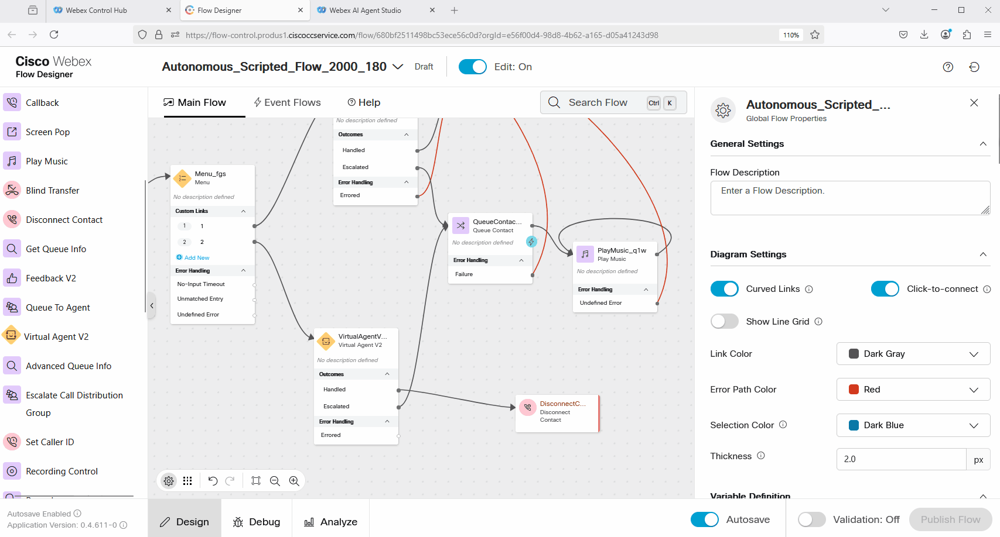
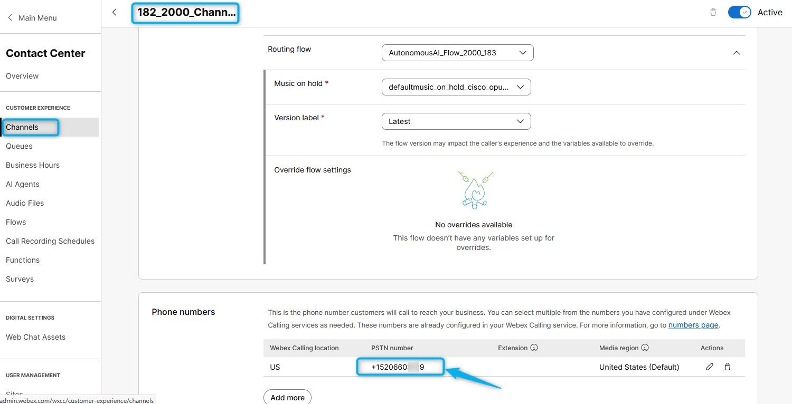

🚨 **Important Lab Dependency**

This mission requires configuration created in the following missions:

1. **[AI Agent Track ⮕ Scripted Agent: Mission 1 - Configure Scripted Agent to answer basic questions](../AI_Lab_Scripted_Mission1/)** 
2. **[AI Agent Track ⮕ Autonomous AI Agent: Mission 1 - Create AI Autonomous Agent](../AI_Lab_Aut_Mission1/)** 
3. **[AI Agent Track ⮕ Autonomous AI Agent: Mission 2 - Integrating the AI Agent with Flow for Voice Calls](../AI_Lab_Aut_Mission2/)** 

If these missions were not completed, some steps in current mission will not function correctly.

---

## Mission Details

 - Your mission is to integrate the **Scripted AI Agent** with the Voice flow so it can answer questions about store hours. In the next steps, you will extend your **Webex Contact Center** flow to use the **Scripted AI Agent** together with the **Autonomous AI Agent**.

## Build

### Task 1. Add the newly created Scripted Agent to the Voice flow.

1. In [Webex Control Hub](https://admin.webex.com){:target="_blank"}, go to **Contact Center**, click on **Flows**, and search for the flow with name **Your_Attendee_ID_2000_AutoAI_Lab** (that you created during the Autonomous AI lab).
   

2. Click on **Edit** and rename the flow to **Autonomous_Scripted_Flow_2000_Your_Attendee_ID**. Publish the flow.
   

3. Add a **Menu** node in front of the **VirtualAgentV2** node.
   

4. Click on the **Menu** node and Enable Text-to-Speech. Select native **Cisco Cloud Text-to-Speech** connector, add Text-to-Speech message, remove the Audio File option. Finally, enter the text: ***Press 1 to create a new order. Press 2 to track an order or check the store hours.*** 
   

5. Adjust the **Menu** node to have options 1 and 2.
   

6. Bring one more **VirtualAgentV2** node. Click on it. In the Contact Center AI Config search for scripted and select **Webex AI Agent (Scripted)**. Under the Virtual Agent option, search for the Scripted AI Agent with name **Your_Attendee_ID_Scripted_AI_Agent** 
   

7. Configure the following connections of the **Menu** node:

    > Connect Option 1 of the **Menu** to the **VirtualAgentV2** that is configured with Autonomous AI agent
    >
    > Connect Option 2 to the **VirtualAgentV2** node that is configured with your Scripted AI Agent.
    >
    > Connect **No-Input Timeout** to the front of the **Menu** node
    >
    > Connect **Unmatched Entry** to the front of the **Menu** node

   

8. Connect **Escalated** output from the **VirtualAgentV2** node to the **Queue** node. Connect **Handled** output to the **Disconnect Contact** node.
   

9. **Validate** and **Publish** the Flow.
   

10. Switch to Control Hub and navigate to **Channels** under Customer Experience section
    
    > - Locate your Inbound Channel (you can use the search):  **Your_Attendee_ID_Channel**
    > 
    > - Select the Routing Flow: **Autonomous_Scripted_Flow_2000_Your_Attendee_ID**
    > 
    > - Select the Version Label: **Latest**
    > 
    > - Click **Save** in the lower right corner of the screen

     

11. Dial the support number assigned to your **Your_Attendee_ID_Channel** to test the Autonomous AI Agent over a voice call.
    

12. During IVR, press 2 and ask **What are the store hours?**

<strong>Congratulations, you have officially completed this mission! 🎉🎉 </strong>

