🚨 **<span style="color: red;">Important Lab Dependency</span>**

This mission requires configuration created in the following missions:

1. **[AI Agent Track ⮕ Scripted Agent: Mission 1 - Configure Scripted Agent to answer basic questions](../AI_Lab_Scripted_Mission1/)**<br>
2. **[AI Agent Track ⮕ Scripted Agent: Mission 2 - Integrate Scripted Agent with Voice Flow](../AI_Lab_Scripted_Mission2/)**<br>
3. **[AI Agent Track ⮕ Scripted Agent: Mission 3 - Configure flow to track an order](../AI_Lab_Scripted_Mission3/)**<br>
4. **[AI Agent Track ⮕ Scripted Agent: Mission 4 - Configure the fulfillment](../AI_Lab_Scripted_Mission4/)**<br>

If these missions were not completed, some steps in current mission will not function correctly.

---

## Mission Details

 - In the previous **Mission 4**, you configured a fulfillment flow that executes an API call in the WxCC Voice flow based on the order number and parses the order status. In this mission, you will configure the flow to return this status to **Webex AI Agent Studio** so that the Scripted AI agent can deliver the result back to the caller.

## Build

### Task 1. Add VirtualAgentV2 node to bring data back to AI Studio

!!! Note
    To deliver the call back to AI Studio, you need to add additional **VirtualAgentV2** node to the flow.

1. Open **<span class="attendee-id-container">Autonomous_Scripted_Flow_2000_<span class="attendee-id-placeholder" data-prefix="Autonomous_Scripted_Flow_2000_">Your_Attendee_ID</span><span class="copy" title="Click to copy!"></span></span>**. Click on **Edit** the flow.
   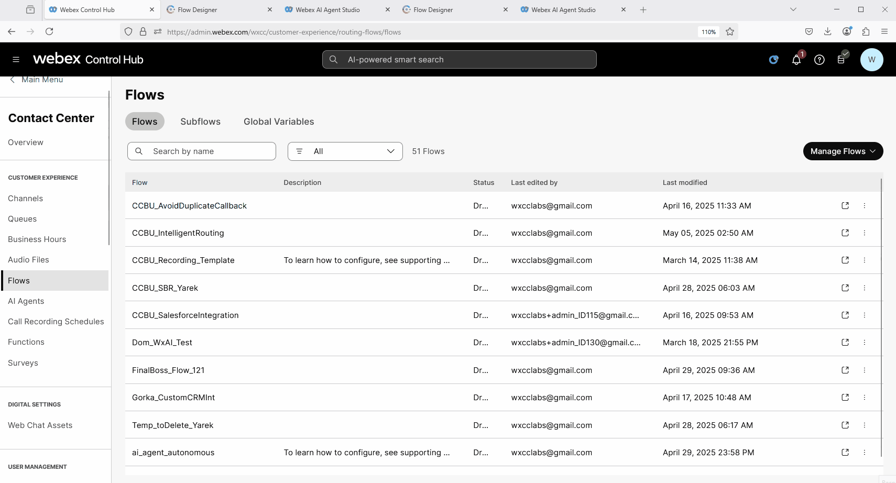

2. Delete the **Disconnect Contact** node and add **VirtualAgentV2** node. Connect **HttpRequest** node to **VirtualAgentV2** node.
   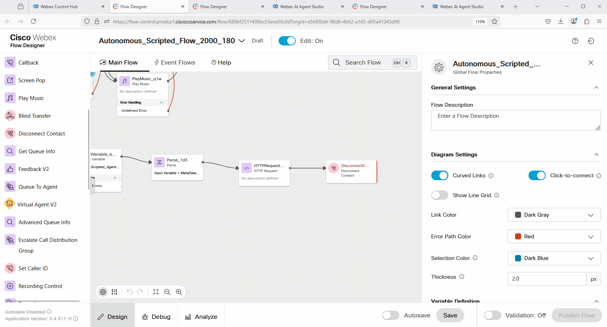

3. Click on **VirtualAgentV2**. In the Contact Center AI Config, search for scripted and select **Webex AI Agent (Scripted)**. Under the Virtual Agent option, search for the Scripted AI Agent with name **<span class="attendee-id-container"><span class="attendee-id-placeholder" data-suffix="_Scripted_AI_Agent">Your_Attendee_ID</span>_Scripted_AI_Agent<span class="copy" title="Click to copy!"></span></span>**.
   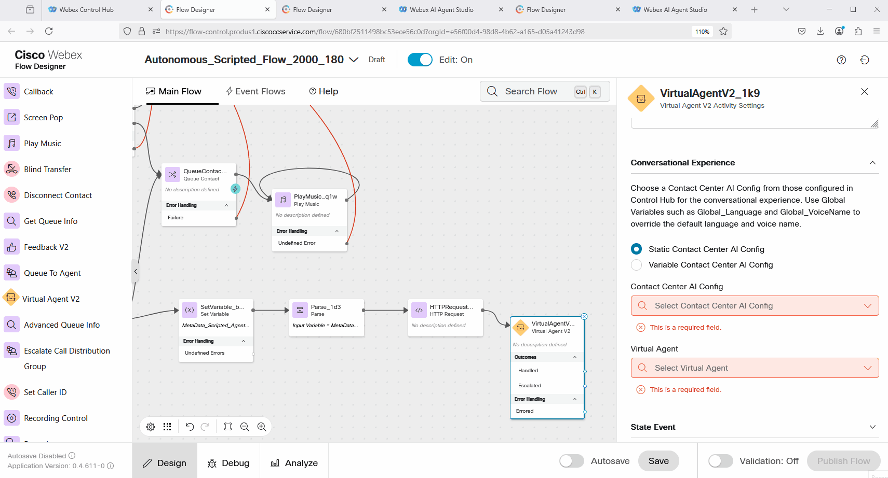

4. Connect **Escalated** output from the **VirtualAgentV2** node to the **Queue** node.
   

5. Add **Disconnect Contact** node and connect **Handled** output to the **Disconnect Contact** node.
   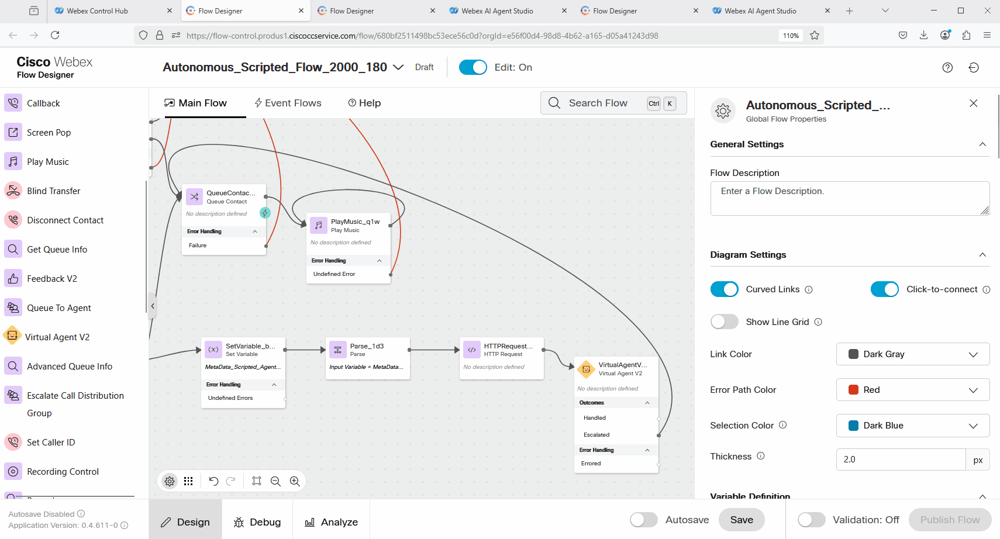

6. You can publish the flow at this point.
   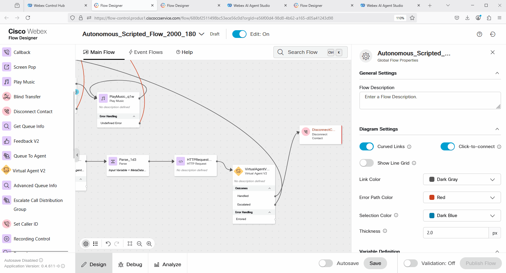

### Task 2. Configure State Event in the VirtualAgentV2 node

!!! Note
    We need to configure the **VirtualAgentV2** node to send the order status to AI Studio, which will be retrieved in the specific response. For this, we will utilize the State Event.

1. Select the **VirtualAgentV2** node that you have added in the previous Task and click on **State Event**.
   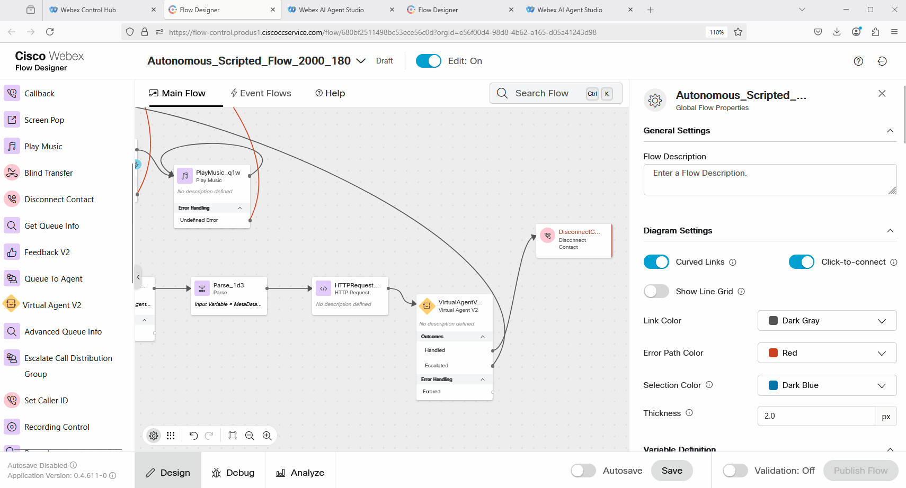

2. Configure the **State Event** with the following: </br>

    > Event Name: **order_status**<span class="copy-static" data-copy-text="order_status"><span class="copy" title="Click to copy!"></span></span><br>
    > Event Data: 
    >
    > ``` JSON
    > {"status":"{{order_status}}"}
    > ```
    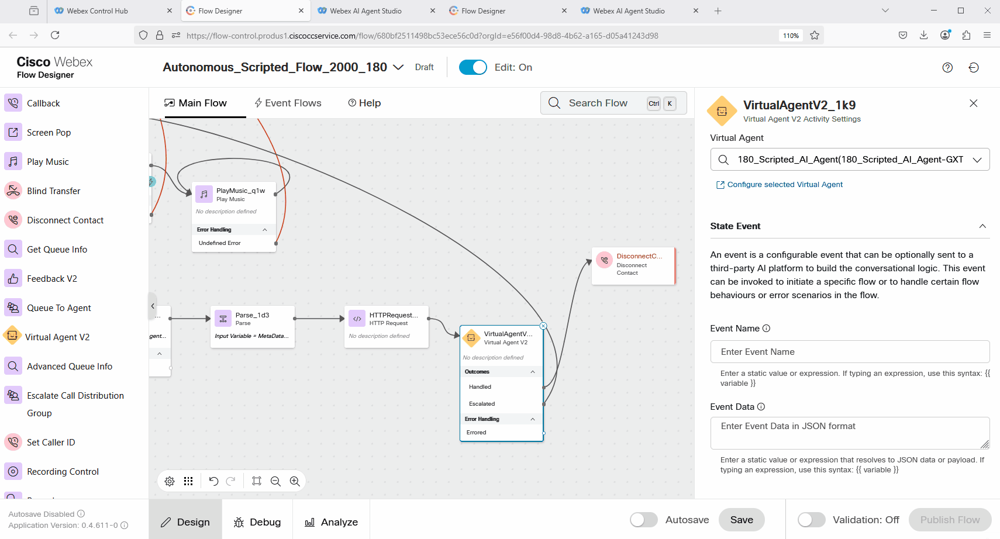

3. You can publish the flow at this point.
   

**<details><summary>Good to Know: <span style="color: blue;">Understand the *State Event* configuration.</span></summary>**

   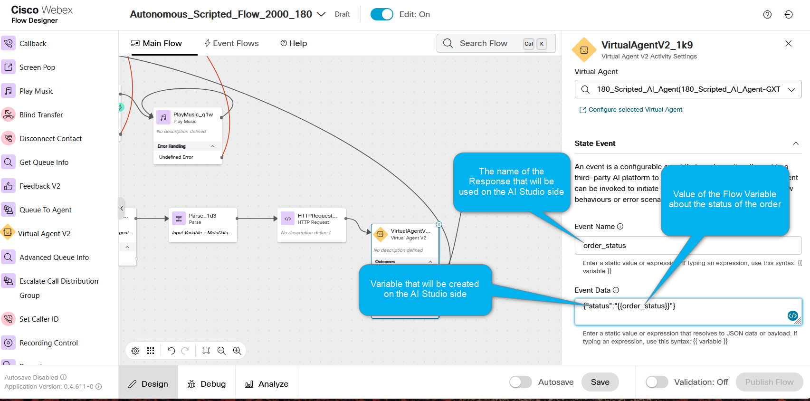

</details>

### Task 3. Review the **order_status** Response configuration

1. Switch to **Webex AI Agent Studio** and open your Scripted Agent. If you followed all the steps the name of the Scripted Agent should be **<span class="attendee-id-container"><span class="attendee-id-placeholder" data-suffix="_Scripted_AI_Agent">Your_Attendee_ID</span>_Scripted_AI_Agent<span class="copy" title="Click to copy!"></span></span>**.
   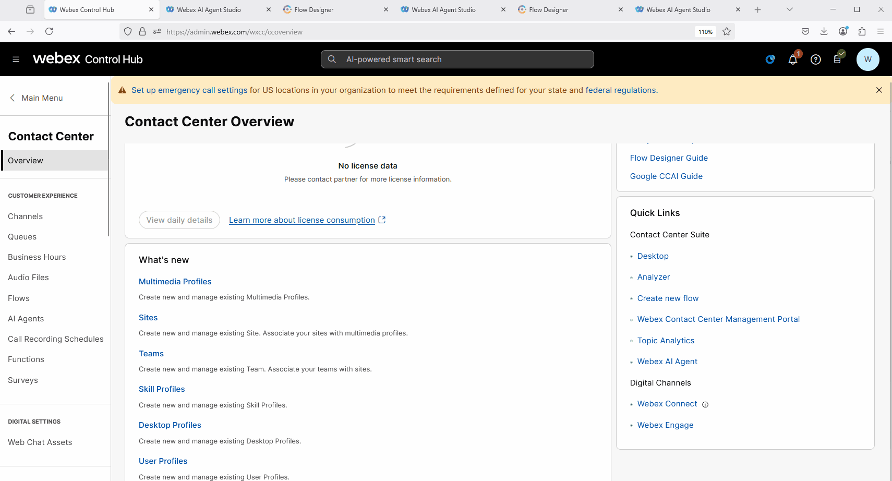

2. Go to **Script ⮕ Responses** and search for the **Response** with the name **order_status**. This response is preconfigured in this lab for you. Go to **Voice** channel and review the configurations.
   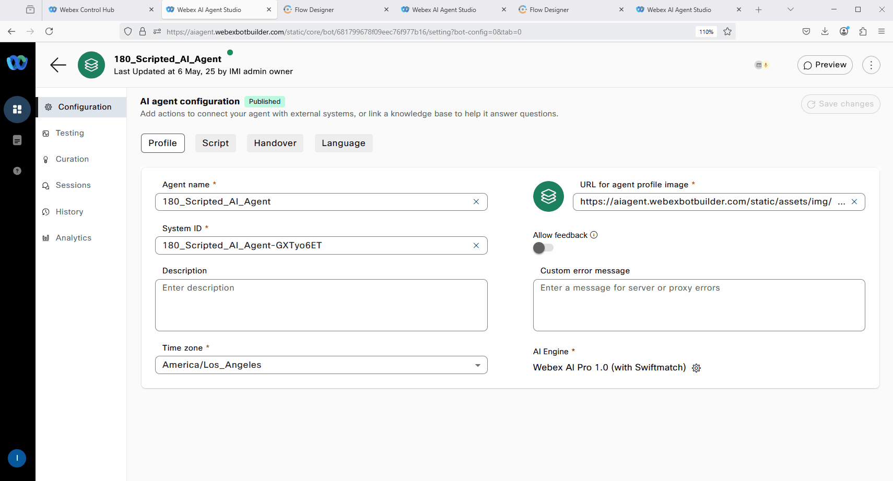

**<details><summary>Good to Know: <span style="color: blue;">Understand the *order_status* configuration.</span></summary>**

   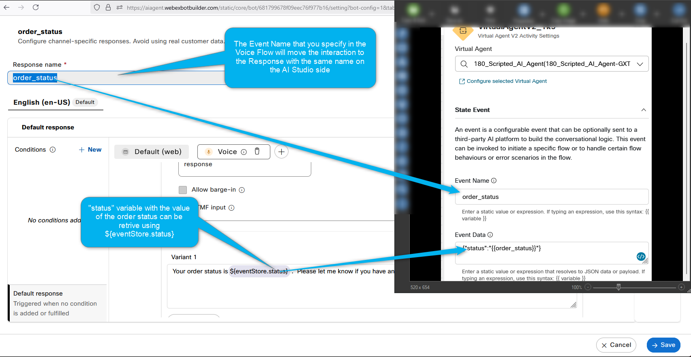

</details>

### Task 4. Test Scripted AI agent order status flow

1. Dial the number assosiated with **<span class="attendee-id-container"><span class="attendee-id-placeholder" data-suffix="_Channel">Your_Attendee_ID</span>_Channel<span class="copy" title="Click to copy!"></span></span>**.
   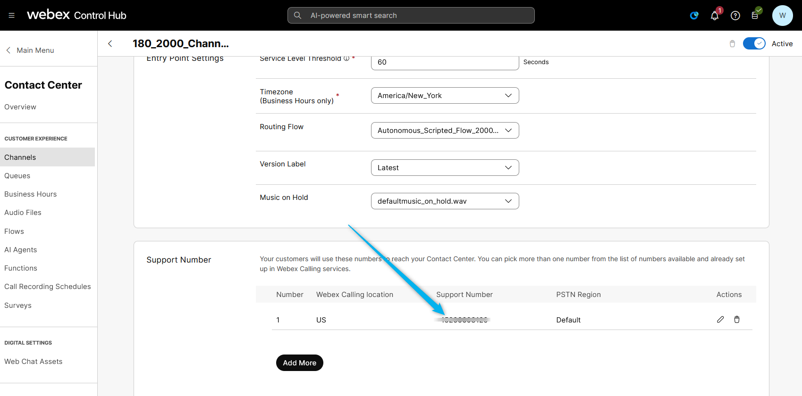

2. During IVR, press 2 to and say **"I want to track my order"**. Provide the order details that you created earlier, or use the order with number 22 for the example.

<p style="text-align:center"><strong>Congratulations, you have officially completed this mission! 🎉🎉 </strong></p>
