🚨 **Important Lab Dependency**

 This mission requires configuration created in the following missions:

 - **[AI Agent Track ⮕ Mission 1 – Create AI Autonomous Agent**](../AI_Lab_Aut_Mission1/) 
 - **[AI Agent Track ⮕ Mission 2 – Integrating the AI Agent with Flow for Voice Calls](../AI_Lab_Aut_Mission1/)**

 If these missions were not completed, some steps in current mission will not function correctly.

## Mission overview

Your mission is to:

 - Create a Knowledge Base for the AI Assistant skill to use. This Knowledge Base will contain documents that provide the necessary information for the AI Assistant to knowledgeably provide suggestions to the agent.

---

## Build

### Task 1. Create Knowledge Base

1. Download the .xlsx file [Flowrs_Catalog](https://docs.google.com/spreadsheets/d/1A5d1ZEPWmPE_38Bi8bVULKLhCH0wyGX4/edit?usp=sharing&ouid=100862210011127627593&rtpof=true&sd=true){:target="\_blank"}.
   > **Flower_Catalog.xlsx** - file contains information on the available single flowers and bouquets, including the price of the flowers or bouquets and occasions that suit the flowers.
   

    !!! Note
        This is same file that used for the [AI Agent Track: Mission 1 – Create AI Autonomous Agent**](../AI_Lab_Aut_Mission1/). You can skip this step if you already completed that mission. 

2. From **Control Hub**, go to Contact Center and open **Webex AI Agent Studio** portal.
   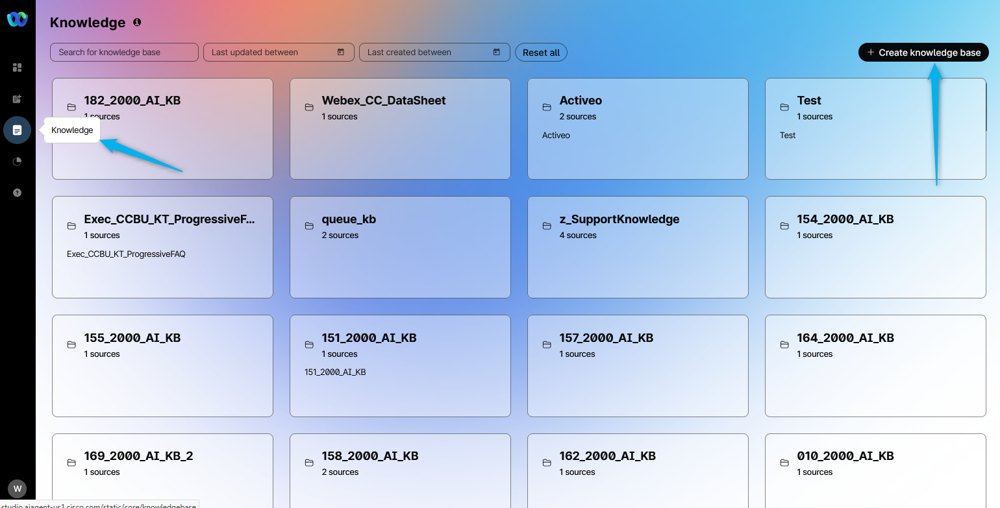

3. Select **Knowledge** and click on **Create Knowledge base**.
   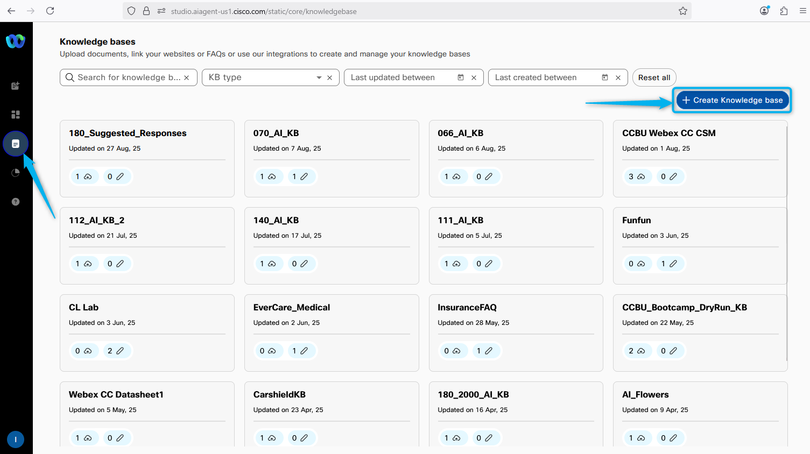

4. Provide the name as **Your_Attendee_ID_Suggested_Responses_Knowledge** and click on **Create**.
   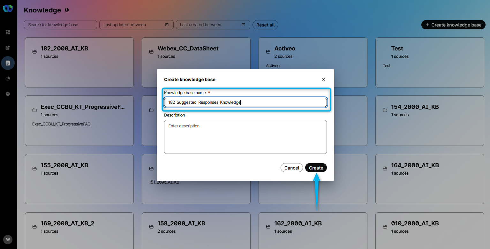

5. Add **Flower_Catalog** file downloaded in step 1.
   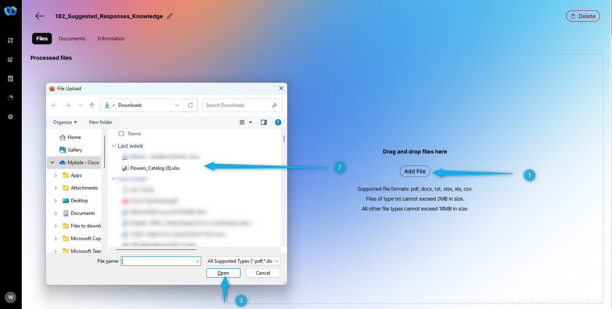

6. Click on **Process** the file.
   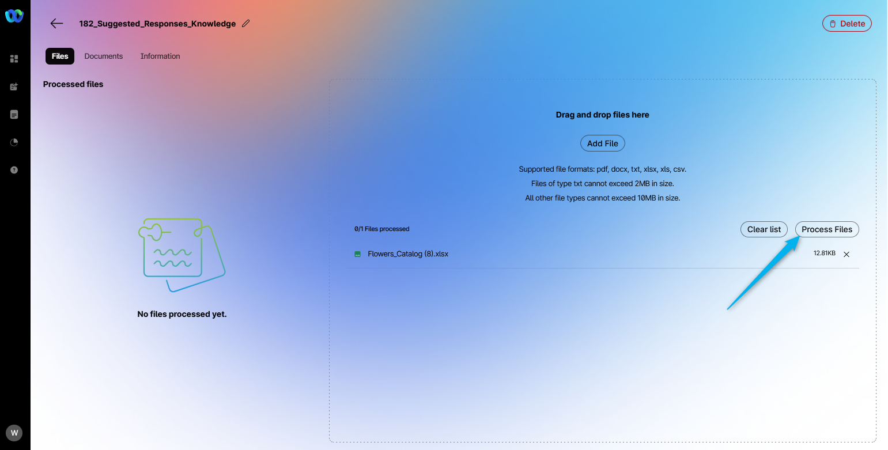

### Task 2. Create AI Assistant skills

1. Now, select **AI Assistant skills** and click on **Create skills**.
   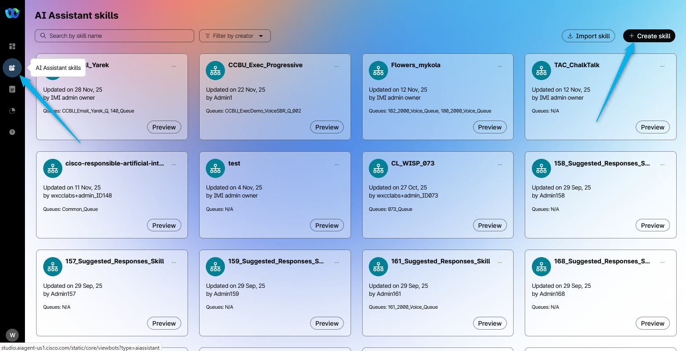

2. Select **Start from scratch** and click **Next**.
   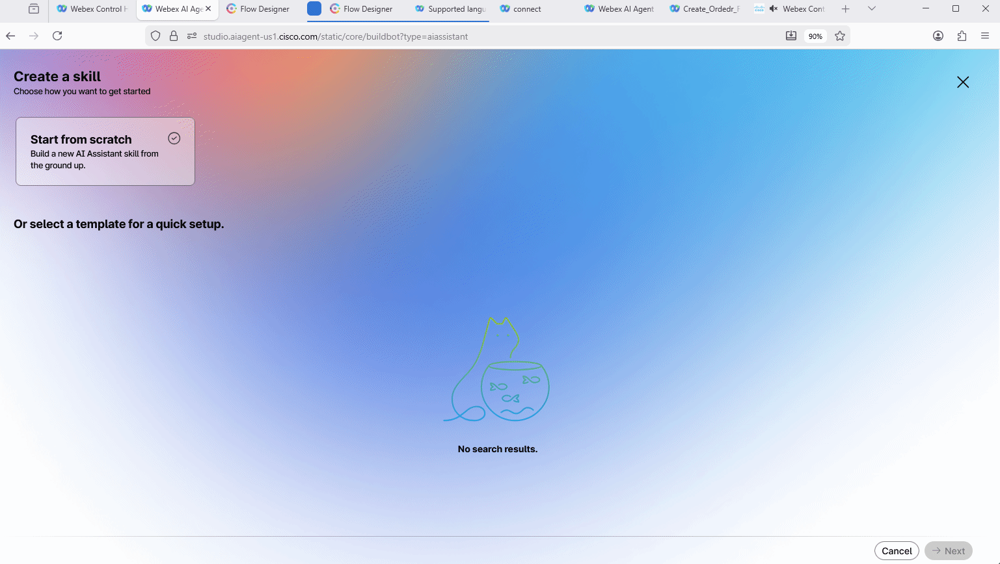

3. Name the skill as **Your_Attendee_ID_Suggested_Responses_Skill**. Add the following text into the **Goal** section **. And then click on **Create**.
   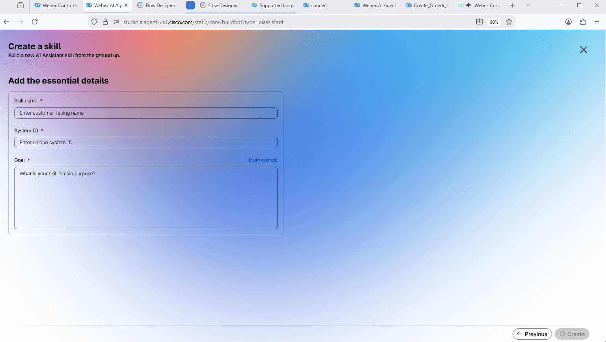

4. Link your knowledge base **Your_Attendee_ID_Suggested_Responses_Knowledge** to the skill in the **Knowledge** section. **Save** and **Publish** the changes.
   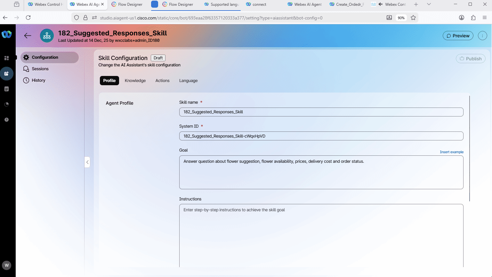

### Task 3. Assign AI skills to your queue

1. Switch to Webex Control Hub, go to Contact Center, scroll down until you see the **AI Assistant** module. Open it and scroll down to the **Real-Time Assist** feature. 

2. Click on Assign AI Assistant skills. In the following window, select the skill that you created in the previous task, **Your_Attendee_ID_Suggested_Responses_Skill**, and add your queue **Your_Attendee_ID_Queue**. Then click **Save**.
   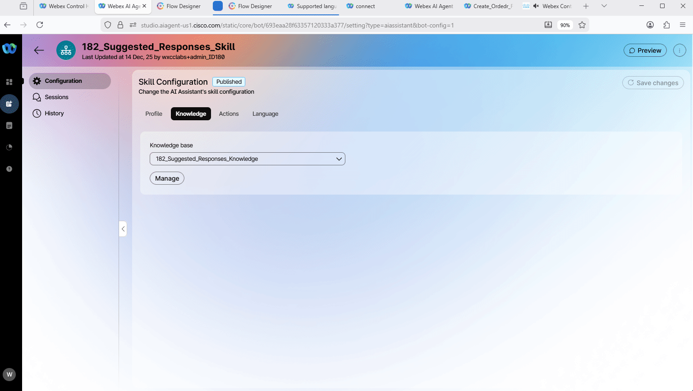

### Add "Start Media Stream" block to the voice flow

1. In the Webex Control hub, find and open your flow **AutonomousAIFlow_2000_Your_Attendee_ID**.
   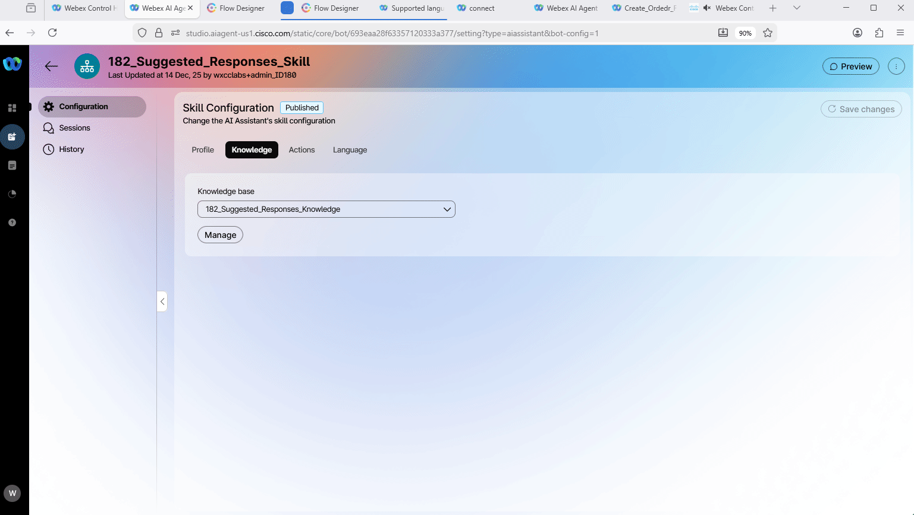

2. Click on **Edit** and select **Event Flows**.
   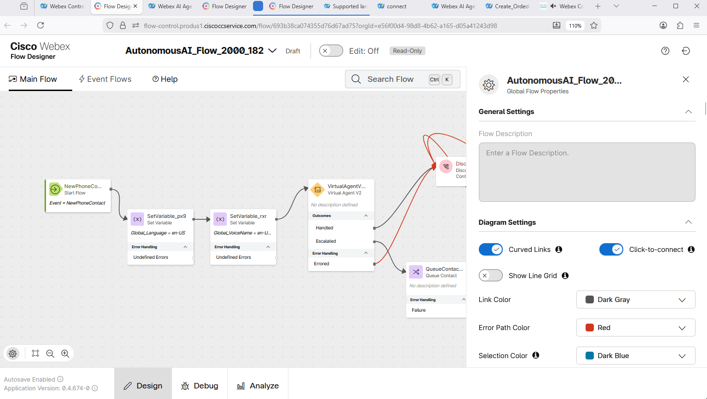

3. Drag and drop **Start Media Stream** node and connect **AgentAnswer** node to the **Start Media Stream** node. 
4. Drag and drop **End Flow** node and connect **Start Media Stream** to **End Flow**.
5. Validate and publish the flow:

    > - Enable the **Validation** toggle in the bottom right corner of the flow designer window to check for any potential flow errors and recommendations.
    >
    > - If there are no **Flow Errors** after validation is complete, click on **Publish Flow** next to it.
    >
    > - In the pop-up window, ensure that the **Latest** label is selected in the **Add Version Label(s)** list, then click **Publish Flow**.

   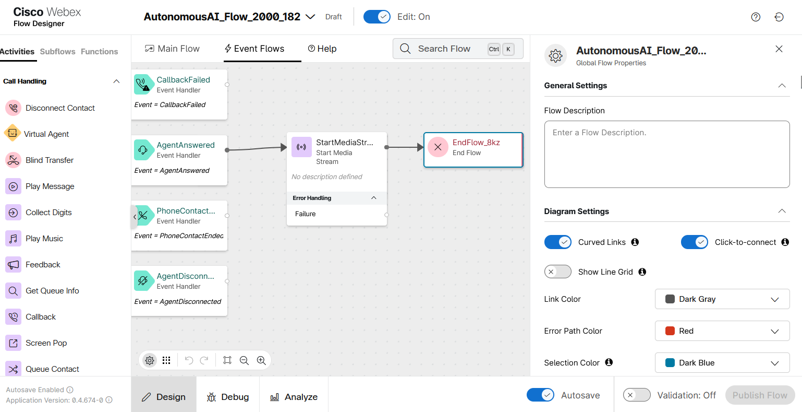

### Task 5. Test Real-Time Assist Feature

1. Switch to Control Hub to assign the Flow to your **Channel (Entry Point)**. Go to **Channels**, search for your channel **Your_Attendee_ID_Channel**
7. Click on **Your_Attendee_ID_Channel**
8. In **Entry Point** settings section change the following, then click **Save** button:

    > - Routing flow: **AutonomousAIFlow_2000_Your_Attendee_ID**
    >
    > - Music on hold: **defaultmusic_on_hold.wav**
    >
    > - Version label: **Latest**

    

2. Your Agent Desktop session should still be active. If it is not, launch **Desktop** using the cross-launch link in **Control Hub**.

    **

See how to run Agent Desktop from the Control Hub
**

    

    

3. Make your agent **Available** and you're ready to make a call.
   

4. Place the test call to the number that is associated with your **Your_Attendee_ID_Channel**. 

5. Once the call is connected to your Agent Desktop, click on the **AI Assistant** module. You will see the option **Get Suggestion**. Click on it and try to order some flowers. You should see that the AI Agent will suggest flower availability and prices to the human agent based on the Knowledge Base.
   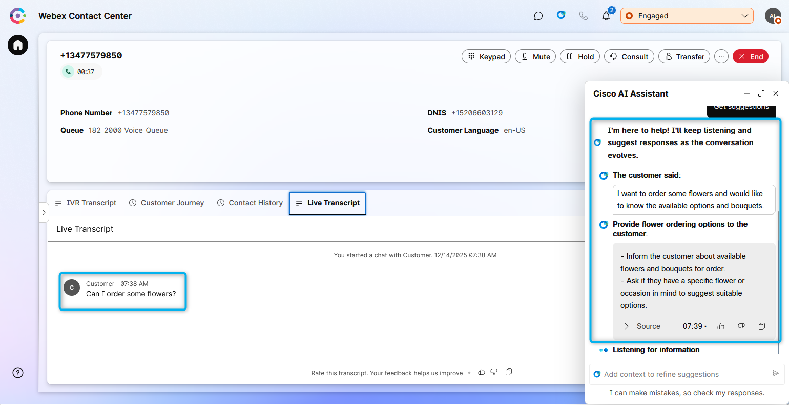

<strong>Congratulations, you have officially completed this mission! 🎉🎉 </strong>

