🚨 **<span style="color: red;">Important Lab Dependency</span>**

 This mission requires configuration created in the following missions:

 1. **[AI Agent Track: Mission 1 – Create AI Autonomous Agent](../AI_Lab_Aut_Mission1/)**<br>
 2. **[AI Agent Track: Mission 2 – Integrating the AI Agent with Flow for Voice Calls](../AI_Lab_Aut_Mission1/)**<br>
 3. **[AI Assistant Track: Real-Time Assist (Suggested Responses): Mission 1: Configure Real-Time Assist in Knowledge Base](../AI_Lab_Suggested_Responseds_Mission1/)**

 If these missions were not completed, some steps in current mission will not function correctly.

## Mission overview

Your mission is to:

 - Configure the fulfillment flow to track the status of existing orders. This functionality will allow the system to track the status of an order after the customer provides the order number, so the agent does not have to do any manual work and can simply deliver the order status to the customer.

---

## Build

### Task 1. Create flow in Webex Connect

1. From the **Control Hub**, login to Webex Connect.
   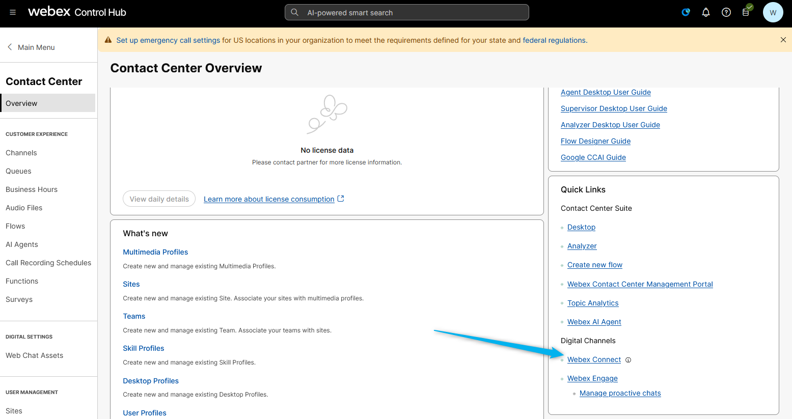

2. Navigate to the **<span class="attendee-id-container"><span class="attendee-id-placeholder" data-suffix="_2000_Service">Your_Attendee_ID</span>_2000_Service<span class="copy" title="Click to copy!"></span></span>**
   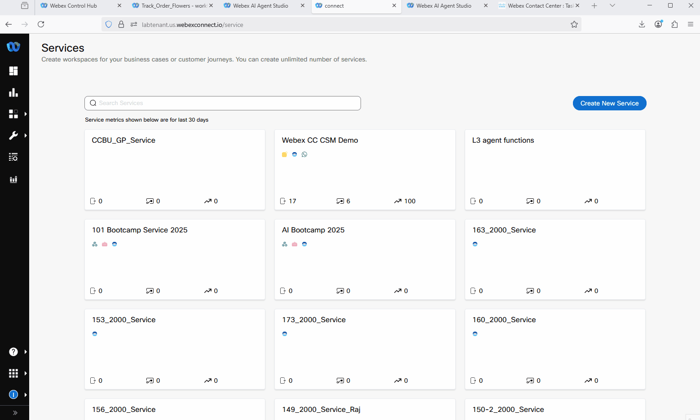

3. Create new flow. Name it <span class="copy-static" data-copy-text="Track_Order_Flowers"><span class="copy" title="Click to copy!"></span></span>.
   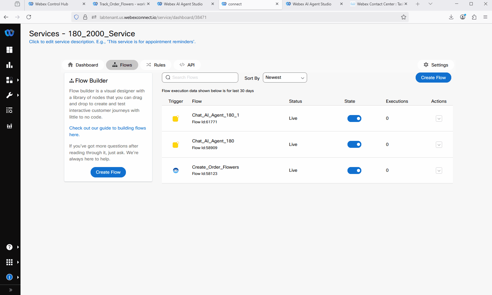

4. Select **Integration** as **AI Agent**. Then click on **Parse** and then click on **Save**. 

5. Click on **Make Live**. We will configure it in a later Task. For now, we just need to create the flow that will be used to complete the Action Configuration on the AI Studio side.
   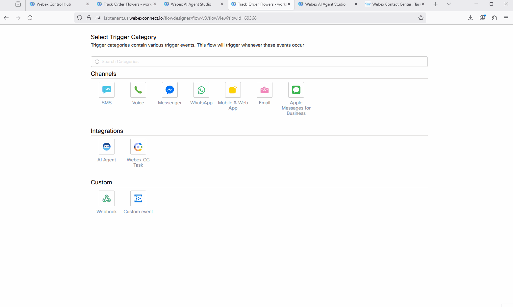

### Task 2. Configure Action in Webex AI Agent Studio

1. Switch back to **Control Hub** and go to the **Webex AI Agent Studio** portal.
   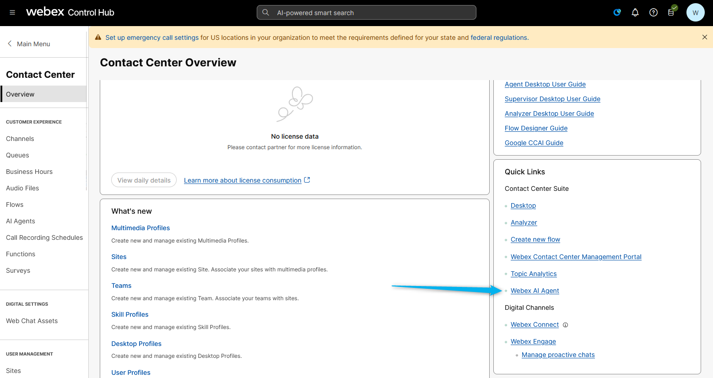

2. Select **AI Assistant** and find the **Skill** that you created earlier - **<span class="attendee-id-container"><span class="attendee-id-placeholder" data-suffix="_Suggested_Responses_Skill">Your_Attendee_ID</span>_Suggested_Responses_Skill<span class="copy" title="Click to copy!"></span></span>**.
   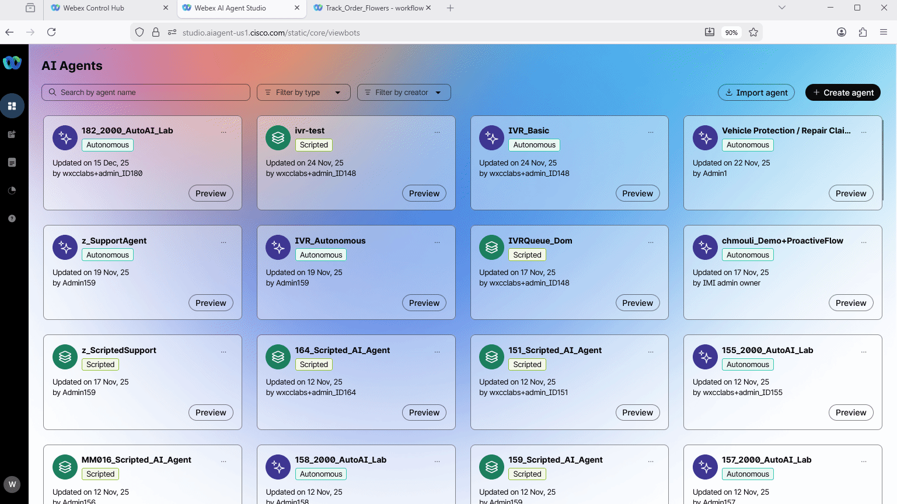

3. Select **Actions** and create new Action.
   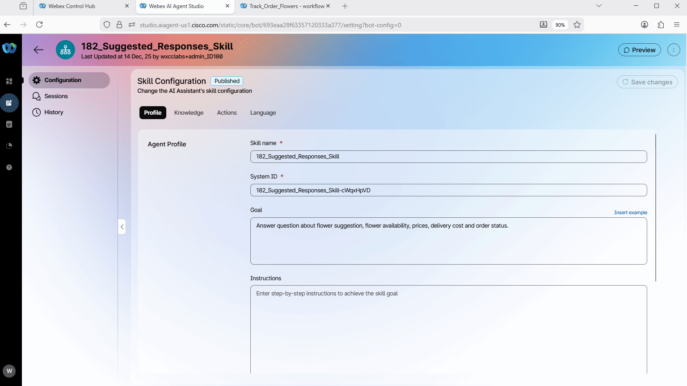

4. Click on **Integration** and select **Fulfillment action**.
   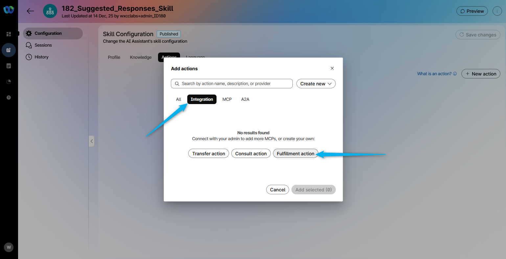

5. Name the Action as **track_order**<span class="copy-static" data-copy-text="track_order"><span class="copy" title="Click to copy!"></span></span>. <br>
   
    > In the **Action description** provide the following: **If the customer want to track and order, collect the order number. With the order number execute the fulfillment and return the customer the order status.**<span class="copy-static" data-copy-text="If the customer want to track and order, collect the order number. With the order number execute the fulfillment and return the customer the order status."><span class="copy" title="Click to copy!"></span></span><br>
    > Select the **Action scope** as **Slot filling and fulfillment.**
   
    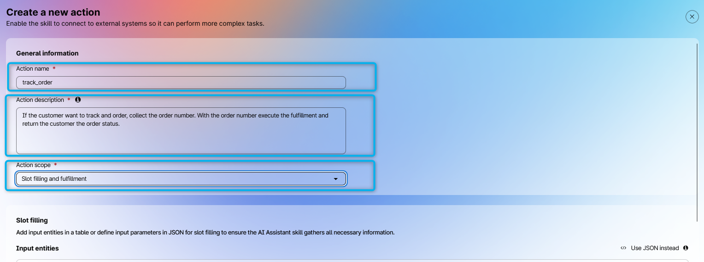

6. Add **New input entity**. Configure it with the following:<br>
   > Name: **orderNumber**<span class="copy-static" data-copy-text="orderNumber"><span class="copy" title="Click to copy!"></span></span>
   > Entity type: **String**<br>
   > Entity description: **If the customer wants to track an order, collect the order number to this entity.**<span class="copy-static" data-copy-text="If the customer wants to track an order, collect the order number to this entity."><span class="copy" title="Click to copy!"></span></span><br>
   > Entity example: **17**<span class="copy-static" data-copy-text="17"><span class="copy" title="Click to copy!"></span></span><br>
   > Required: **Yes**<br>
   > Input field display name: **orderNumber**<span class="copy-static" data-copy-text="orderNumber"><span class="copy" title="Click to copy!"></span></span>
   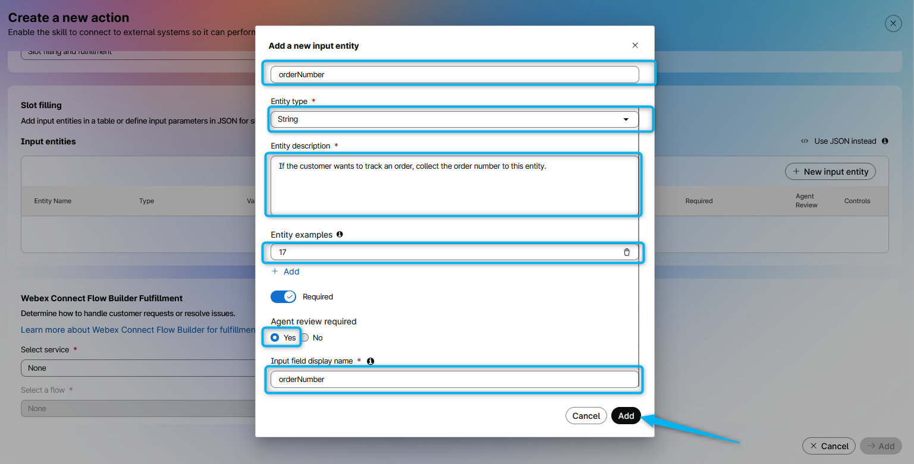

7. For the fulfillment flow, select the Service **<span class="attendee-id-container"><span class="attendee-id-placeholder" data-suffix="_2000_Service">Your_Attendee_ID</span>_2000_Service<span class="copy" title="Click to copy!"></span></span>** and the flow **Track_Order_Flowers**<span class="copy-static" data-copy-text="Track_Order_Flowers"><span class="copy" title="Click to copy!"></span></span>, that you have created in the previous tasks. Then click **Add**.
   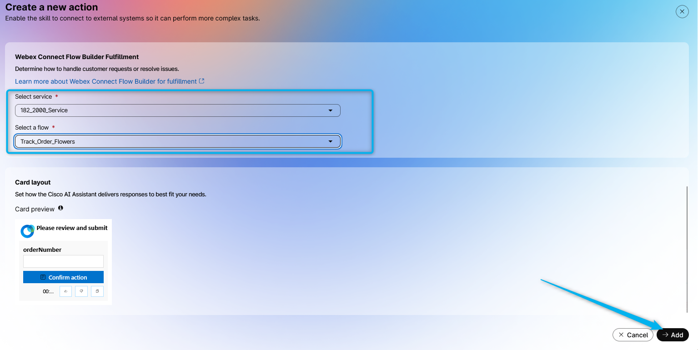

8. **Publish** the recent changes of the skill.
   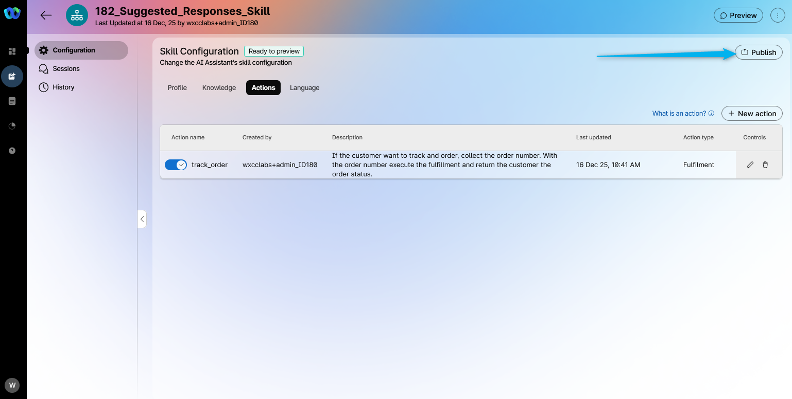

### Task 3. Configure Fulfillment flow in Webex Connect

1. Switch to **Webex Connect**. Find the service **<span class="attendee-id-container"><span class="attendee-id-placeholder" data-suffix="_2000_Service">Your_Attendee_ID</span>_2000_Service<span class="copy" title="Click to copy!"></span></span>** and open up flow: **Track_Order_Flowers**. Click on **Edit** the flow.
   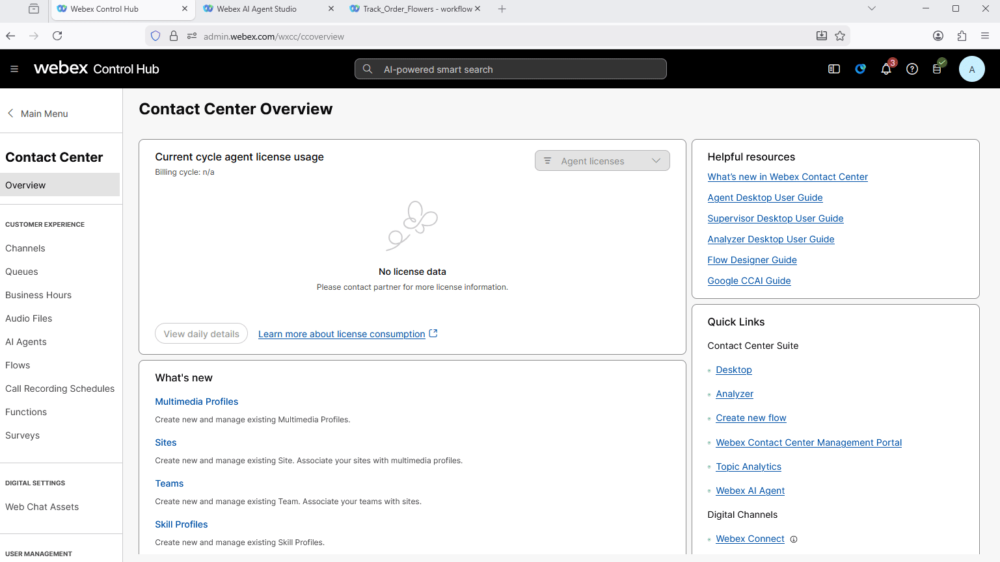

2. Add an **HTTP Request** node to the flow and connect **Configure AI Agent Event** node to this **HTTP Request** node.
   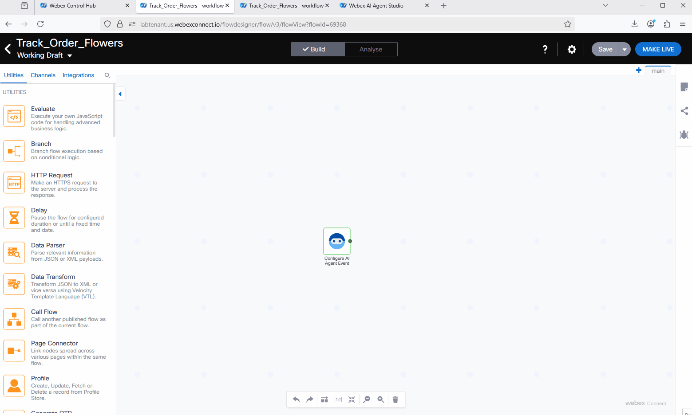

3. Open up **Configure AI Agent Event** node and replace the Sample JSON body with the following. Then click on **Parse** and **Save** the changes of the node.
   ```JSON
   {
     "orderNumber": "number"
   }
   ```
   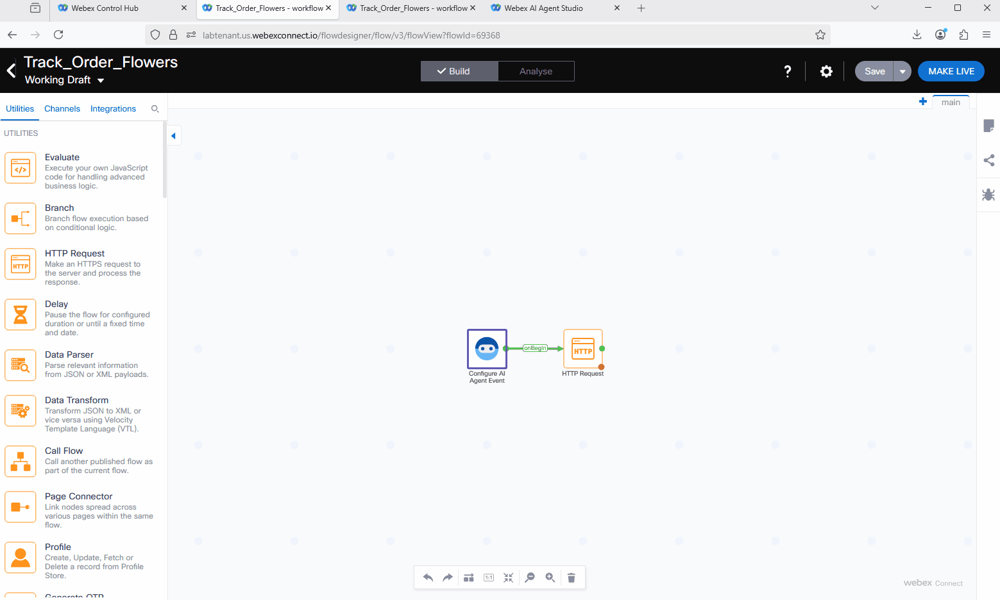

4. Open up **HTTP Request** node and configure it with the following:
   > Method: **GET**
   >
   > Endpoint URL: **https://674481b1b4e2e04abea27c6e.mockapi.io/flowdesigner/Lab/flowers?id=$(n2.aiAgent.orderNumber)<span class="copy-static" data-copy-text="https://674481b1b4e2e04abea27c6e.mockapi.io/flowdesigner/Lab/flowers?id=$(n2.aiAgent.orderNumber)"><span class="copy" title="Click to copy!"></span></span>**<br>
   > Header: **Content-Type**<span class="copy-static" data-copy-text="Content-Type"><span class="copy" title="Click to copy!"></span></span>
   >
   > Value **application/json**<span class="copy-static" data-copy-text="application/json"><span class="copy" title="Click to copy!"></span></span>
   >
   > Output Variable Type set to **JSON**<br>
   > Click on **+Add Variable**<br>
   > Output Variable Name: **orderStatus**<span class="copy-static" data-copy-text="orderStatus"><span class="copy" title="Click to copy!"></span></span><br>
   > Response Entity: **Body**<br>
   > Response Path **$[0].status**<span class="copy-static" data-copy-text="$[0].status"><span class="copy" title="Click to copy!"></span></span><br>
   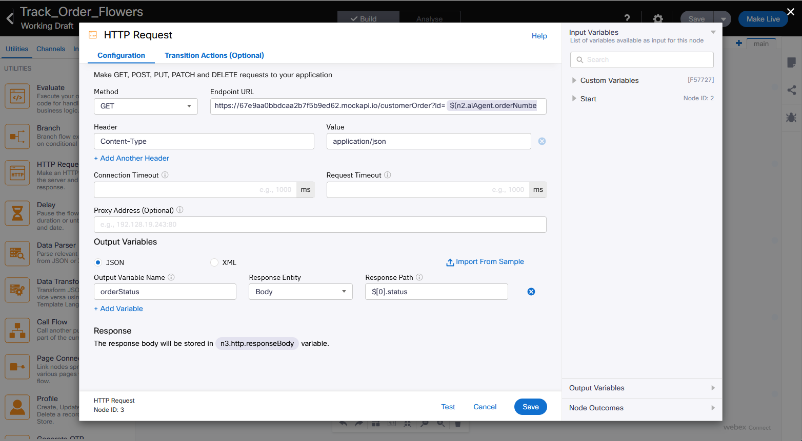

5. Save changes and click on **Make Live**.
   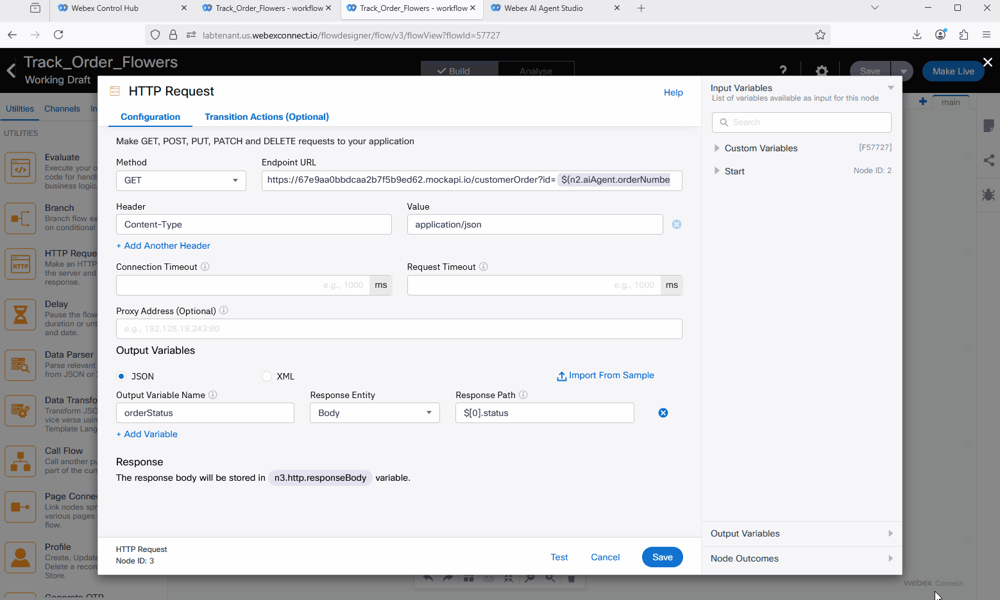

### Task 4. Deliver data from Webex Connect to AI studio for the response to the customer

1. While on your **Webex Connect** flow, click on **Edit** the flow then click on the **Settings** and on the top, select **Flow Outcomes** and expand **Last Execution Status**. In the **Define key-value pairs to be sent to the AI Agent**, select **Enter JSON**.
   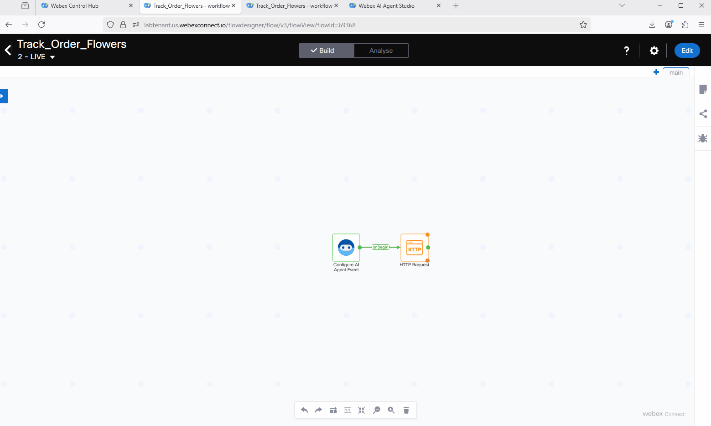

2. We need to add the key-value pair to the existing JSON body. Add the comma after the last pair and insert **"orderStatus": "$(n3.orderStatus)"**. Make sure there is no comma after the pair that you inserted. Then click on **Save**.<br>
    ``` JSON
    "orderNumber": "$(n3.orderStatus)"
    ```    
    <br>

3. Click on **Save**. Then click on **Make Live** option to publish the flow.
   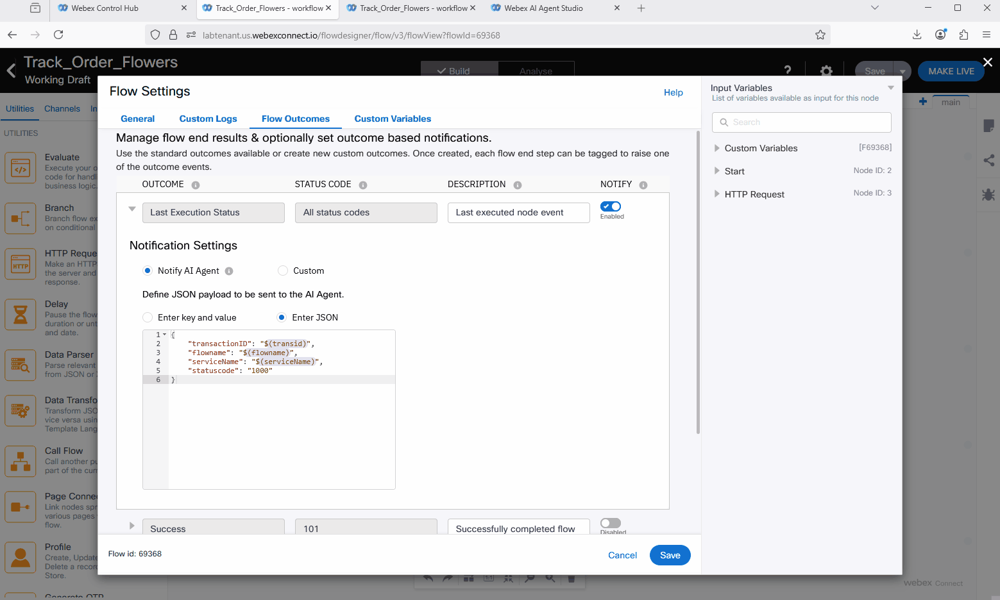

### Task 5. Test the Suggested Responses feature with fulfillment

1. Your Agent Desktop session should still be active. If it is not, launch **Desktop** using the cross-launch link in **Control Hub**.

    **<details><summary>See how to run Agent Desktop from the Control Hub</summary>**

    

    </details>

2. Make your agent **Available** and you're ready to make a call.
   


3. Place the call to the number that is related to your channel **<span class="attendee-id-container"><span class="attendee-id-placeholder" data-suffix="_Channel">Your_Attendee_ID</span>_Channel<span class="copy" title="Click to copy!"></span></span>**.

4. Ask the AI Agent to transfer the call to the human agent.

5. Once the call is connected to the Agent Desktop, select the **AI Assistant widget** and then click on **Get suggestions**.
   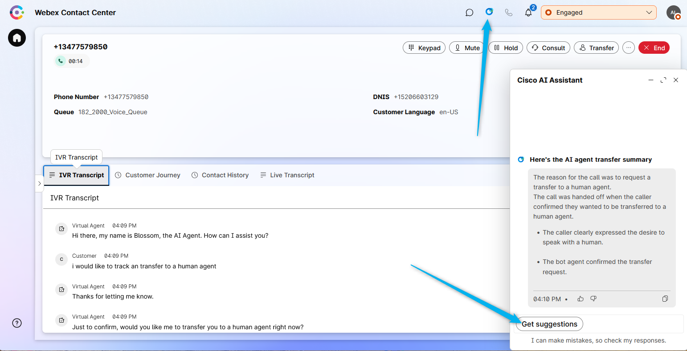

6. As the caller, say that you would like to track an order. You will see the suggestion come up to ask for the order number.
   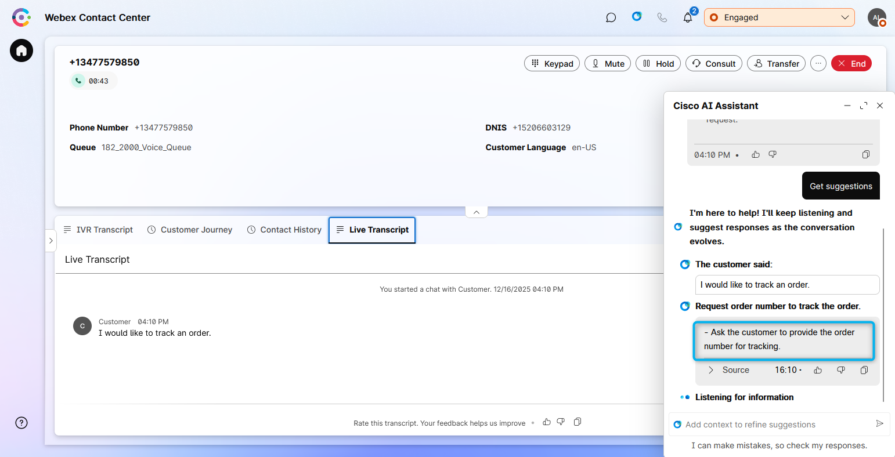

7. As the caller, provide your order number, and you should see the review window show up where the agent can confirm the order number that needs to be tracked.
   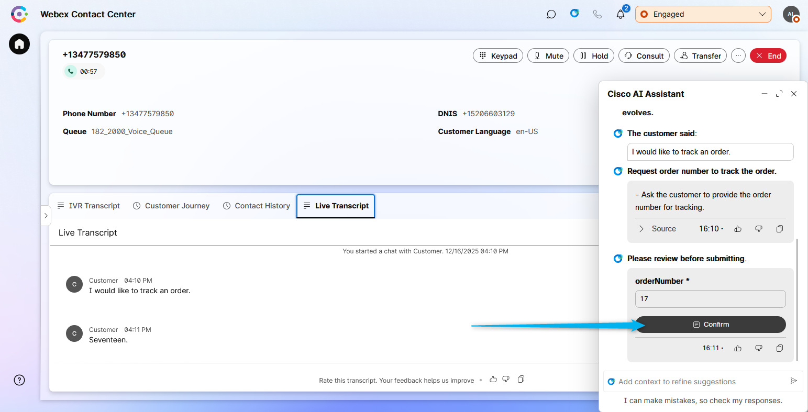

8. For this lab, all order statuses are "new" so you should see that the AI responds that the order status is "new".
   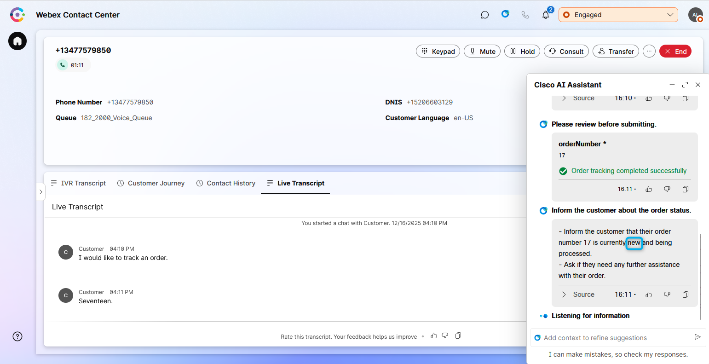

9. (Optional) To see all order information you can by placing this URL in your browser. <br>
   **https://674481b1b4e2e04abea27c6e.mockapi.io/flowdesigner/Lab/flowers<span class="copy-static" data-copy-text="https://674481b1b4e2e04abea27c6e.mockapi.io/flowdesigner/Lab/flowers"><span class="copy" title="Click to copy!"></span></span>** <br>
   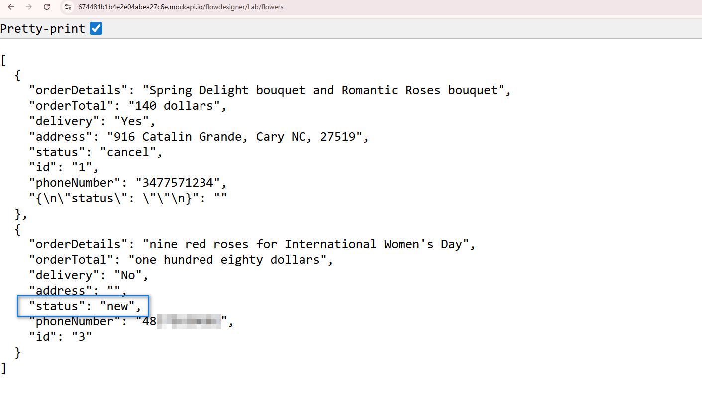

<p style="text-align:center"><strong>Congratulations, you have officially completed this mission! 🎉🎉 </strong></p>
