🚨 **<span style="color: red;">Important Lab Dependency</span>**

 This mission requires configuration created in the following missions:

1. **<span style="color: green;">NO DEPENDENCY</span>**

---

# Mission 6: The "Zen of Simplicity" (UI vs. Code). Using Functions to simplify flow logic.


!!! Note
    Current usecase was covered in **Cisco Live 2026** and **Partner Technical Summits 2026**. 
    [**Boosting Customer Experience with Flow Orchestration in Webex Contact Center - BRKCCT-2345**](https://www.ciscolive.com/on-demand/on-demand-library.html?search=BRKCCT-2345&search=BRKCCT-2345#/session/1770243038329001vrUy){:target="\_blank"} (login required)

## Story 
In this mission, you will use a **Function** node in Webex Contact Center to select a language based on caller's ANI. By analyzing ANI our function will return a country name that we can use further in script logic to either select language or redirect to a specific team. This approach allows you to collapse 10 messy nodes into one elegant script. 

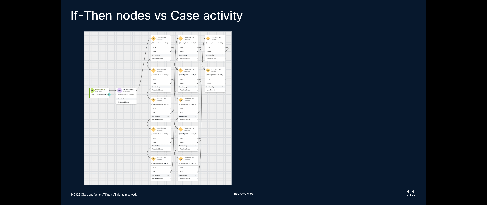

## Call Flow Overview

1. When call arrives, function node analyzes ANI and returns respective country name in the output.</br>
2. **Play Message** node plays the message with selected country name.</br>


## Mission Details

Your mission is to:

1. Create a function that analyzes phone country code as part of ANI of the caller, processes it, and return a country name based on a country phone code.</br>
2. Create a new flow with the **Function** element.</br>
3. Play the country generated by the **Function** to the caller.</br>


## Building Function 

1. Switch to Control Hub, then navigate to **Functions**, click on **Create a function**. 

2. New Tab will be opened. Select **Start Fresh** and provide name **<span class="attendee-id-container">CountryCase_Function_<span class="attendee-id-placeholder" data-prefix="CountryCase_Function_">Your_Attendee_ID</span><span class="copy" title="Click to copy!"></span></span>**. Leave **Function Language** as **JavaScript**, then click **Create Function**.

    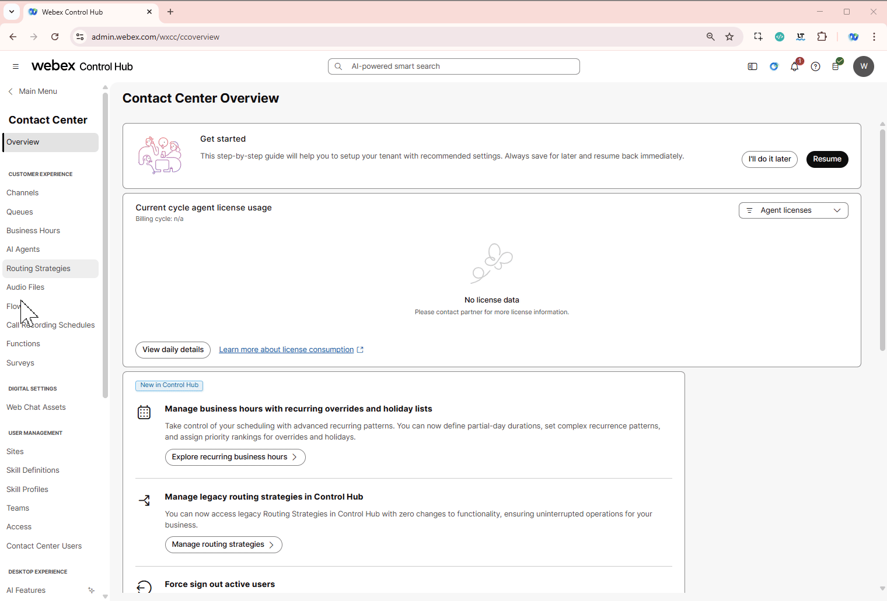

3. Add following variable by clicking **Add Input Variables** on the right-hand side:

    > Name: **ANI**<span class="copy-static" data-copy-text="ANI"><span class="copy" title="Click to copy!"></span></span></br>
    > Type: **String**
 
4. Add output variable **CountryName**<span class="copy-static" data-copy-text="personalizedMessage"><span class="copy" title="Click to copy!"></span></span> in **Output Variable Definition** field.</br>

    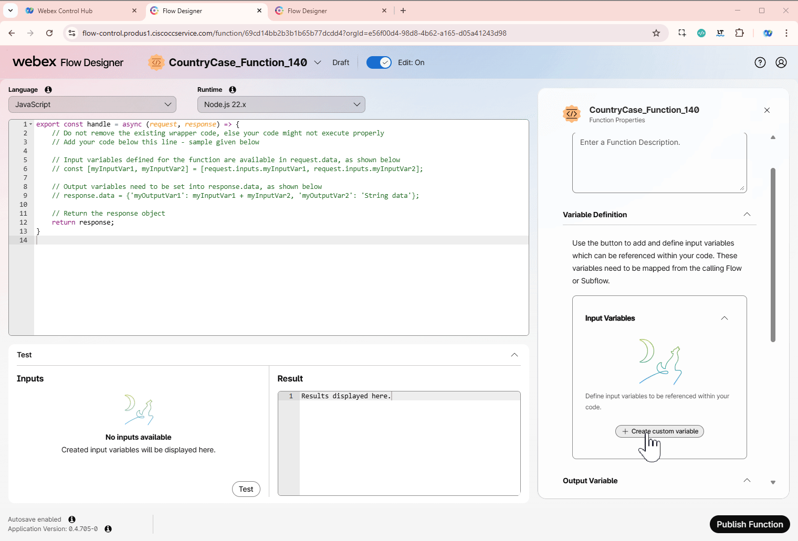

5. Clear the editor from the default code and paste the following JavaScript code into Function editor.

    ``` JSON
    export const handle = async (request, response) => {
      let ani = request.inputs.ANI || "";

      // Ensure it starts with "+"
      if (!ani.startsWith("+")) {
        ani = "+" + ani;
      }
    
      // Country code map
      const countryCodes = {
        "+380": "Ukraine",
        "+44": "United Kingdom",
        "+48": "Poland",
        "+1": "United States"
      };
    
      // Check longest prefixes first
      const prefixes = Object.keys(countryCodes).sort((a, b) => b.length - a.length);
    
      let country = "Unknown";
    
      for (let prefix of prefixes) {
        if (ani.startsWith(prefix)) {
          country = countryCodes[prefix];
          break;
        }
      }
    
      response.data = { Country: country };
      return response;
    };
    ```

    !!! Note
        You can add more country codes into  **// Country code map**. Se the following example of how to add **Spain** country code
        ``` JSON        
        const countryCodes = {
          "+380": "Ukraine",
          "+44": "United Kingdom",
          "+48": "Poland",
          "+1": "United States",
          "+34": "Spain"
          };
        ```
    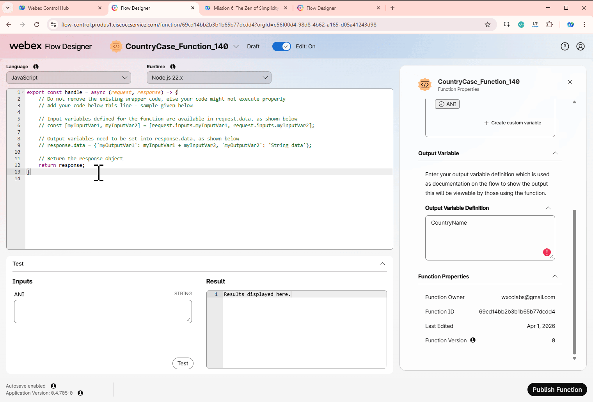

    **<details><summary>Good to know: Script Breakdown <span style="color: orange;">[Optional]</span></summary>**
    This function takes an incoming phone number (ANI) and determines the country based on its international dialing prefix.
     
        ``` JSON
        export const handle = async (request, response) => {
        ```     
    This is the entry point of the function:</br>
    - `request` → contains input data (like ANI)
    - `response` → where we store the result returned to the flow
         

    1. Read the ANI (Caller Number):</br>

        ``` JSON
        let ani = request.inputs.ANI || "";
        ```   

        - Retrieves the caller’s phone number from the flow</br>
        - If ANI is missing → defaults to an empty string (prevents errors)

    2. Normalize the Number Format</br>
        ``` JSON
        if (!ani.startsWith("+")) {
        ani = "+" + ani;
        }
        ```   
        - Ensures the number is in international format (E.164)</br>
        - Example: `447911123456` → `+447911123456`</br>
        - This is critical because all comparisons rely on **+** prefixes</br>

    3. Define Country Code Mapping:</br>
        ``` JSON
        const countryCodes = {
          "+380": "Ukraine",
          "+44": "United Kingdom",
          "+48": "Poland",
          "+1": "United States"
        };
        ``` 
        - A simple lookup table</br>
        - Keys = country dialing prefixes</br>
        - Values = country names</br>
        - Easy to extend (just add more entries)</br>

    4. Sort Prefixes by Length:</br>
        ``` JSON
        const prefixes = Object.keys(countryCodes).sort((a, b) => b.length - a.length);
        };
        ``` 
        - Sort prefixes from longest to shortest.</br>
        - Ensures most specific match wins</br>

    5. Find Matching Country:</br>
        ``` JSON
        let country = "Unknown";

        for (let prefix of prefixes) {
          if (ani.startsWith(prefix)) {
            country = countryCodes[prefix];
            break;
          }
        }
        ``` 
        - Loop through all prefixes</br>
        - Check if ANI starts with a given prefix</br>
        - If match found:</br>
        - - Assign country</br>
        - - Stop loop (`break`)</br>

    6. Return Result:</br>
        
        ``` JSON
        response.data = { Country: country };
        return response;
        ```

        - Stores the result in response object `Country`

    </details>

6. Perform a test to see how you script preforms by navigating to **Test** panel below the editor. Provide the following data into respective fields, then click **Test** button.

    > `ANI`: **+48123211853**<span class="copy-static" data-copy-text="+48123211853"><span class="copy" title="Click to copy!"></span></span>

    

7. Click on **Publish Function** in the bottom right corner of the page. Then click **Publish Function** in pop up window.

    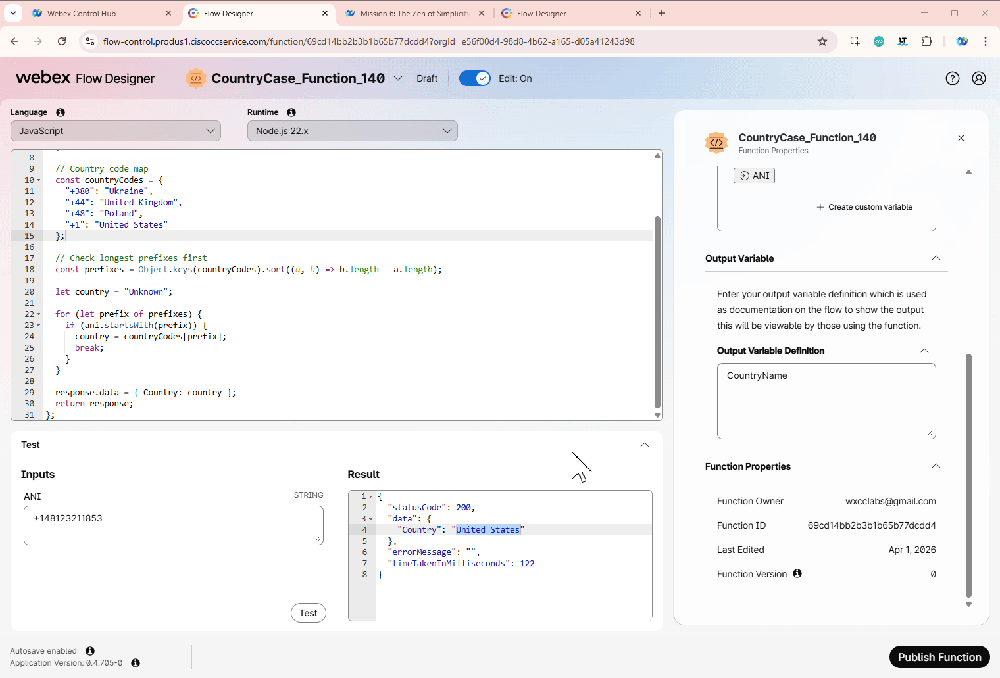

---

## Building Flow

1. Switch to Control Hub, then navigate to **Flows**, click on **Manage Flows** then select **Create Flows** from drop down list. 

2. Select **Start from scratch** and click next

3. Enter flow name **<span class="attendee-id-container">CountryCaseFlow_<span class="attendee-id-placeholder" data-prefix="FunctionFlow_">Your_Attendee_ID</span><span class="copy" title="Click to copy!"></span></span>** and click on **Create Flow**.

    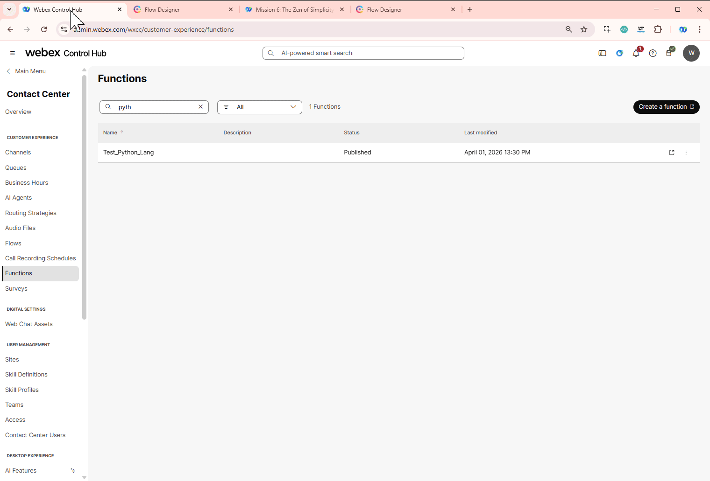


4. Add these flow variables:
  
    - ANI variable:
    
      >
      > Name: **ANI**<span class="copy-static" data-copy-text="ANI"><span class="copy" title="Click to copy!"></span></span>
      >
      > Type: **String**
      >
      > Default Value: leave it empty

    - Country Name variable:
    
      >
      > Name: **CountryName**<span class="copy-static" data-copy-text="CountryName"><span class="copy" title="Click to copy!"></span></span>
      >
      > Type: **String**
      >
      > Default Value: leave it empty

   
 
5. Add **Set Variable** node
    
    >
    > Activity Label: **SetANI**<span class="copy-static" data-copy-text="SetANI"><span class="copy" title="Click to copy!"></span></span>
    >
    > Connect **NewPhoneContact** you added at the previous step to this node
    >
    > We will connect this **Set Variable** node in next step
    >
    > Variable: **`ANI`**<span class="copy-static" data-copy-text="ANI"><span class="copy" title="Click to copy!"></span></span>
    >
    > Set Variable: **`NewPhoneContact.ANI`**<span class="copy-static" data-copy-text="NewPhoneContact.ANI"><span class="copy" title="Click to copy!"></span></span>
    >

    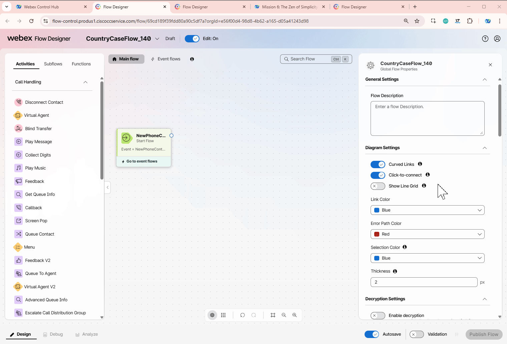

6. Add **Play Message** node 
    
    > Connect the **SetANI** node edge to the **Play Message** node
    >
    > We will connect this **Play Message** node in next step
    >
    > Enable Text-To-Speech
    >
    > Select the Connector: **Cisco Cloud Text-to-Speech**
    >
    > Click **Add Text-to-Speech Message** button
    >
    > Delete the selection for Audio File
    >
    > Text-to-Speech Message: **Welcome to Zen of Simplicity flow.**<span class="copy-static" data-copy-text="Welcome to Zen of Simplicity flow."><span class="copy" title="Click to copy!"></span></span></br>
    >
    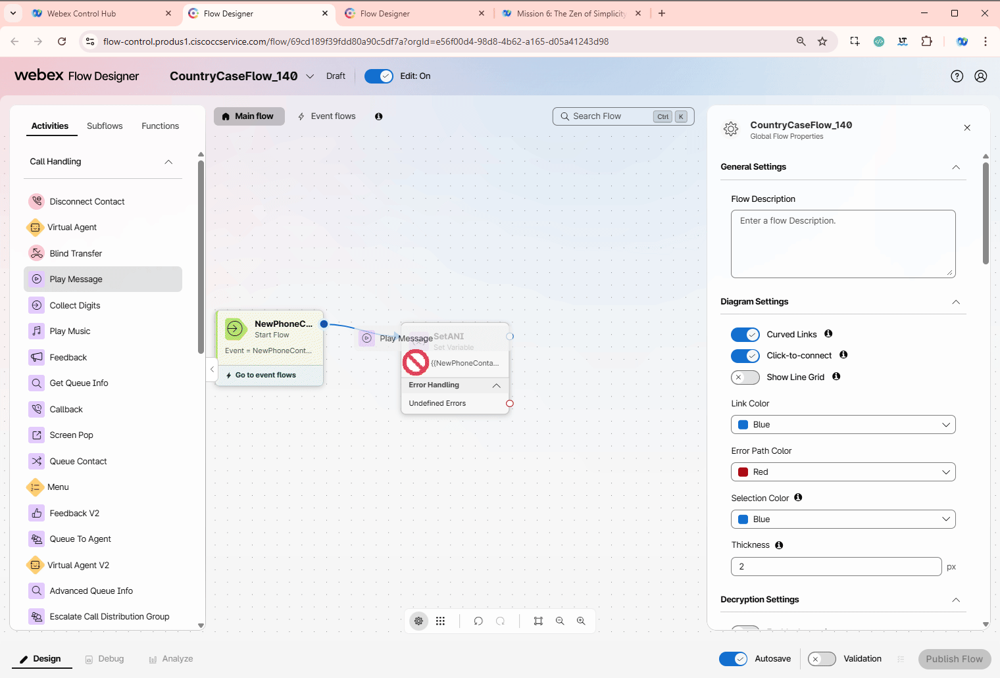

7. Switch to **Functions** tab at the panel on the left-hand side. Then drag **<span class="attendee-id-container">CountryCase_Function_<span class="attendee-id-placeholder" data-prefix="Function_">Your_Attendee_ID</span><span class="copy" title="Click to copy!"></span></span>** node to the canvas.

    > Connect **SetANI** node you added at the previous step to this node
    >
    > We will connect this node in next step
    >
    > Function Version Label: **Latest**
    >
    > **Function Input Variables** should autopopulate
    > 
    > **Output Settings**
    >
    >> Output Variable: **`CountryName`**<span class="copy-static" data-copy-text="CountryName"><span class="copy" title="Click to copy!"></span></span>
    >>
    >> Path Expression **`$.Country`**<span class="copy-static" data-copy-text="$.Country"><span class="copy" title="Click to copy!"></span></span>

    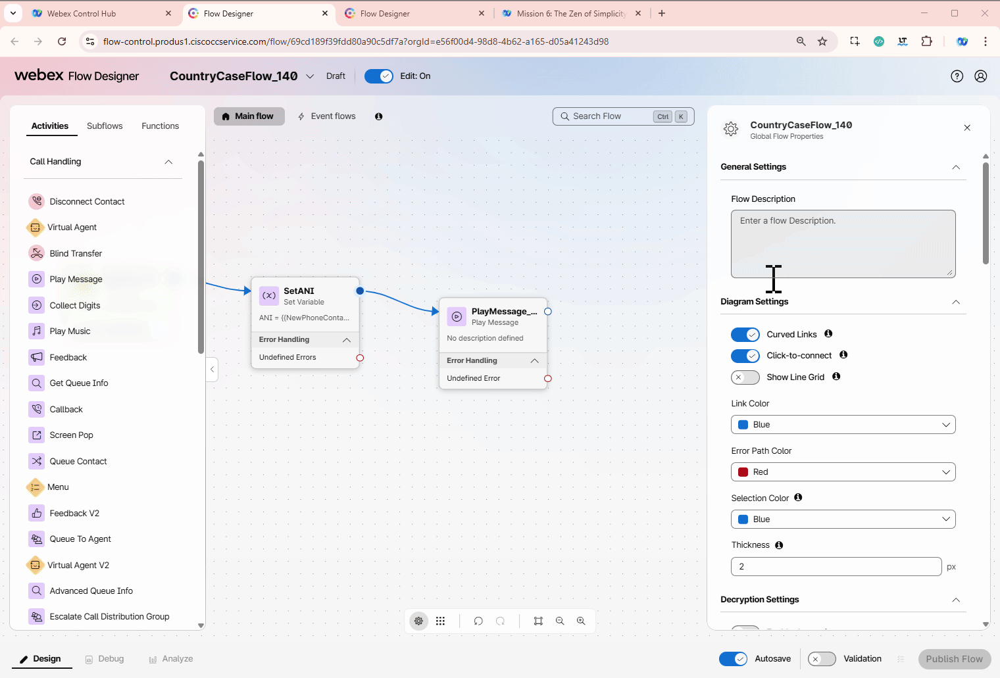


8. Switch to **Activity** tab in the left menu. Add **Case** node
  
    > - Activity Label: **Country_Case_Check**<span class="copy-static" data-copy-text="Country_Case_Check"><span class="copy" title="Click to copy!"></span></span>
    > 
    > - Connect the output node edge from the **Function** node to this node
    >
    > - Variable: **`CountryName`**<span class="copy-static" data-copy-text="CountryName"><span class="copy" title="Click to copy!"></span></span>
    >
    > In **LINK DESCRIPTION**
    > - Change **Case 0** to **Ukraine**<span class="copy-static" data-copy-text="Ukraine"><span class="copy" title="Click to copy!"></span></span>
    >
    > - Change **Case 1** to **United Kingdom**<span class="copy-static" data-copy-text="United Kingdom"><span class="copy" title="Click to copy!"></span></span>
    >
    > - Click **Add New**. Change **Case 2** and to **Poland**<span class="copy-static" data-copy-text="Poland"><span class="copy" title="Click to copy!"></span></span>
    >
    > - Click **Add New**. Change **Case 3** and to **United States**<span class="copy-static" data-copy-text="United States"><span class="copy" title="Click to copy!"></span></span>
    >
    > - We will connect the all cases in future steps.  

    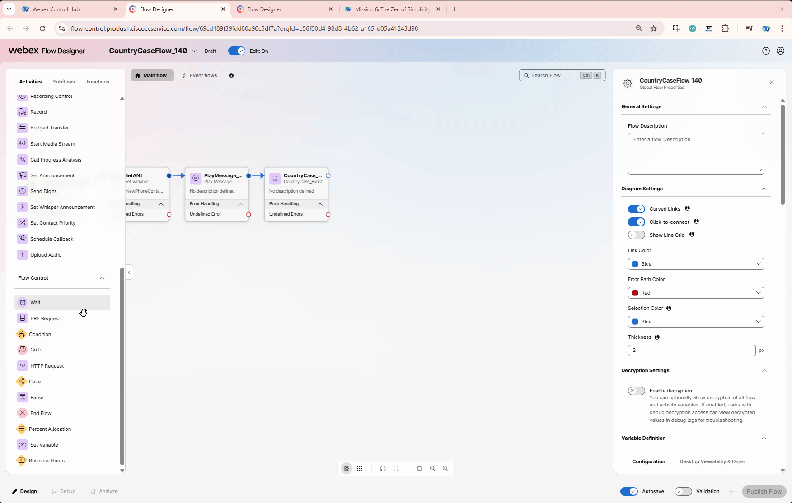

9. Switch to **Activity** tab in the left menu. Add **Play Message** and **Disconnect Contact** nodes

    > Connect all **Case** node edges except **Undefined Errors** to the **Play Message** node
    >
    > Enable Text-To-Speech
    >
    > Select the Connector: **Cisco Cloud Text-to-Speech**
    >
    > Click **Add Text-to-Speech Message** button
    >
    > Delete the selection for Audio File
    >
    > Text-to-Speech Message: **{{CountryName}} was selected based on your ANI.**<span class="copy-static" data-copy-text="{{CountryName}} was selected based on your ANI."><span class="copy" title="Click to copy!"></span></span>
    >
    > Connect the **Play Message** node edge to this **Disconnect Contact** node

10.  Validate and publish the flow:

    > Enable the **Validation** toggle in the bottom right corner of the flow designer window to check for any potential flow errors and recommendations.
    >
    > If there are no **Flow Errors** after validation is complete, click on **Publish Flow** next to it.
    >
    > In the pop-up window, ensure that the **Latest** label is selected in the **Add Version Label(s)** list, then click **Publish Flow**.

    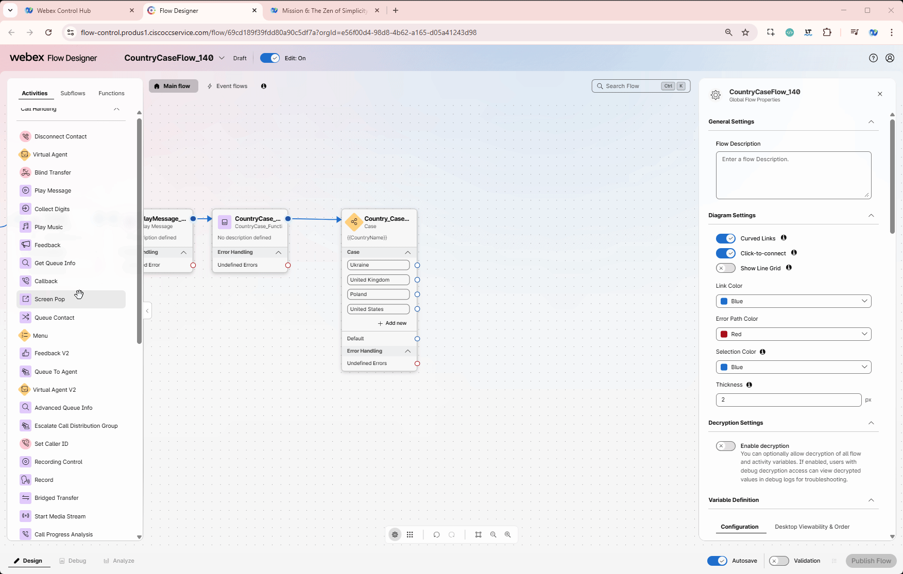
</br>

11. Map your flow to your inbound channel
    
    > Navigate to Control Hub > Contact Center > Channels
    >
    > Locate your Inbound Channel (you can use the search): **<span class="attendee-id-container"><span class="attendee-id-placeholder" data-suffix="_Channel">Your_Attendee_ID</span>_Channel<span class="copy" title="Click to copy!"></span></span>**
    >
    > Select the Routing Flow: **<span class="attendee-id-container">FunctionFlow_<span class="attendee-id-placeholder" data-prefix="FunctionFlow_">Your_Attendee_ID</span><span class="copy" title="Click to copy!"></span></span>**
    >
    > Select the Version Label: **Latest**
    >
    > Click **Save** in the lower right corner of the screen

    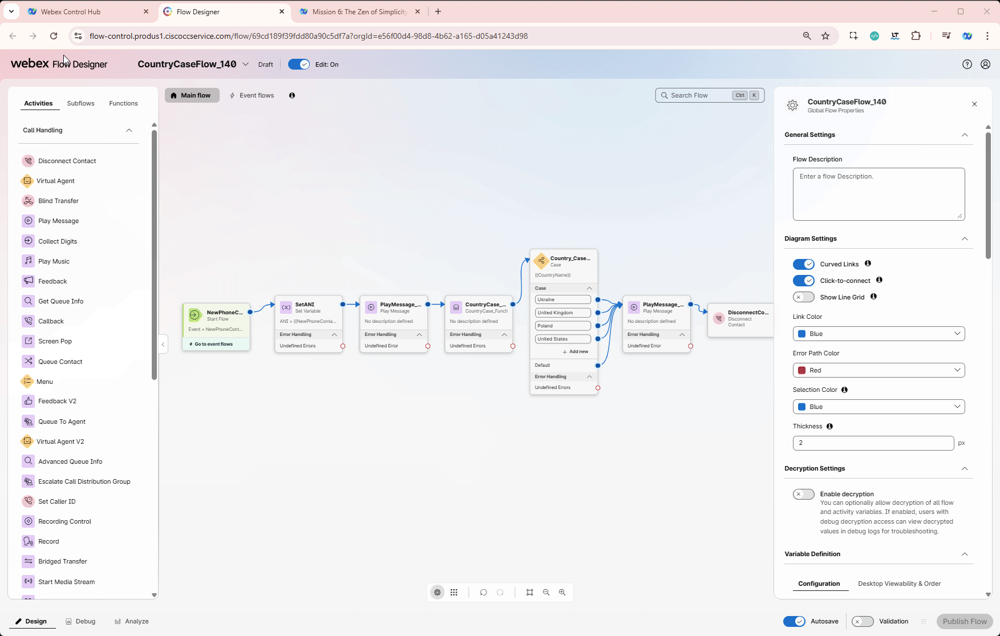

## Testing

1. Open your Webex App and dial the Support Number provided to you, which is configured in your **<span class="attendee-id-placeholder">Your_Attendee_ID</span>_Channel** configuration.

    

2. Verify if you hear a message built inside your function.

3. Switch to Flow Designer and click **Debug** tab at the bottom and select last interaction (the first in the list).

4. Click on **SetANI** and on the right-hand side window scroll to the bottom. In **Modified Variables** check if **ANI** variable has your ANI assigned.

5. Click on **<span class="attendee-id-container">CountryCase_Function_<span class="attendee-id-placeholder" data-prefix="CountryCase_Function_">Your_Attendee_ID</span></span>**. Scroll down to see **Activity Inputs**, **Activity Outputs** and **Modified Variables**.

6. Click on **Case** step and check if selected path corresponds to your selected country name value. 

    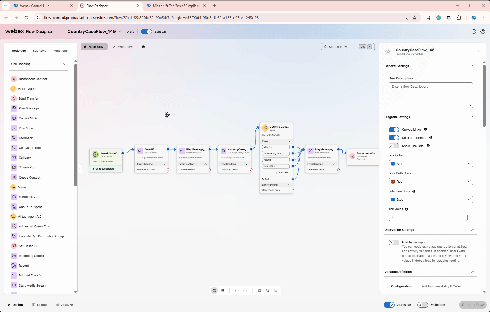

---
<p style="text-align:center"><strong>Congratulations, you have succesfully completed Country Case mission! 🎉🎉 </strong></p>
