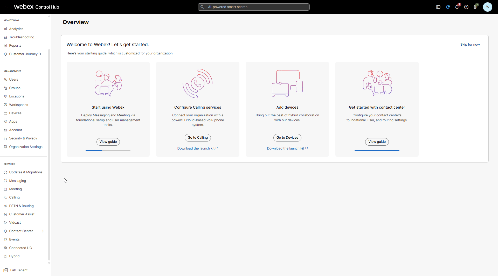
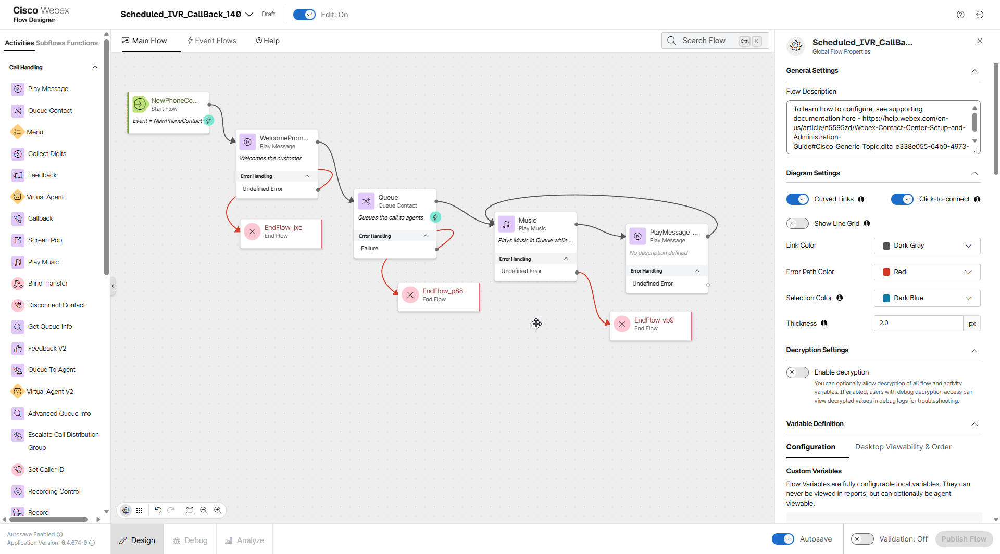
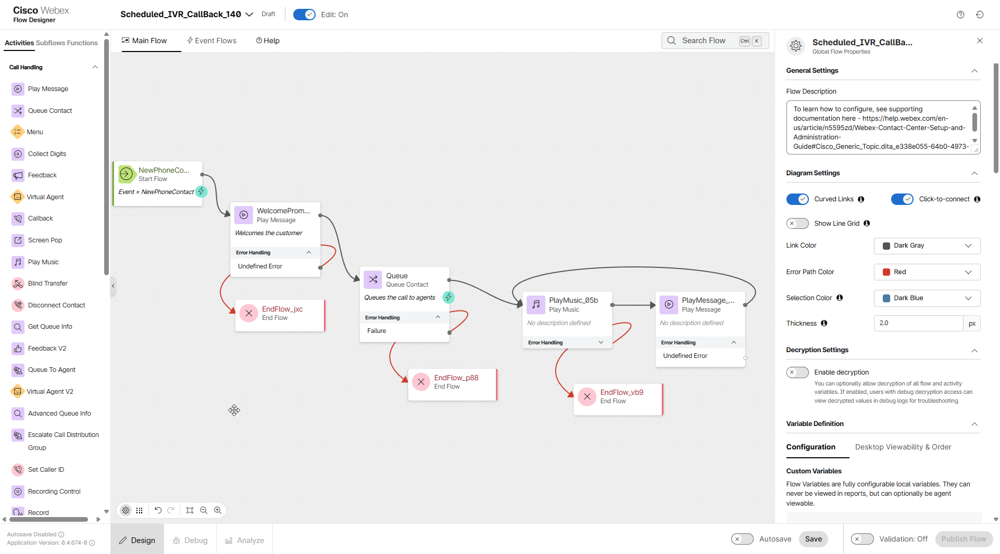
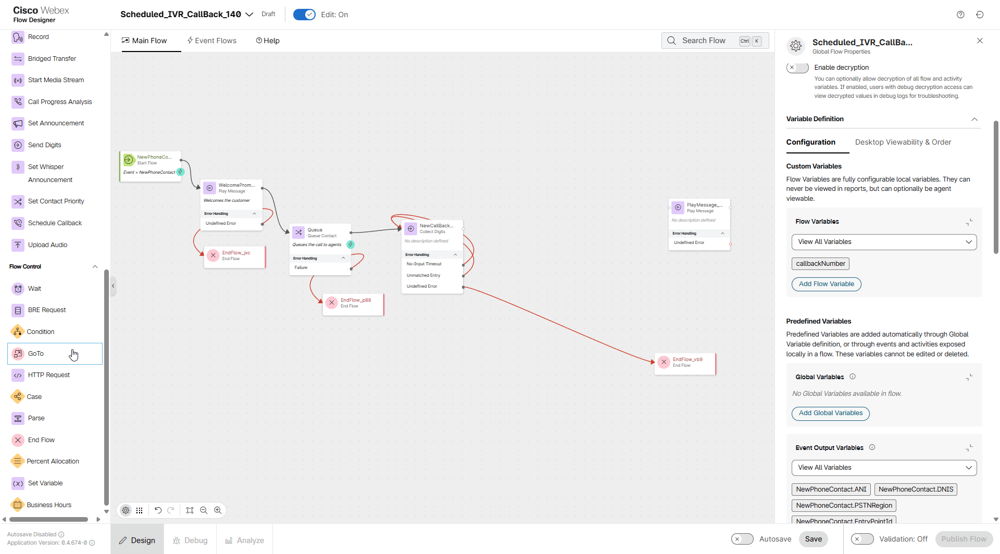
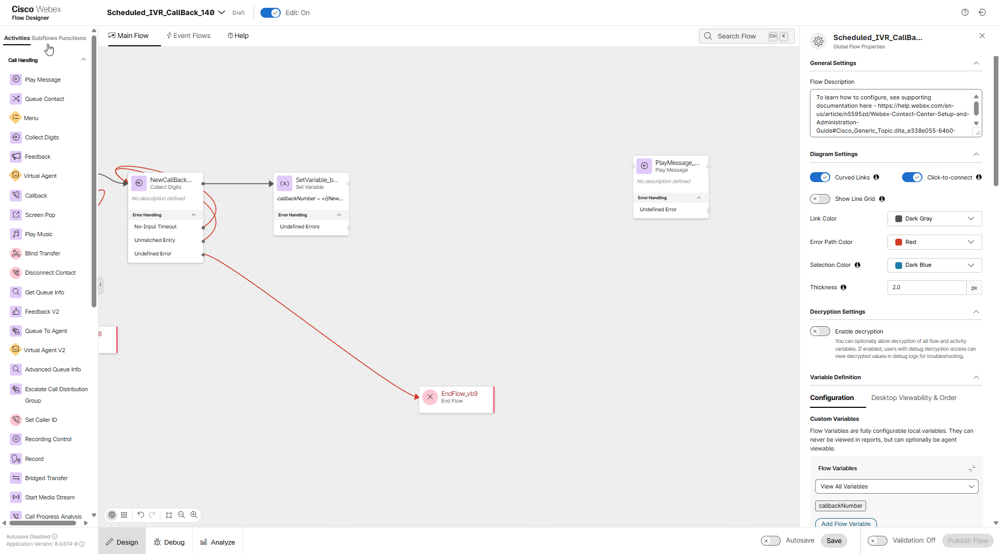
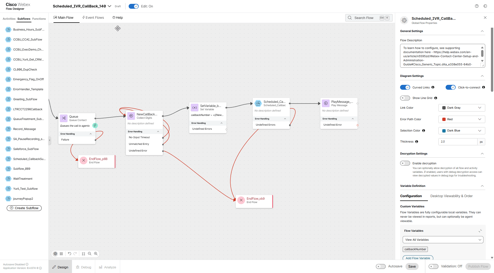
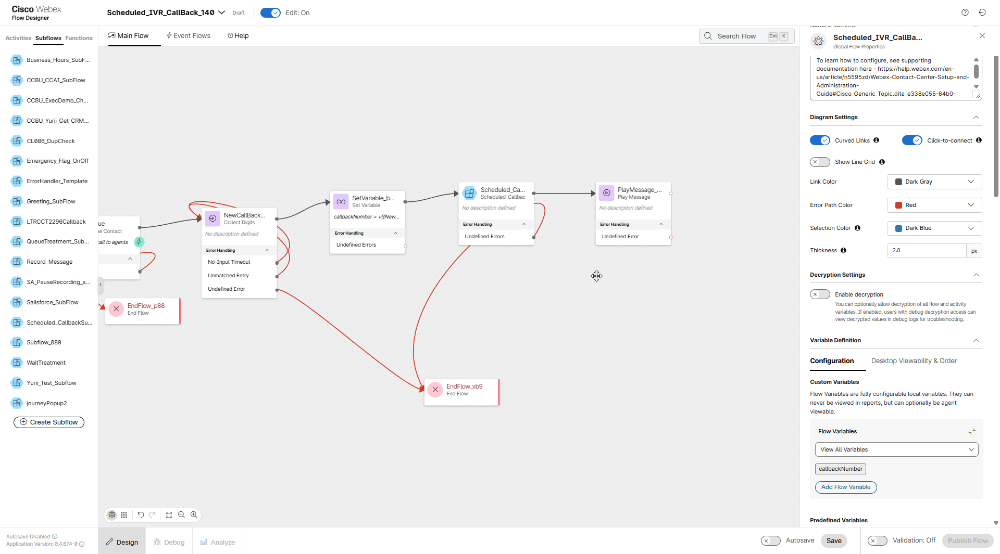
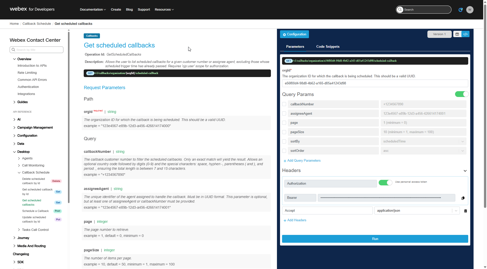

# Mission 5: Adding Scheduled IVR Callback


## Story 
You are designing a customer-friendly callback experience for a busy customer contact center. During peak hours, callers often face long wait times and prefer not to stay on hold. Instead, they want control over when they receive a return call.

In this lab, you will build a Scheduled IVR Callback flow that allows callers to request a callback at a date and time of their choosing. Rather than waiting in queue, the caller interacts with the IVR, selects a preferred callback slot, and disconnects—confident that the system will call them back as requested.

## Call Flow Overview

1. A new call enters the flow. </br>
2. The flow executes the logic configured in previous steps.</br>
3. The call is routed to the appropriate queue, but no agents are available.</br>
4. Since no agents are available, a callback option is offered to the caller.</br>
5. Caller provides prefered date and time for a Callback. </br>
6. When time comes and agent becomes available, the callback is initiated to the provided number.

## Mission Details

Your mission is to:

1. At this stage, if you have completed either of the Core or Callback tracks so far, your Main Flow has likely grown significantly. To simplify navigation, we will create a new flow dedicated specifically to the scheduled IVR callback.
 
2. Use preconfigured subflow **Scheduled_CallbackSubflow**<span class="copy-static" data-copy-text="Scheduled_CallbackSubflow"><span class="copy" title="Click to copy!"></span></span> **<span style="color: red;">[Important!]</span></summary>** Existing **Scheduled_CallbackSubflow** must be used without any modifications. This subflow is shared across all lab attendees and should remain unchanged.

**<details><summary>Scheduled Callback Subflow details <span style="color: orange;">[Optional]</span></summary>**

**Scheduled_CallbackSubflow** has already been preconfigured for you. However, the steps below explain how this subflow can be created and configured manually for reference.

1. Switch to Control Hub, then navigate to **Flows** and switch to **Subflows** at the top of the page.
2. Open the **Manage Subflows** dropdown list in the top right corner, and select **Create Subflows**.
3. A new tab will open. Navigate to **Subflow Templates**.
4. Select **Register Scheduled Callback Subflow** and click **View Details**.
5. The template details window provides detailed information about the subflow structure, its description, and other useful insights into the subflow logic.
6. Click **Next** after selecting the template, then provide a new name and press **Create Subflow** button.

</details>

## Build

1. Switch to Control Hub, then navigate to **Flows**, click on **Manage Flows** dropdown list and select **Create Flows**.

2. New tab will be opened. Navigate to **Flow Templates**.

3. Choose **Simple Inbound Call to Queue** and click **Next**. You can open **View Details** and to see observe flow structure and read flow description.

4. Name you flow as **<span class="attendee-id-container">Scheduled_IVR_CallBack_<span class="attendee-id-placeholder" data-prefix="Scheduled_IVR_CallBack_">Your_Attendee_ID</span><span class="copy" title="Click to copy!"></span></span>** Then click on Create Flow.

    

5. On the right-hand side, in the **Global Flow Properties** panel, scroll down to locate the **Flow Variables** section under **Custom Variables**. Click the **Add Flow Variable** button and add the following flow variable: 

    - Callback Number variable:
      >
      > Name: **callbackNumber**<span class="copy-static" data-copy-text="callbackNumber"><span class="copy" title="Click to copy!"></span></span>
      >
      > Type: **String**
      >
      > Default Value: leave it empty
  
    

6. Select **Queue** node and navigate to the **General settings** panel on the right-hand side. Keep **Static Queue** checked and select queue **<span class="attendee-id-container"><span class="attendee-id-placeholder" data-suffix="_Queue">Your_Attendee_ID</span>_Queue<span class="copy" title="Click to copy!"></span></span>** from the dropdown list.

7. Remove the **Music** node from the flow canvas, then move the **PlayMessage** and **EndFlow** nodes to the right to create space for additional nodes that will be added in the next steps.

8. Drag **Collect Digits** node.
    
    > Rename Activity Label to **NewCallBackNumber**<span class="copy-static" title="Click to copy!" data-copy-text="NewCallBackNumber"><span class="copy"></span></span>
    >
    > Enable Text-To-Speech
    >
    > Select the Connector: **Cisco Cloud Text-to-Speech**
    >
    > Click the **Add Text-to-Speech Message** button and paste text: ***All agents are currently busy. Please enter your 11 digits phone number to which we should call you back.***<span class="copy-static" title="Click to copy!" data-copy-text="All agents are currently busy. Please enter your 11 digits phone number to which we should call you back."><span class="copy"></span></span>
    >
    > Delete the selection for Audio File
    >
    > Set **Make Prompt Interruptible** checkbox
    >   
    > Advanced Settings:
    >
    >> No-Input Timeout: **5** 
    >>
    >> Inter-Digit Timeout: **3**
    >>
    >> Minimum Digits: **11**
    >>
    >> Maximum Digits: **11**
    >       
    > Connect **No-Input Timeout** output of this **NewCallBackNumber** node to its input
    >
    > Connect **Unmatched Entry** output of this **NewCallBackNumber** node to its input
    >
    > Connect the output of **Queue** node to the input of this **NewCallBackNumber** node
    >
    > Connect **Undefined Error** to the front of the **EndFlow** node, which was disconnected at step #7 above.
    >

    


8. Add **Set Variable** node.

    >
    > Connect the output of **NewCallBackNumber** to this node
    >
    > We will connect the output of this **Set Variable** node in next step
    >
    > Variable: **callbackNumber**<span class="copy-static" data-copy-text="callbackNumber"><span class="copy" title="Click to copy!"></span></span>
    >
    > Set Value: **+{{NewCallBackNumber.DigitsEntered}}**<span class="copy-static" data-copy-text="+{{NewCallBackNumber.DigitsEntered}}"><span class="copy" title="Click to copy!"></span></span>
    >

    


10. Switch to **Subflows** tab in the left menu. Then drag **Scheduled_CallBack_Subflow** node to the canvas. 

    >
    > Connect the output of **Set Variable** node created at the step 8 above to the input of this subflow node
    >
    > Connect the output of this subflow node to the input of the **Play Message** node, which was disconnected at step #7 above.
    >
    > Connect **Undefined Error** to any of available **EndFlow** nodes.
    >

    Optionally, you can view this preconfigured subflow by clicking the **View** button in the top-right corner of the node settings, next to the node name. **<span style="color: red;">This subflow is preconfigured and must not be modified. Close the subflow tab after viewing it.</span>**

    

11. Click on the **Scheduled_CallBack_Subflow** node. Go to the node settings pane on the right and set the following parameters:
    
    > Subflow Label: **Latest**
    
    Scroll down to the **Subflow Input Variables** section and configure the following mapping by pressing **Add New** button for every variable:
    
    > - Current flow variable: **callbackNumber**<span class="copy-static" data-copy-text="callbackNumber"><span class="copy" title="Click to copy!"></span></span>
    > - Subflow Input Variable: **CallbackNumber**<span class="copy-static" data-copy-text="CallbackNumber"><span class="copy" title="Click to copy!"></span></span>
    > <br/><br/>
    > Press **+ Add New** to add the next variable mapping
    > <br/><br/>
    > - Current flow variable: **Queue.QueueId**<span class="copy-static" data-copy-text="Queue.QueueId"><span class="copy" title="Click to copy!"></span></span>
    > - Subflow Input Variable: **CallbackQueue**<span class="copy-static" data-copy-text="CallbackQueue"><span class="copy" title="Click to copy!"></span></span>
    >
    
    


12. Click on **Play Message** modify Text-to-Speech Message by replacing existing text to the following: ***Your callback has been successfully scheduled.***<span class="copy-static" title="Click to copy!" data-copy-text="Your callback has been successfully scheduled."><span class="copy"></span></span>

13. Add **Disconnect Contact** node and connect the output of **Play Message** to the input of this **Disconnect Contact** node.

14. Validate and publish the flow:

    > Enable the **Validation** toggle in the bottom right corner of the flow designer window to check for any potential flow errors and recommendations.
    >
    > If there are no **Flow Errors** after validation is complete, click on **Publish Flow** next to it.
    >
    > In the pop-up window, ensure that the **Latest** label is selected in the **Add Version Label(s)** list, then click **Publish Flow**.

    

15. Return to Control Hub to assign the Flow to your **Channel (Entry Point)**. Go to **Channels**, search for your channel **<span class="attendee-id-container"><span class="attendee-id-placeholder" data-suffix="_Channel">Your_Attendee_ID</span>_Channel<span class="copy" title="Click to copy!"></span></span>**

16. Click on **<span class="attendee-id-placeholder">Your_Attendee_ID</span>_Channel**. In **Entry point settings** section change the following, then click **Save** button:

    > - Routing flow: **Scheduled_IVR_CallBack_<span class="attendee-id-placeholder">Your_Attendee_ID</span>**
    >
    > - Version label: **Latest**

## Testing
    
1. Ensure that your agent state is set to **Not Available**. In this state, the call will not be assigned to an agent, and the system will offer the callback option to the caller.

2. With your agent remaining in **Not Available** place a test call to your support number.

3. To successfully schedule a callback, you must provide the following information when prompted using your Webex app’s Keypad:
    
    > a.  **An 11-digit phone number.** This can be your personal mobile number or a known Cisco Worldwide Technical Support number, such as **1 408 526 7209**. Use the dial pad to enter the Cisco TAC number.
    >
    > b. Preferred date in ***YYYYMMDD*** format. Example: If you want to schedule a callback for February 12, 2026, enter ***20260212***.
    >
    > c. Preferred start time for your callback should be in ***HHMM*** 24-hour format. <span style="color: red;">Selected time should be at least 30 minutes from now.</span>
    >
    > d. Preferred end time for your callback should be in ***HHMM*** 24-hour format. <span style="color: red;">The time between start and end time must be at least 30 minutes and no more than 8 hours</span>.
    >
    > e. **Callback timezone**. For EMEA press **1**.

4. After providing all inputs, you will hear a confirmation message indicating that your callback has been successfully scheduled.

5. To receive the callback, ensure you set your agent desktop to **Available** during the scheduled time frame.

!!! Note
    You may proceed with other tasks without waiting for the callback time. When the time comes, please remember to make yourself available to accept the call.


## Callback status verification.

1. Open [**Developer Portal**](https://developer.webex.com/){:target="_blank"} and click on **Log In**. 
   Your login will be of the format **<span class="attendee-id-container">wxcclabs+admin_ID<span class="attendee-id-placeholder" data-prefix="wxcclabs+admin_ID" data-suffix="@gmail.com">Your_Attendee_ID</span>@gmail.com<span class="copy" title="Click to copy!"></span></span>**. You will see another login screen with Webex icon on it where you may need to enter the email address again and the password provided to you.

2. Click on the little arrow next to **Documentation**, choose **Webex Contact Center** under **Customer Experience** section. 

    

3. On Menu panel on the left, scroll down to **API Reference** section, expand **Desktop** and then expand **Callback Schedule**

4. Click on **Get scheduled callbacks** to open an endpand description page.

    

5. On the right-hand side under **Query Params** set a checkbox next to ***callbackNumber***, then type 11-digit number you provided while were doing the test call.

    !!! Note
        Please note that if you submitted a callback request via IVR using the number format without the leading "+" symbol (for example, 14085267209), you still need to enter the number with the leading "+" (for example, +14085267209) when searching for a callback via **Get scheduled callbacks** API.

6. Then click **Run**.

    

7. Verify output of the executed API call and observe the important keys. Here is an example of the most important response fields:

    ``` JSON
      {
          "id": "190f7f91-bd48-4247-9e47-f9747559f6f5",         // Unique identifier for the scheduled callback.
          "customerName": "+14085267209",                       // Customer Name. Uses Callback Number if not provided specifically
          "callbackNumber": "+14085267209",                     // Phone number provided for the callback.
          "timezone": "Europe/Amsterdam",                       // Timezone in which the callback is scheduled.
          "scheduleDate": "2026-02-10",                         // Date for the callback in ISO format (YYYY-MM-DD).
          "startTime": "08:30:00",                              // Scheduled start time in ISO 8601 format (HH:mm:ss), local to the specified timezone. 
          "endTime": "09:30:00",                                // Scheduled end time in ISO 8601 format (HH:mm:ss), local to the specified timezone.
          "queueId": "f8007be2-3e53-40e0-a1d0-a58a97ed784b"     // Identifier for the queue to route the callback request.           
      }    
    ```   
    
    **<details><summary>Example of the full response of *Get scheduled callbacks* API</summary>**

        ``` JSON
            {
                "meta": {
                    "orgId": "e56f00d4-98d8-4b62-a165-d05a41243d98",
                    "page": 0,
                    "pageSize": 50,
                    "totalPages": 1,
                    "totalRecords": 1,
                    "links": {
                        "self": "/v1/callbacks/organization/e56f00d4-98d8-4b62-a165-d05a41243d98/scheduled-callback?callbackNumber=%2B14085267209&page=0&pageSize=50&sortBy=scheduledTime&sortOrder=asc"
                    }
                },
                "data": [
                    {
                        "id": "190f7f91-bd48-4247-9e47-f9747559f6f5",
                        "customerName": "+14085267209",
                        "callbackNumber": "+14085267209",
                        "timezone": "Europe/Amsterdam",
                        "scheduleDate": "2026-02-10",
                        "startTime": "08:30:00",
                        "endTime": "09:30:00",
                        "queueId": "f8007be2-3e53-40e0-a1d0-a58a97ed784b",
                        "callbackReason": null,
                        "sourceInteraction": "efd7e86c-c095-4e58-9c75-9354668080e0",
                        "callbackOrigin": "IVR",
                        "createdTimestamp": 1770670959758,
                        "lastUpdatedTimestamp": 1770670959758,
                        "assigneeAgent": null,
                        "assignedTime": null,
                        "orgId": "e56f00d4-98d8-4b62-a165-d05a41243d98",
                        "campaignId": null,
                        "callbackType": "scheduled"
                    }
                ]
            }
        ```

    </details>
    
    Full Schema Definition can be found in the [**API Reference**](https://developer.webex.com/webex-contact-center/docs/api/v1/callback-schedule/get-scheduled-callbacks){:target="_blank"} for this API call.
  
8. Please remember to make your agent available within the callback timeframe to take the callback and clean up the schedule.

---
<p style="text-align:center"><strong>Congratulations, you have succesfully completed Preventing Callback Duplication mission! 🎉🎉 </strong></p>
