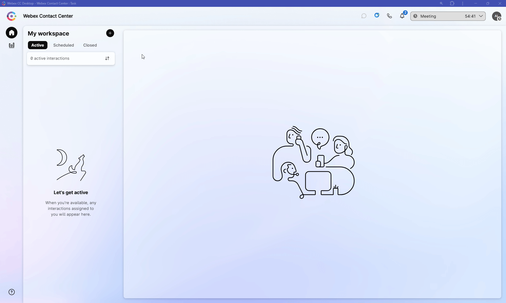
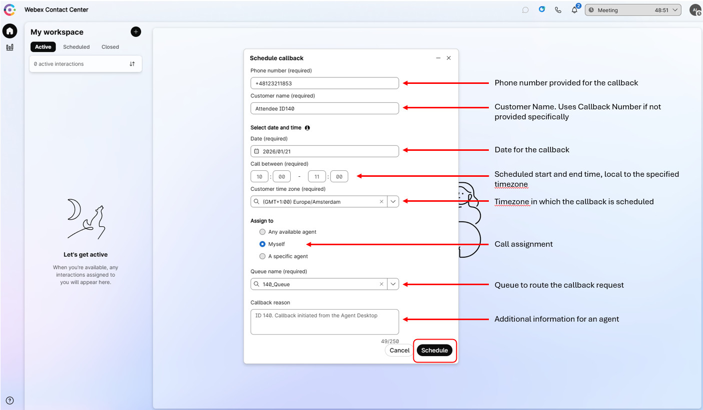
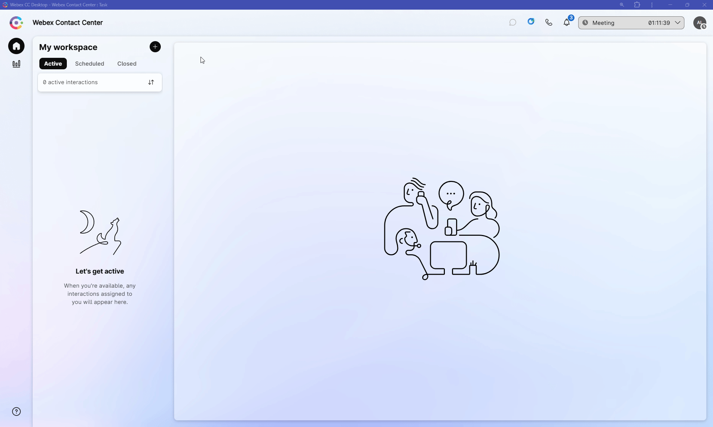
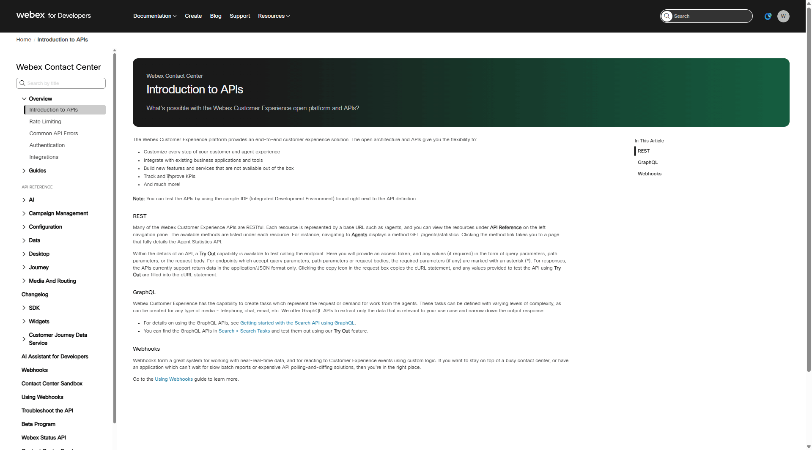
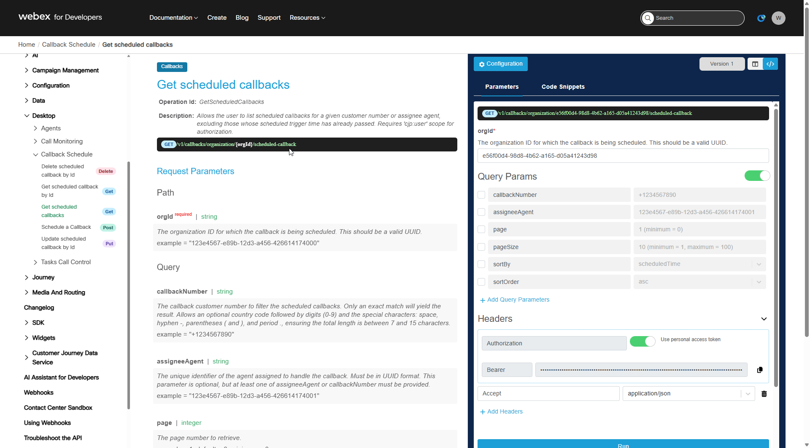

# Mission 6: Adding Personalized Callback

!!! Note
    This mission does not involve Flow Designer configuration or inbound call handling.
    While it is not a traditional flow-building task, it is included to ensure that attendees completing the Callback Track are fully aware of all callback options available in Webex Contact Center, including agent-initiated scheduled callbacks from the agent desktop.

## Story 
In many real-world scenarios, agents agree with customers on a specific date and time for a follow-up call. For example, after investigating a case, waiting for external confirmation, or aligning with the customer’s availability.

Instead of asking customers to call back or keeping reminders outside the platform, agents can schedule a callback directly from the Webex Contact Center Agent Desktop. The system takes care of placing the outbound call at the agreed time, ensuring consistency, reliability, and a better customer experience.

In this lab, you will learn how to schedule a callback from the agent desktop, without any inbound call or flow changes, demonstrating a powerful but often overlooked capability of Webex Contact Center.

## Call Flow Overview

!!! Note
    An agent can schedule a call with a customer at any time - whether they are on an active call or in a Not Available state.

1. An agent is working in the Webex Contact Center Agent Desktop.
2. The agent agrees with a customer on a specific date and time for a follow-up call. 
3. Using the Agent Desktop interface, the agent schedules a callback for the selected time.
4. The customer disconnects, confident that the callback will be handled automatically. *(If on active call with a customer)*
5. At the scheduled time, when an agent becomes available, Webex Contact Center initiates the outbound callback to the specified number.

## Mission Details

Your mission is to:

1. Understand how scheduled callbacks can be created directly from the Webex Contact Center Desktop, without relying on inbound calls or IVR flows.
2. Learn the agent-side workflow for scheduling a callback at a specific date and time.
 

## Testing
    
Your Agent desktop session should be still active but if not, use Webex CC Desktop application  and login with agent credentials you have been provided **<span class="attendee-id-container">wxcclabs+agent_ID<span class="attendee-id-placeholder" data-prefix="wxcclabs+agent_ID" data-suffix="@gmail.com">Your_Attendee_ID</span>@gmail.com<span class="copy" title="Click to copy!"></span></span>**. You will see another login screen where you may need to enter the email address again and the password provided to you. 

1. With your agent remaining in **Not Available** place a test call to your Support Number.

2. Click on the little plus sign next to **My Workstation** on top left corner, choose **Schedule a callback** from drop down menu. 

    

4. To successfully schedule a callback, you must provide the following information on pop up window:
    
    > a.  **Phone number (required)**. An 11-digit phone number. This can be your personal mobile number or a known Cisco Worldwide Technical Support (TAC) number, such as **+1 408 526 7209**<span class="copy-static" data-copy-text="+14085267209"><span class="copy" title="Click to copy!"></span></span>. Use the Keypad of Webex app to enter the Cisco TAC number.
    >
    > b. **Customer name (required)**. Type **<span class="attendee-id-container">Attendee_ID<span class="attendee-id-placeholder" data-prefix="Attendee_ID">Your_Attendee_ID</span><span class="copy" title="Click to copy!"></span></span>**
    >
    > c. **Date (required)**. Choose today's date. *(You can schedule a callback up to 31 days in advance.)*
    >
    > d. **Call between (required)**. Selected time should be at least 30 minutes from now. *(The **Call Between** window must be at least 40 minutes and no more than 8 hours.)*
    >
    > e. **Customer time zone (required)**. Select **Europe/Amsterdam**<span class="copy-static" data-copy-text="Europe/Amsterdam"><span class="copy" title="Click to copy!"></span></span>
    >
    > f. **Assign to**. Choose **Myself**.
    >
    > g. **Queue name**. Provide your **<span class="attendee-id-container"><span class="attendee-id-placeholder" data-suffix="_Queue">Your_Attendee_ID</span>_Queue<span class="copy" title="Click to copy!"></span></span>**
    >
    > h. **Callback Reason**. Type **<span class="attendee-id-container"><span class="attendee-id-placeholder" data-prefix="Attendee ID ">Your_Attendee_ID</span>. Callback initiated from the Agent Desktop.<span class="copy" title="Click to copy!"></span></span>**

    

5. After providing all inputs, press **Schedule** button. You should see a pop-up notification that **Callback scheduled successfully**.

6. To receive the callback, ensure you set your agent desktop to **Available** during the scheduled time window.

7. You can verify, delete or edit your scheduled callbacks by clicking on **Scheduled** tab on agent desktop. 

    

!!! Note
    You may proceed with other tasks without waiting for the callback time. When the time comes, please remember to make yourself available to accept the call.


## Callback status verification over API.

1. Open [**Developer Portal**](https://developer.webex.com/){:target="_blank"} and click on **Log In**. 
   Your login will be of the format **<span class="attendee-id-container">wxcclabs+admin_ID<span class="attendee-id-placeholder" data-prefix="wxcclabs+admin_ID" data-suffix="@gmail.com">Your_Attendee_ID</span>@gmail.com<span class="copy" title="Click to copy!"></span></span>**. You will see another login screen with Webex icon on it where you may need to enter the email address again and the password provided to you.

2. Click on the little arrow next to **Documentation**, choose **Webex Contact Center** under **Customer Experience** section. 

    

3. On Menu pannel on the left, scroll down to **API Reference** section, expand **Desktop** and then expand **CallBack Schedule**

4. Click on **Get scheduled callbacks** to open an endpand description page.

    

5. On the right hand side under **Query Params** set a checkbox next to ***callbackNumber***, then type 11 digit number you provided while were doing the test call. 
6. Then click **Run**.

    

7. Verify output of the executed API call. Observe the important keys:

    ``` JSON
      {
          "id": "3824bcea-03c7-41b8-957d-5d62ecda3b82",         // Unique identifier for the scheduled callback.
          "customerName": "+48575638602",                       // Customer Name. Uses Callback Number if not provided specifically
          "callbackNumber": "+48575638602",                     // Phone number provided for the callback.
          "timezone": "Europe/Amsterdam",                       // Timezone in which the callback is scheduled.
          "scheduleDate": "2026-01-19",                         // Date for the callback in ISO format (YYYY-MM-DD).
          "startTime": "18:45:00",                              // Scheduled start time in ISO 8601 format (HH:mm:ss), local to the specified timezone. 
          "endTime": "19:20:00",                                // Scheduled end time in ISO 8601 format (HH:mm:ss), local to the specified timezone.
          "queueId": "ee46583c-8d0d-4c09-8829-8c0b79c11a79",     // Identifier for the queue to route the callback request.
          "callbackReason": "Attendee ID 140. Callback initiated from the Agent Desktop."    // Text provided while schedule a call back.
          //<ommitted>,
              
      }    
    ```   
    Full Schema Definition can be found in the [**API Reference**](https://developer.webex.com/webex-contact-center/docs/api/v1/callback-schedule/get-scheduled-callbacks){:target="_blank"} for this API call.
  
---
<p style="text-align:center"><strong>Congratulations, you have succesfully completed Adding Personalized Callback mission! 🎉🎉 </strong></p>
