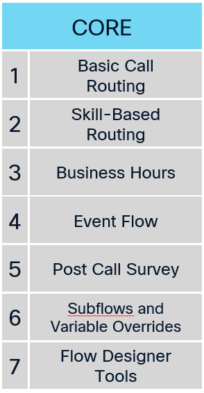
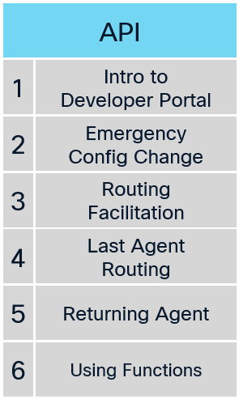
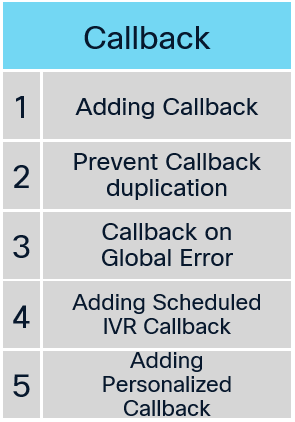
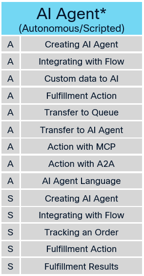
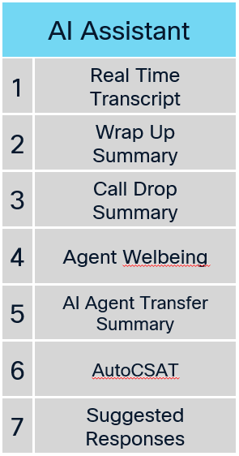
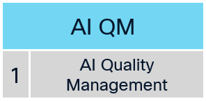

## Welcome to Your Lab Adventure! **Work in progress.**

### Overview
In this session, we’ve designed 15 unique labs for you to explore, grouped into 4 distinct tracks to create a focused and engaging learning experience. Each track is crafted to help you develop specific skills.

Here’s what you need to know:

  > Each track offers a different number of labs, guiding you through a cohesive learning journey.
  >
  > Completing just one track is enough to achieve the session’s goals.
  > 
  > Want to push further? Finish 2 tracks to excel, 3 tracks to become an expert, or take on all 4 tracks to earn the ultimate title of Mega Superstar!
  >
  > Take a moment to review the tracks, choose the ones that excite you, and dive in. This is your adventure—make it unforgettable!

There’s no set order—start with any track that interests you most, but we recommend starting with the **Core Track**. One of the missions contains information you are going to use on the final troubleshooting task, which we will complete as the last mission.

## Track 1: Core Track

This track introduces the fundamental features of Flow Designer. Participants will explore flow templates, business hours, and event flows while learning to utilize additional tools like the Debugger and Analyzer.

## Track 2: API Track

In this track, participants will work on customizing flows using a variety of API requests to interact with different data sources.

## Track 3: CallBack Track

The Callback track includes a series of labs focused on various callback scenarios. It begins with basic callback configuration and progresses to advanced GraphQL techniques to eliminate duplicate callbacks.

## Track 4: AI Agent Track

This track introduces participants to both Autonomous and Scripted AI Agent capabilities. It covers creating AI agents, integrating them with flows, using custom data and fulfillment actions, and enabling more advanced interactions such as order tracking, queue transfer, agent handoff, and actions with MCP or A2A.

## Track 5: AI Assistant Track

In this track, participants will explore AI Assistant features designed to improve both agent efficiency and customer experience. Labs focus on capabilities such as real-time transcription, automated summaries, agent wellbeing insights, AI Agent transfer summaries, AutoCSAT, and suggested responses.

## Track 6: AI Quality Management Track

This track focuses on AI-powered Quality Management capabilities for contact centers. Participants will learn how AI Quality Management helps evaluate customer interactions, improve coaching and performance management, and support more consistent service quality across the team.

<script src='../template_assets/load.js'><script>
