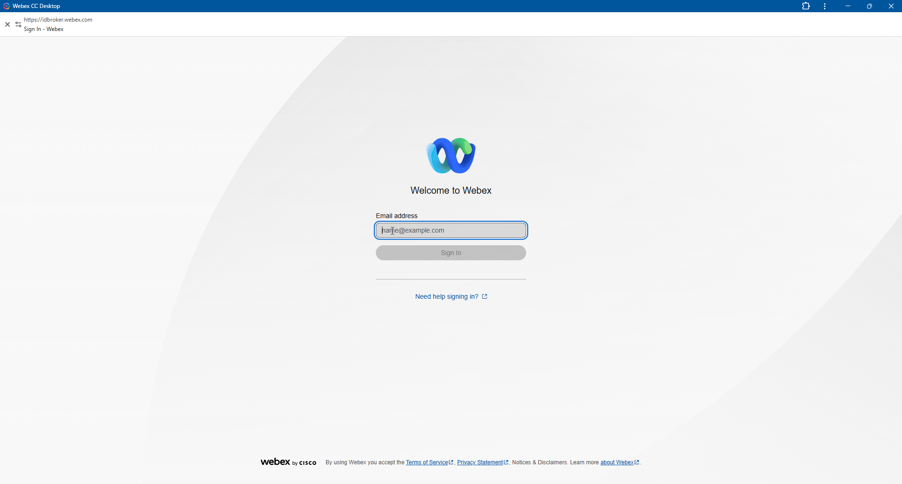
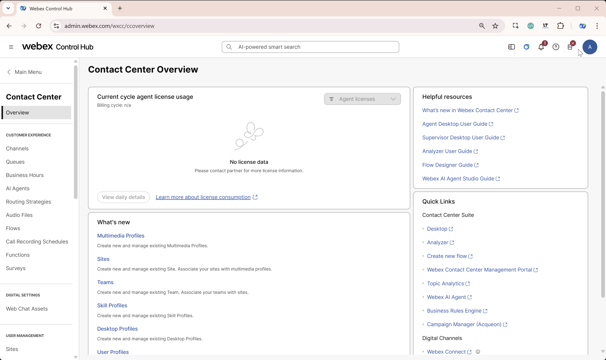

# Final Challenge: Get the Call Through

Your attendee flow has been preconfigured with a few problems. Find and fix them so a test call reaches speaker's Agent Desktop.

## Goal

Be the first attendee whose Agent Desktop rings with the challenge call. When it rings, let the facilitator know that you have won.

## What is ready for you

- Your individual flow is named **TS2026_Challenge_Your_Attendee_ID**.
- Your individual dialed number is mapped to that flow. Use the number assigned to you on the **Credentials** page or provided by the facilitator.

!!! Note
    - Dialed Numbers are based in US, hence calls from your mobile might be charged.
    - Use IP Phones on your desks to dial.

## Challenge

1. Sign in to **Agent Desktop** with your assigned agent credentials. Set your agent state to **Available** and leave Agent Desktop open.

    

2. In a separate tab, sign in to [Webex Control Hub](https://admin.webex.com){:target="_blank"} with your provided admin credentials. Go to **Contact Center > Flows**.

    

3. Find and open **TS2026_Challenge_Your_Attendee_ID**. Make sure you are working on your own attendee flow.

4. Open the flow's **Debug** view, then call your assigned dialed number. Use the Debug results to trace what happens and identify the flow problem.

    

5. Switch to **Edit** mode, correct the issue, and validate and publish the flow. Place another test call and check the Debug results again. Repeat until the call reaches your Agent Desktop.

!!! Hint
    There are **three mistakes** in the flow: one incorrect node connection and two mistakes inside nodes.

## You win

When your Agent Desktop rings with the challenge call, let the facilitator know. That is the finish line; no further flow changes are needed.

---

<strong>Good luck, and happy troubleshooting!</strong>

