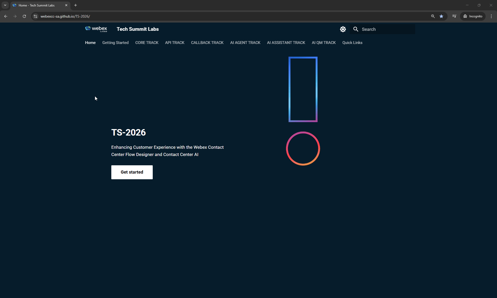

<!-- Markdown content with embedded HTML -->

    <h2>Please submit the form below with your Attendee ID.</h2> 
    <h3>All configuration entries in the lab guide will be renamed to include your Attendee ID.</h3>
    <form id="attendee-form">
        <label for="attendee">Attendee ID:</label>
        <input type="text" id="attendee" name="attendee" placeholder="Enter 3 digits" required>
        <button type="submit">Save</button>
    </form>

     

    
Your stored Attendee ID is: <b>No ID stored</b>

**

How to set Attendee ID
**

 

## Disclaimer
The lab design and configuration examples provided are for educational purposes. For production design queries, please consult your Cisco representative or an authorized Cisco partner.
Let’s get started and discover how **Webex Contact Center** takes customer experiences from good to great!

